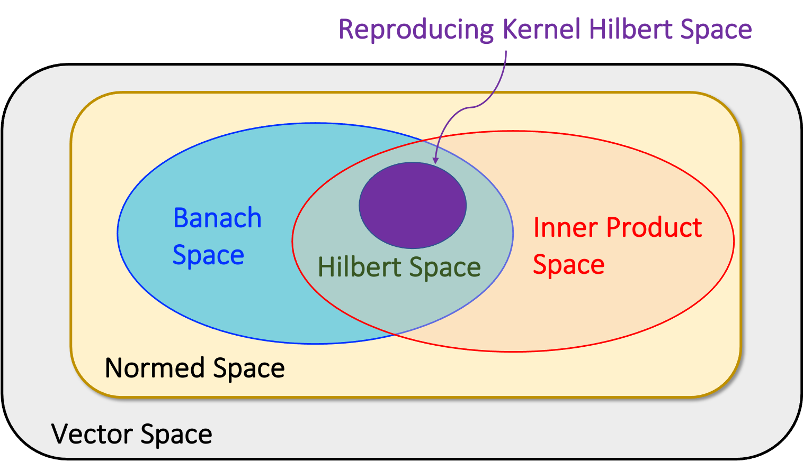
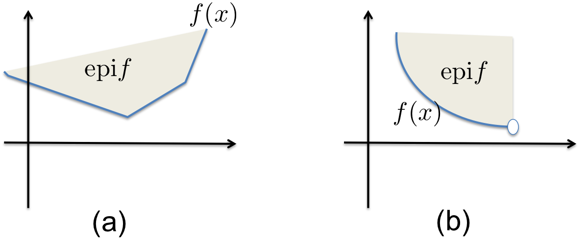
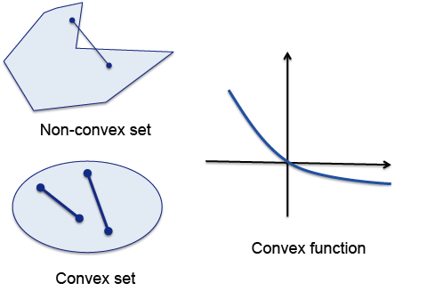
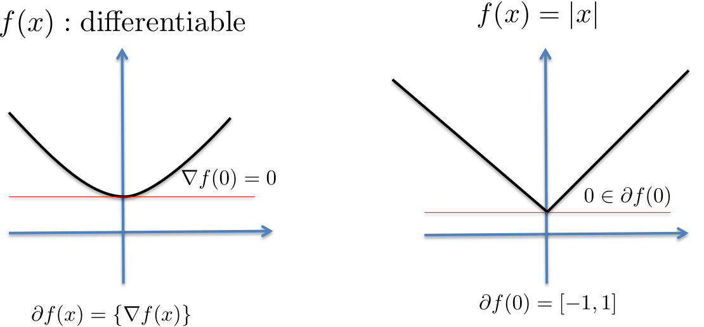
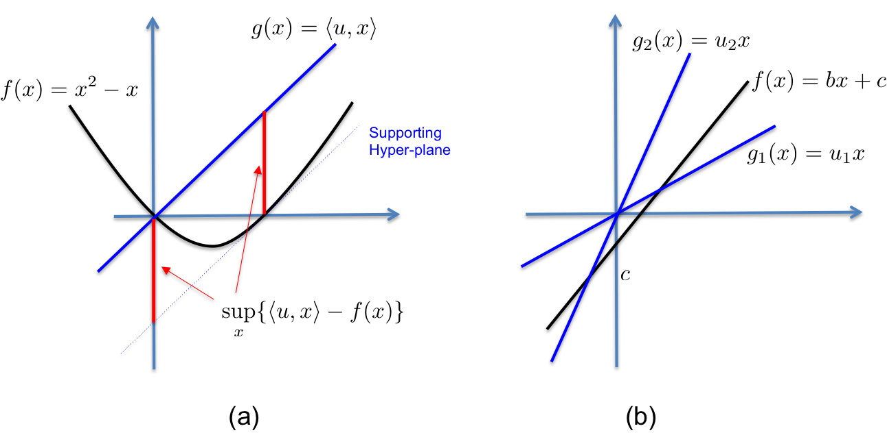

# Mathematical Preliminaries {.unnumbered}

<!--
DRAFT seeded by scripts/promote.py from the strongest lec00 scribe note.
Base note: test. Merge sources: test.

This repository is public and this comment ships in the page source, so it
carries no scores and no per-note criticism. Both live in
drafts/lec00-merge.md, which .gitignore keeps out of the repository.

Before this chapter is publishable:

1. Fill the gaps listed in drafts/lec00-merge.md, which also says which of
   the other notes covered each one.
2. Resolve every suspected error in the worksheet against the lecture itself.
3. Reconcile notation with the neighbouring chapters.
4. Copy-edit. The scribe repository never penalised English fluency, so some
   base notes need a real pass here.
5. Replace this comment and the contributor list below with the final credit.
-->

::: {.callout-important}
## Draft
This chapter is a merge in progress and has not been edited or checked.
:::

In this chapter, we briefly review the basic mathematical concepts that are required to understand
the materials of this book.

## Metric Space {#sec-metric}

A metric space $(\mathcal{X},d)$ is a set $\mathcal{X}$ together with a metric $d$ on the set.
Here, a *metric* is a function that defines a concept of distance between any two members of the set,
which is formally defined as follows.

::: {#def-metric}

A metric on a set $\mathcal{X}$ is a function called the distance
$d : \mathcal{X}\times \mathcal{X}\mapsto {\mathbb R}_+$, where ${\mathbb R}_+$ is the set of non-negative real numbers.
For all $x, y, z \in \mathcal{X}$, this function is required to satisfy the following conditions:

1.  $d(x, y) \geq 0$ (non-negativity).

2.  $d(x, y) = 0$ if and only if $x = y$.

3.  $d(x, y) = d(y, x)$ (symmetry).

4.  $d(x, z) \leq d(x, y) + d(y, z)$ (triangle inequality).

:::

A metric on a space induces topological properties like open and closed sets, which lead to the study of more abstract topological spaces.
Specifically, about any point $x$ in a metric space $\mathcal{X}$, we define the open ball of radius $r>0$ about $x$ as the set

$$
\begin{aligned}
B_r(x)=\{y\in \mathcal{X}:d(x,y)<r\}.
\end{aligned}
$$

Using this, we have the formal definition of openness and closedness of a set.

::: {#def-c64c}

A subset $U\subset \mathcal{X}$ is called open if for every $x \in U$ there exists an $r > 0$ such that $B_r(x)$ is contained in $U$. The complement of an open set is called closed.

:::

A sequence $(x_{n})$ in a metric space $\mathcal{X}$ is said to converge to the limit $x\in \mathcal{X}$ if and only if for every $\varepsilon >0$, there exists a natural number $N$ such that $d(x_{n},x)<\varepsilon$ for all $n>N$.
A subset $\mathcal{S}$ of the metric space $\mathcal{X}$ is closed if and only if every sequence in $\mathcal{S}$ that converges to a limit in $\mathcal{X}$ has its limit in $\mathcal{S}$.
In addition, a sequence of elements $(x_{n})$
is a Cauchy sequence if and only if (iff) for every $\varepsilon> 0$, there is some $N \geq 1$ such that

$$
d(x_n, x_m) < \varepsilon,\quad \forall\quad m,n \geq N.
$$

We are now ready to define the important concepts in metric spaces.

::: {#def-7300}

A metric space $\mathcal{X}$ is said to be complete if every Cauchy sequence converges to a limit; or if $d(x_n, x_m) \rightarrow 0$ as both $n$ and $m$ independently go to infinity, then there is some $y\in \mathcal{X}$ with $d(x_n, y) \rightarrow 0$.

:::

::: {#def-edfc}

Given two metric spaces $(\mathcal{X}, d_{\mathcal{X}})$ and $(\mathcal{Y}, d_{\mathcal{Y}})$, where $d_{\mathcal{X}}$ denotes the metric on the set $\mathcal{X}$ and $d_{\mathcal{Y}}$ is the metric on set $\mathcal{Y}$, a function $f:\mathcal{X}\mapsto \mathcal{Y}$ is called Lipschitz continuous if there exists a real constant $K\geq 0$ such that, for all $x_1,x_2\in \mathcal{X}$,

$$
\begin{aligned}
 d_{\mathcal{Y}}(f(x_{1}),f(x_{2}))\leq K d_{\mathcal{X}}(x_{1},x_{2}).
\end{aligned}
$$

Here, the constant $K$ is often called the Lipschitz constant, and a function $f$ with the Lipschitz constant $K$ is called
$K$-Lipschitz function.

:::

## Vector Space

A vector space $\mathcal{V}$ is a set that is closed under finite vector addition and scalar multiplication. In machine learning applications, the scalars are usually members of real or complex values,
in which case $\mathcal{V}$ is called a vector space over real numbers, or complex numbers.

For example, the Euclidean $n$-space ${\mathbb R}^n$ is called a real vector space, and ${\mathbb C}^n$ is called a complex vector space.
In the $n$-dimensional Euclidean space ${\mathbb R}^n$, every element is represented by a list of $n$ real numbers, addition is component-wise, and scalar multiplication is multiplication on each term separately.
More specifically, we define a column $n$-real-valued vector ${\boldsymbol{x}}$ to be an array of $n$ real numbers, denoted by

$$
{\boldsymbol{x}}= \begin{bmatrix} x_1 \\ x_2 \\ \vdots \\ x_n \end{bmatrix} = \begin{bmatrix}x_1 & x_2 & \cdots & x_n \end{bmatrix}^\top  \in {\mathbb R}^n,
$$

where the superscript $^\top$ denotes the adjoint. Note that for a real vector, the adjoint is just a transpose.
Then, the sum of the two vectors ${\boldsymbol{x}}$ and ${\boldsymbol{y}}$, denoted by ${\boldsymbol{x}}+{\boldsymbol{y}}$, is defined by

$$
{\boldsymbol{x}}+{\boldsymbol{y}}= \begin{bmatrix}x_1 +y_1 & x_2 +y_2 & \cdots & x_n+ y_n \end{bmatrix}^\top.
$$

Similarly, the scalar multiplication with a scalar $\alpha\in {\mathbb R}$ is defined by

$$
\alpha {\boldsymbol{x}}= \begin{bmatrix}\alpha x_1 & \alpha x_2 & \cdots & \alpha x_n \end{bmatrix}^\top.
$$

In addition, we formally define the inner product and the norm in a vector space as follows.

::: {#def-df13}

Let $\mathcal{V}$ be a vector space over ${\mathbb R}$. A function $\langle\cdot,\cdot\rangle_{\mathcal{V}}:\mathcal{V}\times\mathcal{V}\mapsto {\mathbb R}$ is an
inner product on $\mathcal{V}$ if:

1.  Linear: $\langle \alpha_1 {\boldsymbol{f}}_1+\alpha_2 {\boldsymbol{f}}_2, {\boldsymbol{g}}\rangle_{\mathcal{V}}= \alpha_1 \langle {\boldsymbol{f}}_1, {\boldsymbol{g}}\rangle_{\mathcal{V}}+ \alpha_2 \langle  {\boldsymbol{f}}_2, {\boldsymbol{g}}\rangle_{\mathcal{V}}$ for all $\alpha_1,\alpha_2\in {\mathbb R}$ and ${\boldsymbol{f}}_1,{\boldsymbol{f}}_2,{\boldsymbol{g}}\in \mathcal{V}$.

2.  Symmetric: $\langle  {\boldsymbol{f}}, {\boldsymbol{g}}\rangle_{\mathcal{V}}= \langle  {\boldsymbol{g}}, {\boldsymbol{f}}\rangle_{\mathcal{V}}.$

3.  $\langle  {\boldsymbol{f}}, {\boldsymbol{f}}\rangle_{\mathcal{V}}\geq 0$ and $\langle  {\boldsymbol{f}}, {\boldsymbol{f}}\rangle_{\mathcal{V}}= 0$ if and only if ${\boldsymbol{f}}=\mathbf{0}$.

:::

If the underlying vector space $\mathcal{V}$ is obvious, we usually
represent the inner product without the subscript $\mathcal{V}$, i.e. $\langle {\boldsymbol{f}},{\boldsymbol{g}}\rangle$.
For example, the inner product of the two vectors ${\boldsymbol{f}},{\boldsymbol{g}}\in {\mathbb R}^n$ is defined as

$$
\langle {\boldsymbol{f}}, {\boldsymbol{g}}\rangle = \sum_{i=1}^n f_i g_i = {\boldsymbol{f}}^\top{\boldsymbol{g}}.
$$

Two nonzero vectors ${\boldsymbol{x}},{\boldsymbol{y}}$ are called *orthogonal* when

$$
\langle {\boldsymbol{x}}, {\boldsymbol{y}}\rangle = 0,
$$

which we denote as ${\boldsymbol{x}}\perp {\boldsymbol{y}}.$ A vector ${\boldsymbol{x}}$ is orthogonal to a subset $\mathcal{S}\subset \mathcal{V}$, denoted by ${\boldsymbol{x}}\perp \mathcal{S}$, if
it is orthogonal to every element of $\mathcal{S}$.
The orthogonal complement of $\mathcal{S}$, denoted by $\mathcal{S}^\perp$, consists of all vectors in $\mathcal{V}$
that are orthogonal to every vector in $\mathcal{S}$, i.e.

$$
\mathcal{S}^\perp = \{{\boldsymbol{x}}\in \mathcal{V}: \langle {\boldsymbol{v}},{\boldsymbol{x}}\rangle = 0, ~\forall {\boldsymbol{v}}\in \mathcal{S}\}.
$$

::: {#def-1a0b}

A norm $\|\cdot\|$ is a real-valued function defined on the vector space that has the following properties:

1.  $\|{\boldsymbol{x}}\|\geq 0$, and $\|{\boldsymbol{x}}\|=0$ if and only if ${\boldsymbol{x}}=\mathbf{0}$.

2.  $\|\alpha {\boldsymbol{x}}\|=|\alpha |\|{\boldsymbol{x}}\|$ for any scalar $\alpha$.

3.  Triangular inequality: $\|{\boldsymbol{x}}+{\boldsymbol{y}}\|\leq \|{\boldsymbol{x}}\|+\|{\boldsymbol{y}}\|$ for any vectors ${\boldsymbol{x}}$ and ${\boldsymbol{y}}$.

:::

From the inner product, we can obtain the so-called induced norm:

$$
\|{\boldsymbol{x}}\|=\sqrt{\langle {\boldsymbol{x}},{\boldsymbol{x}}\rangle}.
$$

Similarly, the definition of the metric in @sec-metric informs us that a norm in a vector space $\mathcal{V}$ induces a metric, i.e.

$$
\begin{aligned}
d({\boldsymbol{x}},{\boldsymbol{y}}) = \|{\boldsymbol{x}}-{\boldsymbol{y}}\|,\quad {\boldsymbol{x}},{\boldsymbol{y}}\in \mathcal{V}.
\end{aligned}
$$

The norm and inner product in a vector space have special relations.
For example, for any two vectors ${\boldsymbol{x}},{\boldsymbol{y}}\in \mathcal{V}$, the following Cauchy--Schwarz inequality always holds:

$$
\begin{aligned}
|\langle {\boldsymbol{x}}, {\boldsymbol{y}}\rangle|  \leq \|{\boldsymbol{x}}\|\|{\boldsymbol{y}}\|.
\end{aligned}
$$ {#eq-cauchy}

## Banach and Hilbert Space

An *inner product space* is defined as a vector space that is equipped with an inner product.
A *normed space* is a vector space on which a norm is defined.
An inner product space is always a normed space since we can define a
norm as $\|{\boldsymbol{f}}\|=\sqrt{\langle {\boldsymbol{f}},{\boldsymbol{f}}\rangle}$, which is often called the induced norm.
Among the various forms of the normed space, one of the most useful normed spaces is the *Banach space*.

::: {#def-0d02}

The Banach space is a complete normed space.

:::

Here, the "completeness"
is especially important from the optimization perspective, since most optimization algorithms are implemented
in an iterative manner so that the final solution of the iterative method should belong to the underlying space $\mathcal{H}$.
Recall that the convergence property is a property of a metric space. Therefore, the Banach space can be regarded as
a vector space equipped with desirable properties of a metric space.
Similarly, we can define the *Hilbert space*.

::: {#def-655b}

The Hilbert space is a complete inner product space.

:::

We can easily see that the Hilbert space is also a Banach space thanks to the induced norm.
The inclusion relationship between vector spaces, normed spaces, inner product spaces, Banach spaces and Hilbert spaces
is illustrated in @fig-space.

{#fig-space width=8cm}

As shown in @fig-space, the Hilbert space has many nice mathematical structures such as inner product, norm,
completeness, etc., so it is widely used in the machine learning literature.
The following are well-known examples of Hilbert spaces:

- $l^2(\mathbb{Z})$: a function space composed of square summable discrete-time signals, i.e.
  

  $$
  l^2(\mathbb{Z})= \left\{ {\boldsymbol{x}}=\{x_l\}_{l=-\infty}^\infty ~\left|\right.~  \sum_{l=-\infty}^\infty |x_l|^2 <\infty\right\}.
  $$

  Here, the inner product is defined as
  

  $$
  \begin{aligned}
    \langle {\boldsymbol{x}}, {\boldsymbol{y}}\rangle_{\mathcal{H}}=\sum_{l=-\infty}^\infty x_l\overline{y_l},  \quad \forall {\boldsymbol{x}},{\boldsymbol{y}}\in \mathcal{H}.
    \end{aligned}
  $$ {#eq-l2}

- $L^2({\mathbb R})$: a function space composed of square integrable continuous-time signals, i.e.
  

  $$
  L^2({\mathbb R})= \left\{ x(t) ~\left|\right.~ \int_{-\infty}^\infty |x(t)|^2 dt <\infty\right\}.
  $$

  Here, the inner product is defined as
  

  $$
  \begin{aligned}
    \langle x, y \rangle_{\mathcal{H}}=\int x(t)\overline{y(t)} dt.
    \end{aligned}
  $$ {#eq-L2}

Among the various forms of the Hilbert space, the reproducing kernel Hilbert space (RKHS) is of particular interest
in the classical machine learning literature, which will be explained later in this book.
Here, the readers are reminded that the RKHS is only a subset of the Hilbert space as shown in @fig-space, i.e.
the Hilbert space is more general than the RKHS.

### Basis and Frames

The set of vectors $\{{\boldsymbol{x}}_1,\cdots, {\boldsymbol{x}}_k\}$ is said to be *linearly independent* if a *linear combination* denoted by

$$
\alpha_1  {\boldsymbol{x}}_1 + \alpha_2 {\boldsymbol{x}}_2 + \cdots + \alpha_k {\boldsymbol{x}}_k = \mathbf{0}
$$

implies that

$$
\alpha_i = 0,\quad i=1,\cdots, k.
$$

The set of all vectors *reachable* by taking linear combinations of vectors in a set $\mathcal{S}$ is called
the *span* of $\mathcal{S}$. For example, if $\mathcal{S}=\{{\boldsymbol{x}}_i\}_{i=1}^k$, then we have

$$
\mathrm{span}(\mathcal{S}) =\left\{  \sum_{i=1}^k \alpha_i {\boldsymbol{x}}_i,   \forall \alpha_i \in {\mathbb R}\right\}.
$$

A set $\mathcal{B}=\{{\boldsymbol{b}}_i\}_{i=1}^m$ of elements (vectors) in a vector space $\mathcal{V}$ is called a basis, if every element of $\mathcal{V}$ may be written in a unique way as a linear combination of elements of $\mathcal{B}$, that is, for all ${\boldsymbol{f}}\in \mathcal{V}$, there exists unique coefficients $\{c_i\}$ such that

$$
\begin{aligned}
{\boldsymbol{f}}= \sum_{i=1}^m c_i {\boldsymbol{b}}_i.
\end{aligned}
$$

A set $\mathcal{B}$ is a basis of $\mathcal{V}$ if and only if every element of $\mathcal{B}$ is linearly independent and $\mathrm{span}(\mathcal{B})=\mathcal{V}$.
The coefficients of this linear combination are referred to as expansion coefficients,
or coordinates on $\mathcal{B}$ of the vector.
The elements of a basis are called basis vectors.
In general, for $m$-dimensional spaces, the number of basis vectors is $m$.
For example, when $\mathcal{V}={\mathbb R}^2$, the following two sets are some examples of a basis:

$$
\begin{aligned}
\left\{ \begin{bmatrix}1 \\ 0 \end{bmatrix}, \begin{bmatrix}0 \\ 1 \end{bmatrix}\right\},\quad \left\{ \begin{bmatrix}1 \\ 1 \end{bmatrix}, \begin{bmatrix}1 \\ -1 \end{bmatrix}\right\}.
\end{aligned}
$$

For function spaces, the number of basis vectors can be infinite.
For example, for the space $V_T$ composed of periodic functions with the period of $T$, the following complex sinusoidals
constitute its basis:

$$
\begin{aligned}
B= \{\varphi_n(t) \}_{n=-\infty}^\infty,\quad \varphi_n(t)=  e^{i\frac{2\pi n t}{T}},
\end{aligned}
$$

so that any function $x(t)\in V_T$ can be represented by

$$
\begin{aligned}
x(t) = \sum_{n=-\infty}^\infty a_n  \varphi_n(t),
\end{aligned}
$$

where the expansion coefficient is given by

$$
\begin{aligned}
a_n = \frac{1}{T}\int_T x(t) \varphi_n^*(t) dt.
\end{aligned}
$$

In fact, this basis expansion is often called the *Fourier series.*

Unlike the basis, which leads to the unique expansion, the frame
is composed of redundant basis vectors, which
allows multiple representations.
For example, consider the following frame in ${\mathbb R}^2$:

$$
\begin{aligned}
 \{{\boldsymbol{v}}_1,{\boldsymbol{v}}_2,{\boldsymbol{v}}_3\} = \left\{ \begin{bmatrix}1 \\ 0 \end{bmatrix}, \begin{bmatrix}0 \\ 1 \end{bmatrix}, \begin{bmatrix}1 \\ 1 \end{bmatrix}\right\}.
\end{aligned}
$$

Then, we can easily see that the frame allows multiple representations of, for example, ${\boldsymbol{x}}=[2,3]^\top$ as shown in the following:

$$
\begin{aligned}
{\boldsymbol{x}}= 2{\boldsymbol{v}}_1+ 3{\boldsymbol{v}}_2 = {\boldsymbol{v}}_2+ 2 {\boldsymbol{v}}_3.
\end{aligned}
$$

Frames can also be extended to deal with function spaces, in which case the number of frame elements is infinite.

Formally, a set of functions

$$
{\boldsymbol {\Phi}}= [{\boldsymbol{\phi}}_k]_{k\in \Gamma}=\begin{bmatrix} \cdots & {\boldsymbol{\phi}}_{k-1} & {\boldsymbol{\phi}}_k & \cdots \end{bmatrix}
$$

in a Hilbert space $H$ is called a *frame* if it satisfies the following inequality:

$$
\begin{aligned}
\alpha \|{\boldsymbol{f}}\|^2 \leq \sum_{k\in \Gamma} |\langle {\boldsymbol{f}}, {\boldsymbol{\phi}}_k \rangle |^2  \leq \beta\|{\boldsymbol{f}}\|^2,\quad \forall {\boldsymbol{f}}\in H,
\end{aligned}
$$ {#eq-frame0}

where $\alpha,\beta>0$ are called the frame bounds. If $\alpha=\beta$, then the frame is said to be tight.
In fact, an orthonormal basis is a special case of a tight frame with $\alpha=\beta=1$, which is Parseval's identity. A general basis need not be a frame at all.

## Some Matrix Algebra

In the following, we introduce some matrix algebra that is useful in understanding the materials in this book.

A *matrix* is a rectangular array of numbers, denoted by an upper case letter, say ${\boldsymbol{A}}$.
A matrix with $m$ rows and $n$ columns is called an $m\times n$ matrix given by

$$
{\boldsymbol{A}}=\begin{bmatrix} a_{11} & a_{12} & \cdots & a_{1n} \\ a_{21} & a_{22} & \cdots & a_{2n} \\ \vdots & \vdots & \ddots & \vdots \\ a_{m1} & a_{m2} & \cdots & a_{mn} \end{bmatrix}.
$$

The $k$-th column of matrix ${\boldsymbol{A}}$ is often denoted by ${\boldsymbol{a}}_k$.
The maximal number of linearly independent columns of ${\boldsymbol{A}}$ is called the *rank* of the matrix ${\boldsymbol{A}}$.
It is easy to show that

$$
\mathrm{Rank}({\boldsymbol{A}}) = \mathrm{dim}~ \mathrm{span}\left([{\boldsymbol{a}}_1,\cdots, {\boldsymbol{a}}_n]\right).
$$

The trace of a square matrix ${\boldsymbol{A}}\in {\mathbb R}^{n\times n}$, denoted $\mathrm{Tr}({\boldsymbol{A}})$ is defined to be the sum of elements on the main diagonal (from the upper left to the lower right) of ${\boldsymbol{A}}$:

$$
\mathrm{Tr}({\boldsymbol{A}})=\sum_{i=1}^n a_{ii}\ .
$$

::: {#def-5acb}

The range space of a matrix ${\boldsymbol{A}}\in  {\mathbb R}^{m\times n}$, denoted by $\mathcal{R}({\boldsymbol{A}})$, is defined by
$\mathcal{R}({\boldsymbol{A}}) :=\{ {\boldsymbol{A}}{\boldsymbol{x}}~|~\forall {\boldsymbol{x}}\in {\mathbb R}^n\}.$

:::

::: {#def-4f0d}

The null space of a matrix ${\boldsymbol{A}}\in  {\mathbb R}^{m\times n}$, denoted by $\mathcal{N}({\boldsymbol{A}})$, is defined by
$\mathcal{N}({\boldsymbol{A}}) :=\{ {\boldsymbol{x}}\in {\mathbb R}^n ~|~ {\boldsymbol{A}}{\boldsymbol{x}}=\mathbf{0}\}.$

:::

A subset of a vector space is called a *subspace* if it is closed under both addition and scalar multiplication.
We can easily see that the range and null spaces are subspaces. Moreover,
we can show the following fundamental property:

$$
\mathcal{R}({\boldsymbol{A}})^\perp = \mathcal{N}({\boldsymbol{A}}^\top),\quad \mathcal{N}({\boldsymbol{A}})^\perp = \mathcal{R}({\boldsymbol{A}}^\top).
$$ {#eq-RN}

If a vector space $\mathcal{V}$ is Hilbert space, then it is known that
for a subspace $\mathcal{S}\in \mathcal{V}$ and the vector ${\boldsymbol{y}}\in \mathcal{V}$, the point in $\mathcal{S}$ that is closest to ${\boldsymbol{y}}$ exists and is unique,
and given by

$$
\hat{\boldsymbol{y}}= {{\mathcal P}}_{\mathcal{S}}{\boldsymbol{y}}
$$

where ${{\mathcal P}}_{\mathcal{S}}$ is the *projector* associated with the subspace $\mathcal{S}$.
In particular, if the subspace $\mathcal{S}$ has a basis ${\boldsymbol{B}}$, then the projector for $\mathcal{S}$ is given by

$$
{{\mathcal P}}_{\mathcal{S}}= {\boldsymbol{B}}({\boldsymbol{B}}^\top{\boldsymbol{B}})^{-1}{\boldsymbol{B}}^\top.
$$

The eigen-decomposition of a square matrix is defined as follows.

::: {#def-1dc5}

A (nonzero) vector ${\boldsymbol{v}}\in {\mathbb C}^n$ is an eigenvector of a square matrix ${\boldsymbol{A}}\in {\mathbb C}^{n\times n}$ if it satisfies the linear equation

$$
\begin{aligned}
{\boldsymbol{A}}{\boldsymbol{v}}=\lambda{\boldsymbol{v}},
\end{aligned}
$$

where $\lambda$ is a scalar, termed the eigenvalue corresponding to ${\boldsymbol{v}}$.

:::

We now define the singular value decomposition (SVD) of ${\boldsymbol{A}}$.

::: {#thm-ac06}

If ${\boldsymbol{A}}\in {\mathbb C}^{m\times n}$ is a rank $r$ matrix, then there exist matrices ${\boldsymbol{U}}\in {\mathbb C}^{m\times r}$ and ${\boldsymbol{V}}\in {\mathbb C}^{n\times r}$ such that
${\boldsymbol{U}}^H{\boldsymbol{U}}={\boldsymbol{V}}^H{\boldsymbol{V}}={\boldsymbol{I}}_r$ and ${\boldsymbol{A}}={\boldsymbol{U}}{\boldsymbol {\Sigma}}{\boldsymbol{V}}^H$, where $^H$ denotes the conjugate transpose, ${\boldsymbol{I}}_r$ is the $r\times r$ identity matrix and
${\boldsymbol {\Sigma}}$ is an $r\times r$ diagonal matrix whose diagonal entries, called *singular values*, satisfy

$$
\sigma_1\geq \sigma_2\geq \cdots \geq \sigma_r >0.
$$

The decomposition can be written as

$$
{\boldsymbol{A}}= \begin{bmatrix}{\boldsymbol{u}}_1 & \cdots & {\boldsymbol{u}}_r \end{bmatrix}\begin{bmatrix}\sigma_1 & 0 & \cdots & 0 \\ 0 & \sigma_2 & \ddots & \vdots \\ \vdots & \ddots & \ddots & 0 \\ 0 & \cdots & 0 & \sigma_r\end{bmatrix}
\begin{bmatrix}{\boldsymbol{v}}_1  &\cdots & {\boldsymbol{v}}_r\end{bmatrix} ^\top = \sum_{k=1}^r \sigma_k {\boldsymbol{u}}_k {\boldsymbol{v}}_k^\top,
$$

where ${\boldsymbol{u}}_k$ and ${\boldsymbol{v}}_k$ are called left singular vectors and right singular vectors, respectively.

:::

Using the SVD, we can easily show the following:

$$
\begin{aligned}
{{\mathcal P}}_{\mathcal{R}({\boldsymbol{A}})}= {\boldsymbol{U}}{\boldsymbol{U}}^\top,\quad & {{\mathcal P}}_{\mathcal{R}({\boldsymbol{A}}^\top)} = {\boldsymbol{V}}{\boldsymbol{V}}^\top.
\end{aligned}
$$

Using the SVD, we can define the matrix norm.
Among the various forms of matrix norms for a matrix ${\boldsymbol{X}}\in {\mathbb R}^{n\times n}$,
the spectral norm $\|{\boldsymbol{X}}\|_2$ and the nuclear norm $\|{\boldsymbol{X}}\|_*$ are quite often used, which are defined by

$$
\begin{aligned}
 \|{\boldsymbol{X}}\|_2 &= \sigma_{\mathrm{max}} ({\boldsymbol{X}}) = (\lambda_{\mathrm{max}} ({\boldsymbol{X}}^\top {\boldsymbol{X}}) )^{1/2},\\
 \|{\boldsymbol{X}}\|_* &=  \sum_i\sigma_i ({\boldsymbol{X}}) = \sum_i(\lambda_i ({\boldsymbol{X}}^\top {\boldsymbol{X}}) )^{1/2},
\end{aligned}
$$

where $\sigma_{\mathrm{max}}(\cdot)$ and $\lambda_{\mathrm{max}}(\cdot)$ denote the largest singular value and eigenvalue, respectively.

The following matrix inversion lemma is quite useful.

::: {#lem-inversion}

$$
\begin{aligned}
 \left({\boldsymbol{I}}+{\boldsymbol{U}}{\boldsymbol{C}}{\boldsymbol{V}}\right)^{-1} &={\boldsymbol{I}}-{\boldsymbol{U}}\left({\boldsymbol{C}}^{-1}+{\boldsymbol{V}}{\boldsymbol{U}}\right)^{-1}{\boldsymbol{V}},   \\
\left({\boldsymbol{A}}+{\boldsymbol{U}}{\boldsymbol{C}}{\boldsymbol{V}}\right)^{-1}&={\boldsymbol{A}}^{-1}-{\boldsymbol{A}}^{-1}{\boldsymbol{U}}\left({\boldsymbol{C}}^{-1}+{\boldsymbol{V}}{\boldsymbol{A}}^{-1}{\boldsymbol{U}}\right)^{-1}{\boldsymbol{V}}{\boldsymbol{A}}^{-1}. 
\end{aligned}
$$ {#eq-inv1}

:::

### Kronecker Product

In mathematics, the Kronecker product, sometimes denoted by $\otimes$, is an operation on two matrices of arbitrary size resulting in a block matrix.
The formal definition is given as follows.

::: {#def-0aa8}

If ${\boldsymbol{A}}$ is an $m \times n$ matrix and ${\boldsymbol{B}}$ is a $p \times q$ matrix, then the Kronecker product ${\boldsymbol{A}}\otimes {\boldsymbol{B}}$ is the
$pm \times qn$ block matrix:

$$
\begin{aligned}
{\boldsymbol{A}}\otimes {\boldsymbol{B}}= \begin{bmatrix}a_{11}{\boldsymbol{B}}& \cdots & a_{1n}{\boldsymbol{B}}\\ \vdots & \ddots & \vdots \\ a_{m1}{\boldsymbol{B}}& \cdots & a_{mn}{\boldsymbol{B}}\end{bmatrix}.
\end{aligned}
$$

:::

The Kronecker product has many important properties, which can be exploited to simplify
many matrix-related operations. Some of the basic properties are provided in the following lemma.
The proofs of the lemmas are straightforward, which can easily be found from a standard linear algebra textbook.

::: {#lem-kron}

$$
\begin{aligned}
{\boldsymbol{A}}\otimes ({\boldsymbol{B}}+{\boldsymbol{C}}) &= {\boldsymbol{A}}\otimes {\boldsymbol{B}}+{\boldsymbol{A}}\otimes {\boldsymbol{C}}. \\
({\boldsymbol{B}}+{\boldsymbol{C}})\otimes {\boldsymbol{A}}&= {\boldsymbol{B}}\otimes {\boldsymbol{A}}+{\boldsymbol{C}}\otimes {\boldsymbol{A}}.\\
{\boldsymbol{A}}\otimes{\boldsymbol{B}}& \neq {\boldsymbol{B}}\otimes {\boldsymbol{A}}.\\
({\boldsymbol{A}}\otimes{\boldsymbol{B}})\otimes {\boldsymbol{C}}& = {\boldsymbol{A}}\otimes ({\boldsymbol{B}}\otimes {\boldsymbol{C}}).\\
({\boldsymbol{A}}\otimes{\boldsymbol{B}})^\top & = {\boldsymbol{A}}^\top\otimes{\boldsymbol{B}}^\top. \\
({\boldsymbol{A}}\otimes{\boldsymbol{B}})^{-1} & = {\boldsymbol{A}}^{-1}\otimes{\boldsymbol{B}}^{-1}.
\end{aligned}
$$ {#eq-transp}

:::

::: {#lem-c719}

If ${\boldsymbol{A}},{\boldsymbol{B}},{\boldsymbol{C}}$ and ${\boldsymbol{D}}$ are matrices of such a size that one can form the matrix products
${\boldsymbol{A}}{\boldsymbol{C}}$ and ${\boldsymbol{B}}{\boldsymbol{D}}$, then

$$
\begin{aligned}
({\boldsymbol{A}}\otimes{\boldsymbol{B}})({\boldsymbol{C}}\otimes{\boldsymbol{D}})={\boldsymbol{A}}{\boldsymbol{C}}\otimes {\boldsymbol{B}}{\boldsymbol{D}}.
\end{aligned}
$$ {#eq-kronprod}

:::

One of the important usages of the Kronecker product comes from the vectorization operation of a matrix.
For this we first define the following two operations.

::: {#def-aca6}

If ${\boldsymbol{A}}=\begin{bmatrix}{\boldsymbol{a}}_1 & \cdots & {\boldsymbol{a}}_n\end{bmatrix}\in {\mathbb R}^{m\times n}$, then

$$
\begin{aligned}
\mathrm{Vec}({\boldsymbol{A}}) &= \begin{bmatrix}{\boldsymbol{a}}_1 \\ \vdots \\ {\boldsymbol{a}}_n \end{bmatrix} \in {\mathbb R}^{mn}, \\
\mathrm{UnVec}(\mathrm{Vec}({\boldsymbol{A}}))&=\mathrm{UnVec}\left( \begin{bmatrix}{\boldsymbol{a}}_1 \\ \vdots \\ {\boldsymbol{a}}_n \end{bmatrix}\right) = {\boldsymbol{A}}.
\end{aligned}
$$

:::

From these definitions, we can obtain the following two lemmas which will be extensively
used here.

::: {#lem-Vec}

For the matrices ${\boldsymbol{A}},{\boldsymbol{B}},{\boldsymbol{C}}$ with appropriate sizes, we have

$$
\begin{aligned}
\mathrm{Vec}({\boldsymbol{C}}{\boldsymbol{A}}{\boldsymbol{B}})= ({\boldsymbol{B}}^\top \otimes {\boldsymbol{C}})\mathrm{Vec}({\boldsymbol{A}}),
\end{aligned}
$$ {#eq-ABC}

where $\mathrm{Vec}(\cdot)$ is the column-wise vectorization operation.

:::

::: {#lem-xy}

For the vectors ${\boldsymbol{x}}\in{\mathbb R}^m, {\boldsymbol{y}}\in {\mathbb R}^n$, we have

$$
\begin{aligned}
\mathrm{Vec}({\boldsymbol{x}}{\boldsymbol{y}}^\top)= ({\boldsymbol{y}}\otimes {\boldsymbol{I}}_m){\boldsymbol{x}},
\end{aligned}
$$

where ${\boldsymbol{I}}_m$ denotes the $m\times m$ identity matrix.

:::

::: {.proof}

By plugging ${\boldsymbol{C}}={\boldsymbol{I}}_m, {\boldsymbol{A}}={\boldsymbol{x}}$ and ${\boldsymbol{B}}={\boldsymbol{y}}^\top$ into @eq-ABC, we conclude the proof. 

:::

### Matrix and Vector Calculus

In computing a derivative of a scalar, vector, or matrix with respect to a scalar, vector, or matrix, we should be consistent
with the notation. In fact, there are two different conventions: numerator layout and denominator layout.
For example, for a given scalar $y$ and a column vector ${\boldsymbol{x}}=[x_1,\cdots, x_n]^\top\in {\mathbb R}^n$,
the numerator layout has the following convention:

$$
\begin{aligned}
\frac{\partial y}{\partial {\boldsymbol{x}}}= \begin{bmatrix} \frac{\partial y}{\partial x_1} & \cdots &\frac{\partial y}{\partial x_n} \end{bmatrix}, &\quad
\frac{\partial {\boldsymbol{x}}}{\partial y}= \begin{bmatrix} \frac{\partial x_1}{\partial y} \\  \vdots \\ \frac{\partial x_n}{\partial y} \end{bmatrix},
\end{aligned}
$$

implying that the number of the row follows that of the numerator.
On the other hand, the denominator layout notation provides

$$
\begin{aligned}
\frac{\partial y}{\partial {\boldsymbol{x}}}= \begin{bmatrix} \frac{\partial y}{\partial x_1} \\ \vdots \\ \frac{\partial y}{\partial x_n} \end{bmatrix}, &\quad
\frac{\partial {\boldsymbol{x}}}{\partial y}= \begin{bmatrix} \frac{\partial x_1}{\partial y}  & \cdots  & \frac{\partial x_n}{\partial y} \end{bmatrix},
\end{aligned}
$$

where the number of resulting rows follows that of the denominator.
Either layout convention is okay, but we should be consistent in using the convention.

Here, we will follow the denominator layout convention.
The main motivation for using the denominator layout is from the derivative
with respect to the matrix. More specifically, for a given scalar $c$ and a matrix ${\boldsymbol{W}}\in {\mathbb R}^{m\times n}$, according to the denominator layout, we have

$$
\begin{aligned}
\frac{\partial c}{\partial {\boldsymbol{W}}}= \begin{bmatrix} \frac{\partial c}{\partial w_{11} } & \cdots &  \frac{\partial c}{\partial w_{1n}}  \\
 \vdots & \ddots & \vdots \\ \frac{\partial c}{\partial w_{m1} }& \cdots & \frac{\partial c}{\partial w_{mn} }\end{bmatrix} \in {\mathbb R}^{m\times n}.
\end{aligned}
$$ {#eq-cW}

Furthermore, this notation leads to the following familiar result:

$$
\begin{aligned}
\frac{\partial{\boldsymbol{a}}^\top{\boldsymbol{x}}}{\partial {\boldsymbol{x}}} &= \frac{\partial{\boldsymbol{x}}^\top{\boldsymbol{a}}}{\partial {\boldsymbol{x}}} = {\boldsymbol{a}}.
\end{aligned}
$$ {#eq-ax}

Accordingly, for a given scalar $c$ and a matrix ${\boldsymbol{W}}\in {\mathbb R}^{m\times n}$, we can show that

$$
\begin{aligned}
\frac{\partial c}{\partial {\boldsymbol{W}}} := \mathrm{UnVec}\left(\frac{\partial c}{\partial \mathrm{Vec}({\boldsymbol{W}})}\right) \in {\mathbb R}^{m\times n},
\end{aligned}
$$

in order to
be consistent with @eq-cW.
Under the denominator layout notation, for given vectors ${\boldsymbol{x}}\in {\mathbb R}^m$ and ${\boldsymbol{y}}\in {\mathbb R}^n$, the derivative of a vector
with respect to a vector is given by

$$
\begin{aligned}
\frac{\partial {\boldsymbol{y}}}{\partial {\boldsymbol{x}}}= \begin{bmatrix} \frac{\partial y_1}{\partial x_{1} } & \cdots &  \frac{\partial y_n}{\partial x_1}  \\
 \vdots & \ddots & \vdots \\ \frac{\partial y_1}{\partial x_m }& \cdots & \frac{\partial y_n}{\partial x_{m} }\end{bmatrix} \in {\mathbb R}^{m\times n}.
\end{aligned}
$$ {#eq-vec2vec}

Then, the chain rule can be specified as follows:

$$
\begin{aligned}
\frac{\partial c({\boldsymbol{g}}({\boldsymbol{u}}))}{\partial {\boldsymbol{x}}} = \frac{\partial {\boldsymbol{u}}}{\partial {\boldsymbol{x}}}\frac{\partial {\boldsymbol{g}}({\boldsymbol{u}})}{\partial {\boldsymbol{u}}}\frac{\partial c({\boldsymbol{g}})}{\partial {\boldsymbol{g}}}.
\end{aligned}
$$ {#eq-chain}

@eq-ax also leads to

$$
\begin{aligned}
%\frac{\partial\ab^\top\xb}{\partial \xb} &= \frac{\partial\xb^\top\ab}{\partial \xb} = \ab \\
\frac{\partial {\boldsymbol{A}}{\boldsymbol{x}}}{\partial {\boldsymbol{x}}} &= {\boldsymbol{A}}^\top.
\end{aligned}
$$ {#eq-At}

Finally, the following result is useful.

:::: {#lem-7139}

Let ${\boldsymbol{A}}\in {\mathbb R}^{m\times n}$ and ${\boldsymbol{x}}\in {\mathbb R}^n$. Then, we have

$$
\begin{aligned}
%\frac{\partial\Ab\xb}{\partial \Ab}:=
\frac{\partial{\boldsymbol{A}}{\boldsymbol{x}}}{\partial \mathrm{Vec}({\boldsymbol{A}})} = {\boldsymbol{x}}\otimes {\boldsymbol{I}}_m.
\end{aligned}
$$

::: {.proof}

Using @lem-Vec, we have
${\boldsymbol{A}}{\boldsymbol{x}}=\mathrm{Vec}({\boldsymbol{A}}{\boldsymbol{x}})= ({\boldsymbol{x}}^\top\otimes{\boldsymbol{I}}_m) \mathrm{Vec}({\boldsymbol{A}})$. Thus,

$$
\begin{aligned}
\frac{\partial{\boldsymbol{A}}{\boldsymbol{x}}}{\partial \mathrm{Vec}({\boldsymbol{A}})} &= \frac{\partial ({\boldsymbol{x}}^\top\otimes{\boldsymbol{I}}_m) \mathrm{Vec}({\boldsymbol{A}})}{\partial \mathrm{Vec}({\boldsymbol{A}})} \\
&= ({\boldsymbol{x}}^\top\otimes {\boldsymbol{I}}_m)^\top  \\
& = {\boldsymbol{x}}\otimes {\boldsymbol{I}}_m,
\end{aligned}
$$

where we use @eq-ax and @eq-transp for the second and the third equalities, respectively. Q.E.D. 

:::

::::

::: {#lem-deriv}Let ${\boldsymbol{x}},{\boldsymbol{a}}$ and ${\boldsymbol{B}}$ denote vectors and a matrix with appropriate sizes, respectively.
Then, we have

$$
\begin{aligned}
\frac{\partial {\boldsymbol{x}}^\top {\boldsymbol{a}}}{\partial {\boldsymbol{x}}} &= \frac{\partial {\boldsymbol{a}}^\top {\boldsymbol{x}}}{\partial {\boldsymbol{x}}}  = {\boldsymbol{a}}, \\
\frac{\partial {\boldsymbol{x}}^\top {\boldsymbol{B}}{\boldsymbol{x}}}{\partial {\boldsymbol{x}}} &= ({\boldsymbol{B}}+{\boldsymbol{B}}^\top) {\boldsymbol{x}}.
\end{aligned}
$$

:::

For a given scalar function $\ell: {\boldsymbol{x}}\in {\mathbb R}^n\mapsto {\mathbb R}$, the derivative is often called the gradient, which can be represented by
the denominator layout:

$$
\begin{aligned}
\nabla \ell := \frac{\partial \ell}{\partial {\boldsymbol{x}}} \in {\mathbb R}^n.
\end{aligned}
$$

## Elements of Convex Optimization

### Some Definitions

Let $\mathcal{X},\mathcal{Y}$ and $\mathcal{Z}$ be non-empty sets.
The identity operator on $\mathcal{H}$ is denoted by
$\mathcal{I}$, i.e. $\mathcal{I}{\boldsymbol{x}}= {\boldsymbol{x}}, \forall {\boldsymbol{x}}\in \mathcal{H}$.
Let ${{\mathcal D}}\subset \mathcal{H}$ be a non-empty set. The set of the *fixed points* of an operator $\mathcal{T}:D \mapsto D$ is denoted by

$$
\mathrm{Fix}\mathcal{T}= \{ {\boldsymbol{x}}\in {{\mathcal D}}~|~ \mathcal{T}{\boldsymbol{x}}={\boldsymbol{x}}\}.
$$

Let $\mathcal{X}$ and $\mathcal{Y}$ be real normed vector space.
As a special case of an operator, we define a set of *linear operators*:

$$
\mathcal{B}(\mathcal{X},\mathcal{Y})=\{\mathcal{T}: \mathcal{X}\mapsto \mathcal{Y}~|~ \mathcal{T}\text{ is linear and continuous}\}
$$

and we write $\mathcal{B}(\mathcal{X}) = \mathcal{B}(\mathcal{X},\mathcal{X})$.
Let $f:\mathcal{X}\mapsto [-\infty,\infty]$ be a function. The *domain* of $f$ is

$$
\mathrm{dom} f = \{ {\boldsymbol{x}}\in \mathcal{X}| f({\boldsymbol{x}}) < \infty\},
$$

the *graph* of $f$ is

$$
\mathrm{gra} f =\{({\boldsymbol{x}},y) \in \mathcal{X}\times {\mathbb R}| f({\boldsymbol{x}}) =y \},
$$

and the *epigraph* of $f$ is

$$
\mathrm{epi}f = \{ ({\boldsymbol{x}},y): {\boldsymbol{x}}\in \mathcal{X}, y \in {\mathbb R}, y\geq f({\boldsymbol{x}}) \}.
$$

The *indicator function* $\iota_{\mathcal{C}}: \mathcal{X}\mapsto [-\infty, \infty]$ of $\mathcal{C}\subset \mathcal{X}$ is defined as

$$
\iota_{\mathcal{C}}({\boldsymbol{x}}) = \left\{ \begin{array}{ll} 0,  & \text{if }{\boldsymbol{x}}\in \mathcal{C}\text{,} \\ \infty, & \text{otherwise.} \end{array} \right.
$$

We often use another definition of the indicator function:

$$
\chi_{\mathcal{C}}({\boldsymbol{x}}) = \left\{ \begin{array}{ll} 1,  & \text{if }{\boldsymbol{x}}\in \mathcal{C}\text{,} \\ 0, & \text{otherwise.} \end{array} \right.
$$

The *support function* of a set $\mathcal{C}$ is defined as

$$
S_{\mathcal{C}}({\boldsymbol{x}}) = \sup\{ \langle {\boldsymbol{x}}, {\boldsymbol{y}}\rangle | {\boldsymbol{y}}\in \mathcal{C}\}.
$$

An *affine function* is denoted by

$$
{\boldsymbol{x}}\mapsto \mathcal{T}{\boldsymbol{x}}+{\boldsymbol{b}}, \quad {\boldsymbol{x}}\in \mathcal{X}, {\boldsymbol{y}}\in \mathcal{Y},   \mathcal{T}\in \mathcal{B}(\mathcal{X},\mathcal{Y}).
$$

A function $f$ is called *lower semicontinuous* at ${\boldsymbol{x}}_0$ if for every $\varepsilon>0$ there exists a neighbourhood $\mathcal{U}$ of ${\boldsymbol{x}}_0$ such that
$f({\boldsymbol{x}}) \geq f({\boldsymbol{x}}_0) -\varepsilon$ for all ${\boldsymbol{x}}\in \mathcal{U}$. This is expressed as

$$
\liminf\limits_{{\boldsymbol{x}}\rightarrow {\boldsymbol{x}}_0} f({\boldsymbol{x}}) \geq f({\boldsymbol{x}}_0).
$$

A function is lower semicontinuous if and only if all of its lower level sets $\{{\boldsymbol{x}}\in \mathcal{X}: f({\boldsymbol{x}}) \leq \alpha\}$ are closed.
Alternatively, $f$ is lower semicontinuous if and only if the epigraph of $f$ is closed.
A function is *proper* if $-\infty \notin f(\mathcal{X})$ and $\mathrm{dom}f \neq \emptyset$.

{#fig-convex width=8cm}

A self-adjoint operator $\mathcal{A}: \mathcal{H}\mapsto \mathcal{H}$ is positive semidefinite if and only if

$$
\langle {\boldsymbol{x}}, \mathcal{A}{\boldsymbol{x}}\rangle  \geq 0, \quad \forall {\boldsymbol{x}}\in \mathcal{H}.
$$

A self-adjoint operator $\mathcal{A}: \mathcal{H}\mapsto \mathcal{H}$ is positive definite if and only if

$$
\langle {\boldsymbol{x}}, \mathcal{A}{\boldsymbol{x}}\rangle  > 0, \quad \forall {\boldsymbol{x}}\in \mathcal{H}\setminus\{\mathbf{0}\}.
$$

For simplicity, we denote $\mathcal{A}\succeq 0$ (resp. $\mathcal{A}\succ 0$ ) for positive semidefinite (resp. positive definite) operators.
If $\mathcal{A}:{\mathbb C}^n \mapsto {\mathbb C}^n$, then ${\mathbb S}^{n}_{++}$ and ${\mathbb S}_{+}^n$ denote the set of $n\times n$ positive definite and positive semidefinite matrices, respectively.
Here, the eigenvalues of positive semidefinite (resp. positive definite) are all real and non-negative (resp. positive).

### Convex Sets, Convex Functions

A function $f({\boldsymbol{x}})$ is a *convex function* if
$\mathrm {dom}f$ is a convex set and

$$
f(\theta {\boldsymbol{x}}_1+ (1-\theta) {\boldsymbol{x}}_2) \leq \theta f({\boldsymbol{x}}_1) + (1-\theta) f({\boldsymbol{x}}_2)
$$

for all ${\boldsymbol{x}}_1,{\boldsymbol{x}}_2 \in \mathrm{dom}f$, $0\leq \theta \leq 1$.
A *convex set* is a set that contains every line segment between any two points in the set (see @fig-convex2). Specifically,
a set $\mathcal{C}$ is convex
if ${ {\boldsymbol{x}}_1,{\boldsymbol{x}}_2 \in \mathcal{C}}$, then $\theta {\boldsymbol{x}}_1 + (1-\theta){\boldsymbol{x}}_2 \in C$ for all $0\leq \theta\leq 1$.
The relation between a convex function and a convex set can also be stated using its epigraph.
Specifically, a function $f({\boldsymbol{x}})$ is convex if and only if its epigraph $\mathrm{epi}f$ is a convex set.

{#fig-convex2 width=8cm}

Convexity is preserved under various operations. For example, if $\{f_i\}_{i\in I}$ is a family of convex functions, then, $\sup_{i\in I} f_i$ is convex. In addition, a set of convex functions is closed under addition and multiplication by strictly positive real numbers. Moreover, the limit point of a convergent sequence of convex functions is also convex.
Important examples of convex functions are
summarized in @tbl-convex.

| Name | $f(x)$ |  |  |
|:--:|:--:|:--:|:--:|
| exponential | $e^{ax},\quad \forall a \in {\mathbb R}$ |  |  |
| quadratic over linear | $x^2/y,  \quad (x,y) \in {\mathbb R}\times {\mathbb R}_{++}$ |  |  |
| Huber function | $\left\{  \begin{array}{cc} \vert x\vert ^2/2\mu,  & \text{if }\vert x\vert <\mu \\ \vert x\vert  - \mu/2, & \text{if  }\vert x\vert \geq \mu \end{array} \right.$ |  |  |
| relative entropy | $y\log y -y \log x, \quad  (x,y) \in {\mathbb R}_{++}\times {\mathbb R}_{++}$ |  |  |
| indicator function | $\iota_{\mathcal{C}}({\boldsymbol{x}}), \quad \mathcal{C}\text{: convex set}$ |  |  |
| support function | $S_{\mathcal{C}}({\boldsymbol{x}}) = \sup\{ \langle {\boldsymbol{x}}, {\boldsymbol{y}}\rangle \vert  {\boldsymbol{y}}\in C \}$ |  |  |
| distance to a set | $d({\boldsymbol{x}},\mathcal{S}) = \inf_{{\boldsymbol{y}}\in \mathcal{S}} \Vert {\boldsymbol{x}}-{\boldsymbol{y}}\Vert$ |  |  |
| affine function | ${\boldsymbol{T}}{\boldsymbol{x}}+ {\boldsymbol{b}}, \quad {\boldsymbol{x}}\in {\mathbb R}^n.$ |  |  |
| quadratic function | ${\boldsymbol{x}}^\top {\boldsymbol{Q}}{\boldsymbol{x}}/2, \quad {\boldsymbol{x}}\in {\mathbb R}^n,   {\boldsymbol{Q}}\in {\mathbb S}_+$ |  |  |
| $p$-norms | $\Vert {\boldsymbol{x}}\Vert _p= \left(\sum_i \vert x_i\vert ^p\right)^{1/p}$, $p \geq 1$ |  |  |
| $l_\infty$-norm | $\Vert {\boldsymbol{x}}\Vert _\infty = \max_i \vert x_i\vert$ |  |  |
| max function | $\max\{x_1,\cdots, x_n\}$ |  |  |
| log-sum-exponential | $\log \left(\sum_{i=1}^n e^{x_i} \right)$, $x=(x_1,\cdots, x^{(k)}) \in {\mathbb R}^n$. |  |  |
| Gaussian data fidelity | $\Vert {\boldsymbol{y}}-{\boldsymbol{A}}{\boldsymbol{x}}\Vert ^2, \quad {\boldsymbol{x}}\in \mathcal{H}$ |  |  |
| Poisson data fidelity | $\langle \boldsymbol{1}, {\boldsymbol{A}}{\boldsymbol{x}}\rangle - \langle {\boldsymbol{y}}, \log({\boldsymbol{A}}{\boldsymbol{x}}) \rangle,\quad {\boldsymbol{x}}\in {\mathbb R}^n, \boldsymbol{1} =(1,\cdots, 1) \in {\mathbb R}^n$ |  |  |
| spectral norm | $\Vert {\boldsymbol{X}}\Vert _2 = \sigma_{\mathrm{max}} ({\boldsymbol{X}}) = (\lambda_{\mathrm{max}} ({\boldsymbol{X}}^\top {\boldsymbol{X}}) )^{1/2}$, ${\boldsymbol{X}}\in {\mathbb R}^{n\times n}$ |  |  |
|  nuclear norm | $\Vert {\boldsymbol{X}}\Vert _* =  \sum_i\sigma_i ({\boldsymbol{X}}) = \sum_i(\lambda_i ({\boldsymbol{X}}^\top {\boldsymbol{X}}) )^{1/2}$, ${\boldsymbol{X}}\in {\mathbb R}^{n\times n}$ |  |  |
: Examples of convex functions. {#tbl-convex}

A function $f$ is *concave* if $-f$ is convex. It is easy to show that an affine function $f({\boldsymbol{x}}) = {\boldsymbol{A}}{\boldsymbol{x}}+{\boldsymbol{b}}$ is both convex and concave.
Examples of concave functions that are often used in this textbook can be found in @tbl-example-concave.

| Name | $f(x)$ |  |
|:--:|:--:|:--:|
| powers | $~~x^p, \quad 0\leq p \leq 1, \quad x \in {\mathbb R}_{++}$ |  |
| geometric mean | $\left( \prod_{i=1}^n x_i \right)^{\frac{1}{n}}$ |  |
| logarithm | $\log x, \quad x \in {\mathbb R}_{++}$ |  |
| log determinant | $\log \det({\boldsymbol{X}}), \quad {\boldsymbol{X}}\in  {\mathbb S}_{++}$ |  |
: Examples of concave functions. {#tbl-example-concave}

### Subdifferentials

The *directional derivative* of $f$ at ${\boldsymbol{x}}\in \mathrm{dom}f$ in the direction of ${\boldsymbol{y}}\in \mathcal{H}$ is defined by

$$
f'({\boldsymbol{x}};{\boldsymbol{y}}) =\lim_{\alpha \downarrow 0} \frac{f({\boldsymbol{x}}+\alpha {\boldsymbol{y}}) - f({\boldsymbol{x}})}{\alpha}\,
$$ {#eq-gateaux}

if the limit exists.
If the limit exists for all ${\boldsymbol{y}}\in \mathcal{H}$, then one says that $f$ is *G$\hat{a}$teaux differentiable* at ${\boldsymbol{x}}$.
Suppose $f'({\boldsymbol{x}};\cdot)$ is linear and continuous on $\mathcal{H}$. Then,
there exist a unique gradient vector $\nabla f({\boldsymbol{x}}) \in \mathcal{H}$ such that

$$
f'({\boldsymbol{x}};{\boldsymbol{y}}) = \langle {\boldsymbol{y}},  \nabla f({\boldsymbol{x}}) \rangle,\quad \forall {\boldsymbol{y}}\in \mathcal{H}.
$$

If a function is differentiable, the convexity of a function can easily be checked using the first- and second-order differentiability, as stated in the following:

::: {#sec-convexity}

Let $f:\mathcal{H}\mapsto  (-\infty, \infty]$ be proper. Suppose that $\mathrm{dom}f$ is open and convex, and $f$ is Gateaux differentiable on $\mathrm{dom}f$. Then, the following are equivalent:

1.  $f$ is convex.

2.  (First-order): $f({\boldsymbol{y}}) \geq f({\boldsymbol{x}}) + \langle {\boldsymbol{y}}-{\boldsymbol{x}}, \nabla f({\boldsymbol{x}}) \rangle, \quad \forall {\boldsymbol{x}}, {\boldsymbol{y}}\in \mathcal{H}$.

3.  (Monotonicity of gradient): $\langle {\boldsymbol{y}}-{\boldsymbol{x}}, \nabla f({\boldsymbol{y}})- \nabla f({\boldsymbol{x}}) \rangle \geq 0, \quad \forall {\boldsymbol{x}}, {\boldsymbol{y}}\in \mathcal{H}$.

:::

If the convergence in @eq-gateaux is uniform with respect to ${\boldsymbol{y}}$ on bounded sets, i.e.

$$
\lim_{\boldsymbol{0}\neq {\boldsymbol{y}}\rightarrow \boldsymbol{0}b} \frac{ f({\boldsymbol{x}}+{\boldsymbol{y}}) - f({\boldsymbol{x}}) - \langle {\boldsymbol{y}}, \nabla f({\boldsymbol{x}}) \rangle}{\|{\boldsymbol{y}}\|} = 0,
$$ {#eq-frechet}

then $f$ is *Frechet differentiable* and $\nabla f({\boldsymbol{x}})$ is called the *Frechet gradient* of $f$ at ${\boldsymbol{x}}$.
If $f$ is differentiable and convex, then it is clear that 

$$
{\boldsymbol{x}}\in \arg\min f \Leftrightarrow  \nabla f({\boldsymbol{x}}) = \boldsymbol{0}.
$$

However, if $f$ is not differentiable, we need a more general framework to characterize the minimizers.
The *sub-differential* of $f$ is a set-valued operator defined as

$$
\partial f({\boldsymbol{x}}) = \{{\boldsymbol{u}}\in \mathcal{H}:  f({\boldsymbol{y}}) \geq f({\boldsymbol{x}}) + \langle {\boldsymbol{y}}-{\boldsymbol{x}}, {\boldsymbol{u}}\rangle, \quad \forall {\boldsymbol{y}}\in \mathcal{H}\}.
$$ {#eq-subdiff}

The elements of sub-differential $\partial f({\boldsymbol{x}})$ are called *sub-gradients* of $f$ at ${\boldsymbol{x}}$.
Another important role of the subdifferentials comes from
*Fermat's rule* that characterizes the global minimizers (@fig-fermat):

::: {#thm-fermat}

Let $f: \mathcal{H}\mapsto (-\infty,\infty]$ be proper. Then,

$$
\arg\min f=\mathrm{zer}\partial f = \{ {\boldsymbol{x}}\in \mathcal{H}~|~ \boldsymbol{0} \in \partial f({\boldsymbol{x}}) \}.
$$ {#eq-fermat}

:::

{#fig-fermat width=11cm}

### Convex Conjugate

A *convex conjugate* or *convex dual* is very important concept for both classical and modern convex optimization techniques. Formally, the *conjugate* function $f^*: \mathcal{H}\mapsto [-\infty,\infty]$
of a function $f: \mathcal{H}\mapsto [-\infty,\infty]$ is defined as

$$
f^*(u) = \sup_{{\boldsymbol{x}}\in \mathcal{H}} \{\langle {\boldsymbol{u}}, {\boldsymbol{x}}\rangle - f({\boldsymbol{x}})\}.
$$ {#eq-legendre}

The transform in @eq-legendre is often called *Legendre-Fenchel transform*.

@fig-conjugate(a) shows a geometric interpretation of the convex conjugate when $\mathcal{H}={\mathbb R}$.
For example, when $f(x)=x^2-x$, the convex conjugate $f^*(u)$ at $u=1$ is the maximum difference
between $g(x)=x$ and $f(x)=x^2-x$, which occurs at $x=1$ in this example.
The difference is also equal to the magnitude of the $y$-intercept of the supporting hyperplane of $f(x)$ at $x=1$.
@fig-conjugate(b) shows another intuitive example.
Here, $f(x)=bx+c$. In this case, the difference between the line $g_1(x)=u_1x$ and $f(x)$ becomes infinite at $x\rightarrow -\infty$.
Similarly, the difference between the line $g_2(x)=u_2x$ and $f(x)$ becomes infinite at $x\rightarrow \infty$.
Only when $u=b$ does the maximum distance become finite, and it is then equal to $-c$.
Therefore, the convex conjugate of $f(x)=bx+c$ is

$$
f^*(u)=\begin{cases} -c, & u=b, \\ \infty, & u\neq b. \end{cases}
$$

@tbl-conjugate summarizes these findings for a variety of functions that are often used in biomedical imaging applications.

{#fig-conjugate width=11cm}

| $f(x)$ | $\mathrm{dom}f$ | $f^*(u)$ | $\mathrm{dom}f^*$ |
|:--:|:--:|:--:|:--:|
| $f(ax)$ | $D$ | $f^*(u/a)$ | $D$ |
| $f(x+b)$ | $D$ | $f^*(u)-\langle b, u \rangle$ | $D$ |
| $af(x), a>0$ | $D$ | $a f^*(u/a)$ | $D$ |
| $bx+c$ | $D$ | $\begin{cases}-c, & u=b \\ +\infty, & u\neq b \end{cases}$ | $\{b\}$ |
| $1/x$ | ${\mathbb R}_{++}$ | $-2 \sqrt{-u}$ | $-{\mathbb R}_{+}$ |
| $-\log x$ | ${\mathbb R}_{++}$ | $-(1+\log(-u))$ | $-{\mathbb R}_{++}$ |
| $x\log x$ | ${\mathbb R}_{+}$ | $e^{u-1}$ | ${\mathbb R}$ |
| $\sqrt{1+x^2}$ | ${\mathbb R}$ | $-\sqrt{1-u^2}$ | $[-1,1]$ |
| $e^x$ | ${\mathbb R}$ | $u\log(u)-u$ | ${\mathbb R}_+$ |
| $\log(1+e^x)$ | ${\mathbb R}$ | $u\log(u)+(1-u) \log (1-u)$ | $[0,1]$ |
| $-\log(1-e^x)$ | ${\mathbb R}_{--}$ | $u\log(u)-(1+u) \log (1+u)$ | ${\mathbb R}_+$ |
| $\frac{\vert x\vert ^p}{p}, ~p>1$ | ${\mathbb R}$ | $\frac{\vert u\vert ^q}{q},~ \frac{1}{p} + \frac{1}{q} =1$ | ${\mathbb R}$ |
| $\Vert x\Vert _1$ | ${\mathbb R}^n$ | $\begin{cases}0, & \Vert u\Vert _\infty\leq 1 \\ \infty & \Vert u\Vert _\infty>1 \end{cases}$ | $\{ u\in {\mathbb R}^n: \Vert u\Vert _\infty\leq 1\}$ |
| $\langle {\boldsymbol{a}}, {\boldsymbol{x}}\rangle+b$ | ${\mathbb R}^n$ | $\begin{cases} - b, & u={\boldsymbol{a}} \\ \infty, & u\neq {\boldsymbol{a}} \end{cases}$ | $\{{\boldsymbol{a}}\} \subset {\mathbb R}^n$ |
| $\frac{1}{2}{\boldsymbol{x}}^\top {\boldsymbol{Q}}{\boldsymbol{x}},  \quad {\boldsymbol{Q}}\in {\mathbb S}_{++}$ | ${\mathbb R}^n$ | $\frac{1}{2}{\boldsymbol{u}}^\top {\boldsymbol{Q}}^{-1}{\boldsymbol{u}}$ | ${\mathbb R}^n$ |
| $\iota_C(x)$ | $C$ | $S_C(u)$ | $\mathcal{H}$ |
| $\log \left(\sum_{i=1}^n e^{x_i} \right)$ | ${\mathbb R}^n$ | $\sum_{i=1}^n u_i \log u_i, \quad \sum_{i=1}^n u_i =1$ | ${\mathbb R}_{+}^n$ |
| $-\log \det {\boldsymbol{X}}^{-1}$ | ${\mathbb S}_{++}^n$ | $\log \det(-{\boldsymbol{U}})^{-1}-n$ | $-{\mathbb S}_{++}^n$ |
: Examples of convex conjugate pairs used often in biomedical imaging problems. {#tbl-conjugate}

Here, $D\subset \mathcal{H}$ and we use the interpretation $0\log 0=0$.
It is clear that $f^*$ is convex since $f^*$ is a point-wise supremum of a convex function of $y$.
In general, if $f: \mathcal{H}\mapsto [-\infty,\infty]$, then the following hold:

1.  For $\alpha \in {\mathbb R}_{++}$, we have
    

    $$
        (\alpha f)^*= \alpha f^*(\cdot/\alpha).
    $$ {#eq-scale-conjugate}

2.  *Fenchel--Young inequality*:
    

    $$
        f({\boldsymbol{x}}) + f^*({\boldsymbol{y}}) \geq \langle {\boldsymbol{y}}, {\boldsymbol{x}}\rangle, \quad \forall {\boldsymbol{x}}, {\boldsymbol{y}}\in \mathcal{H}.
    $$ {#eq-FYineq}

3.  Let $f,g$ be proper functions from $\mathcal{H}$ to $(-\infty,\infty]$. Then,
    

    $$
        f({\boldsymbol{x}})+g({\boldsymbol{x}}) \geq  -f^*({\boldsymbol{u}})-g^*(-{\boldsymbol{u}}),\quad \forall {\boldsymbol{x}},{\boldsymbol{u}}\in \mathcal{H}.
    $$ {#eq-cdual}

If $f$ is convex, proper, and lower semicontinuous, then the following properties hold:

$$
\begin{aligned}
f^{**} &= f, \\
{\boldsymbol{y}}\in \partial f({\boldsymbol{x}}) &\Longleftrightarrow& f({\boldsymbol{x}})+ f^*({\boldsymbol{y}})= \langle {\boldsymbol{x}}, {\boldsymbol{y}}\rangle \Longleftrightarrow {\boldsymbol{x}}\in \partial f^*({\boldsymbol{y}}).
%\\
%(\partial f)^{-1} &=  \partial f^*
\end{aligned}
$$ {#eq-partial-inv}

### Lagrangian Dual Formulation

Perhaps one of the most important uses of convex conjugate is to obtain the dual formulation.
More specifically,
for a given *primal problem* (P),

$$
(P) : \quad \min_{{\boldsymbol{x}}\in \mathcal{H}}f({\boldsymbol{x}})+g({\boldsymbol{x}}),
$$

we can obtain the
associated *dual problem* using @eq-cdual:

$$
(D): \quad -\min_{{\boldsymbol{u}}\in \mathcal{H}} f^*({\boldsymbol{u}})+ g^*(-{\boldsymbol{u}}).
$$

The gap between the primal and dual problem is called the *duality gap*.

:::: {#exm-190b}

## Dual for Composite Function
For the given primal problem:

$$
(P) : \quad \min\limits_{{\boldsymbol{x}}\in {\mathbb R}^n}f({\boldsymbol{x}})+g({\boldsymbol{A}}{\boldsymbol{x}}),
$$ {#eq-primal}

with ${\boldsymbol{A}}\in {\mathbb R}^{m\times n}$,
the dual problem is given by

$$
(D): -\min_{{\boldsymbol{u}}\in {\mathbb R}^m} f^*({\boldsymbol{A}}^\top {\boldsymbol{u}})+ g^*(-{\boldsymbol{u}}).
$$

::: {.proof}

Note that (P) is equivalent to the following constraint minimization problem:

$$
\begin{aligned}
 \min\limits_{{\boldsymbol{x}},{\boldsymbol{y}}} & f({\boldsymbol{x}})+g({\boldsymbol{y}})\\
 \text{subject to} & {\boldsymbol{A}}{\boldsymbol{x}}={\boldsymbol{y}},
\end{aligned}
$$

which provides

$$
\begin{aligned}
 \min\limits_{{\boldsymbol{x}}\in {\mathbb R}^n}f({\boldsymbol{x}})+g({\boldsymbol{A}}{\boldsymbol{x}})&\geq  \min\limits_{{\boldsymbol{x}},{\boldsymbol{y}}}  f({\boldsymbol{x}})+g({\boldsymbol{y}}) +{\boldsymbol{u}}^\top({\boldsymbol{A}}{\boldsymbol{x}})-{\boldsymbol{u}}^\top {\boldsymbol{y}}\\
&=  \min_{\boldsymbol{x}}\{f({\boldsymbol{x}})+({\boldsymbol{A}}^\top {\boldsymbol{u}})^\top {\boldsymbol{x}}\} + \min_{\boldsymbol{y}}\{g({\boldsymbol{y}})-{\boldsymbol{u}}^\top {\boldsymbol{y}}\}\\
&=  -f^*(-{\boldsymbol{A}}^\top {\boldsymbol{u}})-g^*({\boldsymbol{u}}),
\end{aligned}
$$

where the first line drops the constraint ${\boldsymbol{A}}{\boldsymbol{x}}={\boldsymbol{y}}$, so the
relaxation is a lower bound for every ${\boldsymbol{u}}$, and the second line holds with
equality because the minimisation separates in ${\boldsymbol{x}}$ and ${\boldsymbol{y}}$.

Since this holds for every ${\boldsymbol{u}}$, taking the supremum gives

$$
\max_{{\boldsymbol{u}}\in {\mathbb R}^m} -f^*(-{\boldsymbol{A}}^\top {\boldsymbol{u}})-g^*({\boldsymbol{u}})
= -\min_{{\boldsymbol{u}}\in {\mathbb R}^m} f^*(-{\boldsymbol{A}}^\top {\boldsymbol{u}})+ g^*({\boldsymbol{u}}),
$$

and substituting ${\boldsymbol{u}}\leftarrow -{\boldsymbol{u}}$ yields the dual problem

$$
-\min_{{\boldsymbol{u}}\in {\mathbb R}^m} f^*({\boldsymbol{A}}^\top {\boldsymbol{u}})+ g^*(-{\boldsymbol{u}}).
$$

 This concludes the proof. 

:::

::::

::: {#exm-7aa5}

## Quadratic Programming under Affine Constraint
Consider the following optimization problem:

$$
P: \min \frac{1}{2} {\boldsymbol{x}}^\top {\boldsymbol{x}}\quad \text{subject to}\quad {\boldsymbol{b}}={\boldsymbol{A}}{\boldsymbol{x}}
$$

 with ${\boldsymbol{A}}\in {\mathbb R}^{m\times n}$.
Now, we define $\mathcal{C}=\{\boldsymbol{0}\}$ such that ${\boldsymbol{b}}-{\boldsymbol{A}}{\boldsymbol{x}}\in \mathcal{C}.$
Then, the original minimization problem becomes

$$
\begin{aligned}
 \min\limits_{{\boldsymbol{x}},{\boldsymbol{y}}} & \iota_{\mathcal{C}}({\boldsymbol{y}})+\frac{1}{2}{\boldsymbol{x}}^\top {\boldsymbol{x}}\\
 \text{subject to} & {\boldsymbol{y}}={\boldsymbol{b}}-{\boldsymbol{A}}{\boldsymbol{x}}.
\end{aligned}
$$

Therefore, we have

$$
\begin{aligned}
 \min\limits_{{\boldsymbol{x}}}  \iota_{\mathcal{C}}({\boldsymbol{b}}-{\boldsymbol{A}}{\boldsymbol{x}})+\frac{1}{2}{\boldsymbol{x}}^\top {\boldsymbol{x}}&\geq  \min_{{\boldsymbol{x}},{\boldsymbol{y}}} \iota_{\mathcal{C}}({\boldsymbol{y}})+\frac{1}{2}{\boldsymbol{x}}^\top {\boldsymbol{x}}+{\boldsymbol{u}}^\top({\boldsymbol{b}}-{\boldsymbol{A}}{\boldsymbol{x}}-{\boldsymbol{y}}) \\
 &\geq   \min_{{\boldsymbol{y}}} \iota_{\mathcal{C}}({\boldsymbol{y}})-{\boldsymbol{u}}^\top {\boldsymbol{y}}+ \min_{\boldsymbol{x}}\frac{1}{2}{\boldsymbol{x}}^\top {\boldsymbol{x}}-{\boldsymbol{u}}^\top {\boldsymbol{A}}{\boldsymbol{x}}+{\boldsymbol{u}}^\top {\boldsymbol{b}}\\
 &\geq  \min_{{\boldsymbol{y}}\in \{\boldsymbol{0}\}}-{\boldsymbol{u}}^\top {\boldsymbol{y}}+ \min_{\boldsymbol{x}}\frac{1}{2}{\boldsymbol{x}}^\top {\boldsymbol{x}}-{\boldsymbol{u}}^\top {\boldsymbol{A}}{\boldsymbol{x}}+{\boldsymbol{u}}^\top {\boldsymbol{b}}\\
 &=  -\frac{1}{2}{\boldsymbol{u}}^\top {\boldsymbol{A}}{\boldsymbol{A}}^\top {\boldsymbol{u}}+ {\boldsymbol{u}}^\top {\boldsymbol{b}},
\end{aligned}
$$

where the last equality comes from ${\boldsymbol{x}}={\boldsymbol{A}}^\top {\boldsymbol{u}}$ at the minimizer.
Hence, the dual problem becomes

$$
D: \min_{{\boldsymbol{u}}\in{\mathbb R}^m} \frac{1}{2}{\boldsymbol{u}}^\top {\boldsymbol{A}}{\boldsymbol{A}}^\top {\boldsymbol{u}}- {\boldsymbol{u}}^\top {\boldsymbol{b}}.
$$

Why is this dual formulation useful? Suppose that ${\boldsymbol{A}}$ is highly ill-posed, say that $n=1000$ and $m=1$.
Then, the dual problem (D) is a one-dimensional problem which is computationally much less expensive than the primal problem (P) of the dimension $n=1000$.
After the dual solution $\hat {\boldsymbol{u}}$ is obtained, the primal solution is just
$\hat {\boldsymbol{x}}={\boldsymbol{A}}^\top\hat {\boldsymbol{u}}$.

:::

We formally define a Lagrangian dual problem.

::: {#def-dual}

Suppose that a primal problem is given by

$$
\begin{aligned}
\min_{\boldsymbol{x}}& f_0({\boldsymbol{x}}) &\\
\mathrm{subject~to} & f_i({\boldsymbol{x}})\leq 0,& i=1,\cdots, n, \\
&h_i({\boldsymbol{x}})=0,& i=1,\cdots, p.
\end{aligned}
$$

Then, the associated Lagrangian dual problem is defined by

$$
\begin{aligned}
{\max_{{\boldsymbol {\alpha}},{\boldsymbol{\nu}}}}& g({\boldsymbol {\alpha}},{\boldsymbol{\nu}}) & \\
\mathrm{subject~to} & {\boldsymbol {\alpha}}\geq \mathbf{0},
\end{aligned}
$$

where ${\boldsymbol {\alpha}}=[\alpha_1,\cdots,\alpha_n]$ and ${\boldsymbol{\nu}}=[\nu_1,\cdots,\nu_p]$ are referred to as the *dual variables*
or *Lagrangian multipliers*, ${\boldsymbol {\alpha}}\geq \mathbf{0}$ implies that each element is non-negative,
and the Lagrangian $g({\boldsymbol {\alpha}},{\boldsymbol{\nu}})$ is defined by

$$
\begin{aligned}
 {g({\boldsymbol {\alpha}}, {\boldsymbol{\nu}})} := \inf_{\boldsymbol{x}}\left\{ f_0({\boldsymbol{x}}) + \sum_{i=1}^n \alpha_i f_i({\boldsymbol{x}}) + \sum_{j=1}^p \nu_jh_j({\boldsymbol{x}})\right\}.
\end{aligned}
$$

:::

One of the important findings in convex optimization theory is that if the primal problem is convex
*and a constraint qualification holds* --- for example Slater's condition, which asks that some strictly
feasible point exist, i.e. a point ${\boldsymbol{x}}$ with $f_i({\boldsymbol{x}})<0$ for all $i$ and
$h_j({\boldsymbol{x}})=0$ for all $j$ --- then
we have the following strong duality:

$$
\begin{aligned}
 g({\boldsymbol {\alpha}}^*,{\boldsymbol{\nu}}^*)=f_0({\boldsymbol{x}}^*),
\end{aligned}
$$ {#eq-duality}

where ${\boldsymbol{x}}^*$ and ${\boldsymbol {\alpha}}^*,{\boldsymbol{\nu}}^*$ are the optimal solutions for the primal and dual problems, respectively.
Often, the dual formulation is easier to solve than the primal problem.
Additionally, there is also an interesting
geometric interpretation, which will be explained later.

---

*Scribe notes for this lecture: test.*
