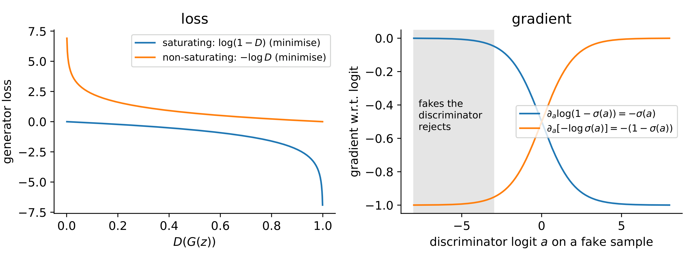
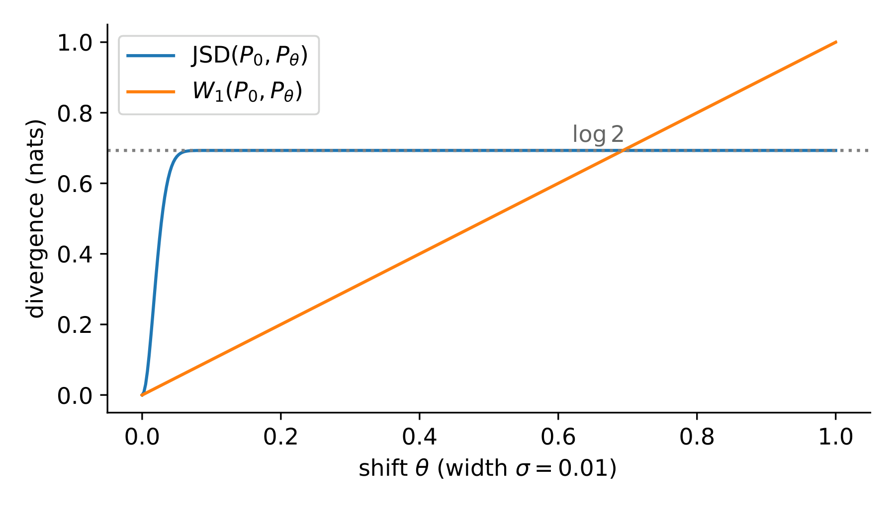

## Overview

A generative adversarial network (GAN) learns to sample from an unknown data
distribution without writing down a likelihood. A generator turns noise into
samples, a discriminator tries to tell those samples from real data, and the
two are trained against each other. The previous lecture introduced
statistical distances and optimal transport; this lecture shows that every
GAN variant is, underneath, a choice of statistical distance between the data
and the model, together with a way of estimating that distance with a neural
network.

The original GAN minimises the Jensen-Shannon divergence (JSD), which gives
no useful gradient when the two distributions do not overlap. Two families of
fixes follow: f-GAN and LS-GAN generalise the divergence, while W-GAN, McGAN
and Geometric GAN replace it by an integral probability metric (IPM). Along
the way we meet the non-saturating loss, mode collapse and InfoGAN.

## Notation

| Symbol | Meaning |
|---|---|
| $x \in \mathcal{X} \subseteq \mathbb{R}^d$ | a data point |
| $P_r$, $p_r$ | data ("real") distribution and its density |
| $z \sim p_z$ | latent noise in $\mathbb{R}^{d_z}$ |
| $G_\theta$, $P_\theta$ or $P_g$, $p_g$ | generator, and the distribution of $G_\theta(z)$ |
| $D(x) \in (0, 1)$ | discriminator (probability that $x$ is real) |
| $f$, $f^*$ | convex function of an f-divergence and its Fenchel conjugate |
| $\Vert f \Vert_L$ | Lipschitz constant of $f$ |
| $\Pi(P, Q)$ | the set of couplings of $P$ and $Q$ |
| $\sigma(a) = 1/(1+e^{-a})$ | logistic sigmoid |

## The GAN minimax game

### The objective

Goodfellow et al. [1] define a two-player game between a generator $G$ and a
discriminator $D$:

$$
\min_G \max_D \; V(D, G)
  = \mathbb{E}_{x \sim p_r}\left[\log D(x)\right]
  + \mathbb{E}_{z \sim p_z}\left[\log\left(1 - D(G(z))\right)\right].
$$ {#eq-gan}

$V$ is the log-likelihood of a binary classifier that labels real samples 1
and generated samples 0. The discriminator maximises it and the generator
minimises it.

![The game of @eq-gan before the algebra. A counterfeiter learns to print
money that a policeman will accept, and the policeman learns to tell the
forgeries from the real notes; neither is given the answer, and each improves
only because the other does. The generator is the counterfeiter and the
discriminator is the policeman. From the course slides
[17].](figures/lec02/slides-gan-game.png){#fig-gan-game width=70%}

 In practice the game is played by alternating stochastic
gradient steps: $k$ ascent steps on the discriminator, then one descent step
on the generator. Writing the second expectation over $x = G(z)$,

$$
V(D, G) = \int_{\mathcal{X}} \Big( p_r(x) \log D(x) + p_g(x) \log\left(1 - D(x)\right) \Big) \, dx .
$$ {#eq-gan-integral}

Writing $p_g$ presumes $P_g$ has a Lebesgue density, and @sec-jsd-saturation argues
the opposite: $P_g$ lives on a $d_z$-dimensional set with $d_z \ll d$, so no
such density exists in exactly the regime we are about to analyse. Nothing
below actually needs one. Take any measure $\rho$ dominating both --- the
mixture $P_r + P_g$ always does --- and read $p_r, p_g$ as the
Radon--Nikodym derivatives $dP_r/d\rho$, $dP_g/d\rho$, with $dx$ replaced by
$d\rho$. Every step through @eq-gan-jsd goes through unchanged, because each
is pointwise in the pair $(p_r, p_g)$. It is the density *notation* that
fails on disjoint supports, not the argument.

### The optimal discriminator

::: {#prp-optimal-d}
## Optimal discriminator
For a fixed generator, the discriminator that maximises @eq-gan-integral is
$$
D^*_G(x) = \frac{p_r(x)}{p_r(x) + p_g(x)}
$$
on the set where $p_r(x) + p_g(x) > 0$.
:::

::: {.proof}
The integrand depends on $D$ only through $y = D(x)$ at the same point, so we
maximise pointwise. For $a = p_r(x) \ge 0$ and $b = p_g(x) \ge 0$, not both
zero, let $h(y) = a \log y + b \log(1 - y)$ on $(0, 1)$. Then
$$
h'(y) = \frac{a}{y} - \frac{b}{1 - y}, \qquad
h''(y) = -\frac{a}{y^2} - \frac{b}{(1-y)^2} < 0 ,
$$
so $h$ is strictly concave and its stationary point $y = a/(a+b)$ is the
maximiser. (If $b = 0$ the supremum is approached as $y \to 1$ but not
attained --- a first hint that disjoint supports cause trouble.)
:::

The assumption doing the work is that $D$ ranges over *all* functions. A
neural discriminator can only approximate $D^*_G$.

### What the generator minimises

Substitute $D^*_G$ into $V$ and write $m = \frac{1}{2}(p_r + p_g)$ for the
mixture. Since $\frac{p_r}{p_r + p_g} = \frac{1}{2} \cdot \frac{p_r}{m}$,

$$
\begin{aligned}
C(G) := \max_D V(D, G)
  &= \mathbb{E}_{p_r}\left[\log \frac{p_r}{p_r + p_g}\right]
   + \mathbb{E}_{p_g}\left[\log \frac{p_g}{p_r + p_g}\right] \\
  &= \mathbb{E}_{p_r}\left[\log \frac{p_r}{m}\right] - \log 2
   + \mathbb{E}_{p_g}\left[\log \frac{p_g}{m}\right] - \log 2 \\
  &= \mathrm{KL}(p_r \,\Vert\, m) + \mathrm{KL}(p_g \,\Vert\, m) - \log 4
   = 2\,\mathrm{JSD}(p_r, p_g) - \log 4 .
\end{aligned}
$$ {#eq-gan-jsd}

::: {#thm-gan-global}
## Global optimum of the GAN game
$C(G) \ge -\log 4$, with equality if and only if $p_g = p_r$. At that point
$D^*_G \equiv 1/2$.
:::

::: {.proof}
$\mathrm{JSD} \ge 0$ with equality iff $p_r = p_g$, since each KL term is zero
iff its argument equals $m$. Plug into @eq-gan-jsd; when $p_g = p_r$,
@prp-optimal-d gives $D^* = 1/2$.
:::

So in the idealised setting the game has the right fixed point. The rest of
the lecture is about why reaching it is hard.

## Why the JSD saturates on disjoint supports {#sec-jsd-saturation}

### The JSD is constant when supports do not overlap

Suppose $P_r$ and $P_g$ are concentrated on disjoint sets $S_r$ and $S_g$.
On $S_r$ we have $p_g = 0$, so $p_r / m = 2$; on $S_g$, $p_g / m = 2$. Hence

$$
\mathrm{KL}(p_r \Vert m) = \mathrm{KL}(p_g \Vert m) = \log 2, \qquad
\mathrm{JSD}(p_r, p_g) = \log 2 ,
$$

and $C(G) = 2 \log 2 - \log 4 = 0$, *however far apart the two sets are*. A
generator one pixel away from the data and one producing pure noise get the
same value, and the gradient of $C$ with respect to $\theta$ is zero.

This is the typical case, not a corner case [2]. Natural images concentrate
near a low-dimensional manifold in $\mathbb{R}^d$, and the generator maps
$\mathbb{R}^{d_z}$ into $\mathbb{R}^d$ with $d_z \ll d$, so $P_g$ also lives
on a low-dimensional set. Two such sets in general position intersect in a
set of measure zero, and then a *perfect discriminator* exists: $D = 1$ on
$S_r$, $D = 0$ on $S_g$.

### What this does to the generator's gradient

Write the discriminator as $D = \sigma(a)$, where $a(x)$ is the logit. By the
chain rule the generator's term in @eq-gan has gradient

$$
\nabla_\theta \log\left(1 - \sigma(a)\right)
  = \frac{\partial \log(1 - \sigma(a))}{\partial a} \, \nabla_\theta a
  = -D(G_\theta(z)) \, \nabla_\theta a(G_\theta(z)).
$$ {#eq-sat-grad}

When the discriminator confidently rejects the fakes, $D(G(z)) \to 0$ and the
factor $-D(G(z))$ kills the gradient, however informative $\nabla_\theta a$
is. The better the discriminator, the less the generator learns; Arjovsky and
Bottou show that the generator gradient goes to zero as $D$ approaches a
perfect discriminator [2, Thm. 2.4]. Training therefore has a narrow window:
too little discriminator training gives a wrong signal, too much gives none.

## The non-saturating loss {#sec-nonsat}

### The heuristic

Goodfellow et al. already proposed a fix [1]: instead of minimising
$\mathbb{E}_z[\log(1 - D(G(z)))]$, the generator minimises

$$
\mathcal{L}_G^{\mathrm{NS}} = -\,\mathbb{E}_{z \sim p_z}\left[\log D(G(z))\right].
$$ {#eq-ns}

Both losses push $D(G(z))$ upwards and share the fixed point $p_g = p_r$, but
their gradients differ. With $D = \sigma(a)$,

$$
\frac{\partial}{\partial a}\left[-\log \sigma(a)\right] = -\left(1 - \sigma(a)\right) \longrightarrow -1
\quad \text{as } D \to 0 ,
$$

so the fakes the discriminator rejects most confidently now receive the
*largest* gradient instead of the smallest (@fig-losses).

{#fig-losses width=95%}

### What the non-saturating loss actually minimises

The non-saturating loss is no longer the minimax game, so which divergence
does it follow? Hold the discriminator at its optimum $D^*$ for the current
generator $\theta_0$ and differentiate with respect to $\theta$ at $\theta_0$,
treating $D^*$ as fixed. Two identities do the work:

$$
\log D^* - \log(1 - D^*) = \log \frac{p_r}{p_g}
\quad\Longrightarrow\quad
-\log D^* = \log \frac{p_g}{p_r} - \log(1 - D^*) ,
$$

and, from @eq-gan-jsd, $\mathbb{E}_{p_r}[\log D^*] + \mathbb{E}_{p_g}[\log(1-D^*)] = 2\,\mathrm{JSD} - \log 4$,
where the first expectation does not depend on $\theta$. Taking
$\mathbb{E}_{p_g}$ of the first identity and differentiating gives
[2, Thm. 2.5]

$$
\nabla_\theta \, \mathbb{E}_{z}\left[-\log D^*(G_\theta(z))\right]
  = \nabla_\theta \left[ \mathrm{KL}(p_g \Vert p_r) - 2\,\mathrm{JSD}(p_r, p_g) \right].
$$ {#eq-ns-kl}

Two remarks. The $-2\,\mathrm{JSD}$ term has the wrong sign: it pushes the
distributions apart. And $\mathrm{KL}(p_g \Vert p_r)$ is the *reverse* KL: it
is infinite if the generator puts mass where there is no data, but costs
almost nothing if the generator ignores part of the data. The non-saturating
loss buys stable gradients at the price of a bias towards dropping modes.

## Mode collapse

Mode collapse is when the generator covers only a few modes of the data even
though each sample may look realistic --- for example, one or two of eight
Gaussians on a circle, or near-duplicate faces in a batch. A dynamic variant
is *mode hopping*: the generator jumps from mode to mode as the discriminator
learns to reject the current one.

Three parts of the objective invite it.

1. **The generator's inner problem.** For a *fixed* discriminator, the
   generator objective $\mathbb{E}_z[-\log D(G(z))]$ is minimised by mapping
   every $z$ to a single point $\arg\max_x D(x)$. @thm-gan-global is about
   $\min_G \max_D$, where the discriminator responds to the generator;
   alternating gradient steps are closer to alternating best responses, and
   the generator's best response to a fixed $D$ *is* a point mass.
2. **The divergence being followed.** By @eq-ns-kl the non-saturating loss
   follows the reverse KL, which is mode-seeking: missing a mode is cheap,
   inventing mass off the data is expensive.
3. **Per-sample judgement.** The discriminator scores samples one at a time,
   so it cannot notice that a whole batch is the same image.

Remedies include minibatch discrimination [3], unrolled GANs [4], and the
IPM-based GANs below, whose gradient does not vanish when the discriminator is
strong. What the first two actually compute, and how collapse is diagnosed, is
in @sec-adv-collapse.

## f-divergences and f-GAN

### f-divergences

::: {#def-fdiv}
## f-divergence
Let $f : (0, \infty) \to \mathbb{R}$ be convex and lower semicontinuous with
$f(1) = 0$. For distributions $P \ll Q$ with densities $p, q$,
$$
D_f(P \Vert Q) = \int_{\mathcal{X}} q(x) \, f\!\left(\frac{p(x)}{q(x)}\right) dx .
$$
:::

By Jensen's inequality, $D_f(P \Vert Q) \ge f\left(\int q \cdot \frac{p}{q}\right) = f(1) = 0$.
Different choices of $f$ give familiar divergences (@tbl-fdiv).

| Divergence | $f(u)$ | $f^*(t)$ | $\operatorname{dom} f^*$ | $g_f(v)$ | $f^*(g_f(v))$ |
|---|---|---|---|---|---|
| KL | $u \log u$ | $e^{t-1}$ | $\mathbb{R}$ | $v$ | $e^{v-1}$ |
| Reverse KL | $-\log u$ | $-1 - \log(-t)$ | $t < 0$ | $-e^{-v}$ | $-1 + v$ |
| Pearson $\chi^2$ | $(u - 1)^2$ | $t + t^2/4$ | $\mathbb{R}$ | $v$ | $v + v^2/4$ |
| Squared Hellinger | $(\sqrt{u} - 1)^2$ | $t / (1 - t)$ | $t < 1$ | $1 - e^{-v}$ | $e^{v} - 1$ |
| Jensen--Shannon | $u \log u - (u+1)\log\frac{u+1}{2}$ | $-\log(2 - e^{t})$ | $t < \log 2$ | $\log 2 - \log(1 + e^{-v})$ | $-\log\bigl(2 - 2\sigma(v)\bigr)$ |
| GAN | $u \log u - (u+1)\log(u+1)$ | $-\log(1 - e^{t})$ | $t < 0$ | $-\log(1 + e^{-v})$ | $-\log\bigl(1 - \sigma(v)\bigr)$ |

: Realisations of the f-GAN, following the lecture [@lecture-slides, p. 59] and
[5]. $\sigma$ is the logistic function, $V_\omega$ the unconstrained critic
and $v = V_\omega(x)$; the last two columns are what an implementation needs,
since $g_f$ is the output activation that lands $V_\omega$ inside
$\operatorname{dom} f^*$. {#tbl-fdiv}

### The Fenchel conjugate and the variational lower bound

The *Fenchel conjugate* of $f$ is $f^*(t) = \sup_{u} \{ut - f(u)\}$. For
convex lower semicontinuous $f$ the Fenchel-Moreau theorem gives $f^{**} = f$:

$$
f(u) = \sup_{t \in \mathrm{dom} f^*} \{ tu - f^*(t) \}.
$$ {#eq-fenchel}

To compute a conjugate, solve $f'(u) = t$ for $u$ and substitute. For the GAN
row: $f'(u) = \log\frac{2u}{u+1} = t$, which requires $e^{t} < 2$ and gives
$u = e^{t}/(2 - e^{t})$. At this $u$ the generator is
$f(u) = ut - \log\frac{u+1}{2}$, so
$f^*(t) = ut - f(u) = \log\frac{u+1}{2} = -\log(2 - e^{t})$. For Pearson,
$2(u-1) = t$ gives $u = 1 + t/2$ and $f^*(t) = t + t^2/4$.

Now insert @eq-fenchel into @def-fdiv, choosing $t = T(x)$ separately at each
point:

$$
\begin{aligned}
D_f(P \Vert Q)
  &= \int q(x) \sup_{t} \left\{ t \, \frac{p(x)}{q(x)} - f^*(t) \right\} dx \\
  &\ge \sup_{T \in \mathcal{T}} \Big( \mathbb{E}_{x \sim P}[T(x)] - \mathbb{E}_{x \sim Q}[f^*(T(x))] \Big).
\end{aligned}
$$ {#eq-fgan-bound}

The inequality comes only from restricting $T$ to a class $\mathcal{T}$ (a
neural network family); over all measurable $T$ it is an equality [6], attained
at $T^*(x) = f'(p(x)/q(x))$, where the supremum in @eq-fenchel is reached.
The right-hand side involves only *expectations*, so it can be estimated from
samples without knowing either density. That is what makes it usable for a
GAN.

![Both halves of the variational bound, for the Kullback--Leibler generator
$f(u) = u\log u$. Left: @eq-fenchel at a single point --- the supporting line
of slope $t$ touches the graph exactly at the density ratio $u$ for which
$t = f'(u)$, which is the equality case of the Fenchel--Young inequality and
the reason $T^*(x) = f'(p(x)/q(x))$ is optimal. Right: on a two-point example,
the objective of @eq-fgan-bound plotted against a one-parameter family of test
functions $T_\alpha$; it rises to the divergence itself and no
further.](figures/lec02/lhk6565-fenchel.png){#fig-fenchel width=95%}

### f-GAN as the general recipe

Nowozin, Cseke and Tomioka [5] take $P = P_r$, $Q = P_\theta$ and turn
@eq-fgan-bound into a game:

$$
\min_\theta \max_\omega \; F(\theta, \omega)
  = \mathbb{E}_{x \sim P_r}\left[g_f(V_\omega(x))\right]
  - \mathbb{E}_{x \sim P_\theta}\left[f^*\!\left(g_f(V_\omega(x))\right)\right],
$$ {#eq-fgan}

where $V_\omega$ is an unconstrained network and $g_f$ is an output activation
mapping $\mathbb{R}$ into the domain of $f^*$ (for KL and Pearson,
$g_f(v) = v$; for reverse KL, $g_f(v) = -e^{-v}$).

**The original GAN, via the normalised generator.** Taking the
Jensen--Shannon row of @tbl-fdiv, its conjugate needs
$t < \log 2$, so take $g_f(v) = \log 2 + \log \sigma(v) = \log\big(2\sigma(v)\big)$.
Writing $D(x) = \sigma(V_\omega(x))$ gives $T = \log(2D)$ and
$f^*(T) = -\log(2 - 2D) = -\log 2 - \log(1 - D)$, so

$$
F(\theta, \omega) = \mathbb{E}_{P_r}[\log D(x)] + \mathbb{E}_{P_\theta}[\log(1 - D(x))] + \log 4
  = V(D, G) + \log 4 ,
$$

which is @eq-gan shifted by a constant --- and it is the same constant that
@eq-gan-jsd carries, since $D_{f_{\mathrm{GAN}}} = 2\,\mathrm{JSD} = C(G) + \log 4$.
Maximising over $\omega$ and minimising over $\theta$ is therefore the same
problem as @eq-gan.

A word on that constant, because it is why @tbl-fdiv carries two rows that
look like the same thing. The **GAN** row uses
$u \log u - (u+1)\log(u+1)$, which is what the f-GAN paper and the lecture
both use [@lecture-slides, pp. 56--59], and it reproduces @eq-gan on the nose:
$g_f(v) = -\log(1+e^{-v})$ gives $f^*(g_f(v)) = -\log(1 - \sigma(v))$, and the
variational objective is exactly $\mathbb{E}_{P_r}[\log D] +
\mathbb{E}_{P_\theta}[\log(1-D)]$ with $D = \sigma(V_\omega)$, with no
constant to carry. That is its convenience and it is the reason to prefer it
when deriving the original GAN.

What it is not is an f-divergence in the sense of @def-fdiv, because
$f(1) = -\log 4 \ne 0$. The Jensen argument above does not apply to it, and
the quantity it generates is $2\,\mathrm{JSD} - \log 4$, which is negative
whenever the two distributions are close. A reader who takes @def-fdiv
seriously would conclude that the GAN divergence is non-negative, and it is
not. The **Jensen--Shannon** row is the same generator normalised so that
$f(1) = 0$; it costs the $\log 4$ and buys back non-negativity. This is the
same normalisation clash as the factor of two in @prp-js-generator of the
previous chapter, and the honest thing is to carry both and say which one is
being used.

So the original GAN is not special: *any* f-divergence gives a GAN. The price
is that every f-divergence depends only on the density ratio, so it cannot see
how far apart two disjoint supports are, and the saturation problem is not
solved within this family. How @eq-fgan is optimised in practice, and what
changes when $f$ changes, is in @sec-adv-fgan.

## LS-GAN and the Pearson chi-squared divergence

### The least-squares objective

Mao et al. [7] replace the log loss by squared error against target labels
$a$ (fake), $b$ (real) and $c$ (what the generator wants the discriminator to
say about its samples):

$$
\begin{aligned}
\min_D \; & \tfrac{1}{2}\,\mathbb{E}_{x \sim p_r}\left[(D(x) - b)^2\right]
   + \tfrac{1}{2}\,\mathbb{E}_{z \sim p_z}\left[(D(G(z)) - a)^2\right], \\
\min_G \; & \tfrac{1}{2}\,\mathbb{E}_{z \sim p_z}\left[(D(G(z)) - c)^2\right].
\end{aligned}
$$ {#eq-lsgan}

Here $D$ has a linear output. With the sigmoid cross-entropy loss, a fake
sample already on the "real" side of the decision boundary gives almost no
gradient even if it is far from the data. The squared loss keeps penalising
it in proportion to its distance from the target, so gradients do not vanish.

### The optimal discriminator and the divergence

Pointwise, $D$ minimises $p_r(x)(D - b)^2 + p_g(x)(D - a)^2$, a convex
quadratic whose minimiser is

$$
D^*(x) = \frac{b\,p_r(x) + a\,p_g(x)}{p_r(x) + p_g(x)} .
$$

Add to the generator objective the term $\tfrac{1}{2}\mathbb{E}_{p_r}[(D(x) - c)^2]$,
which does not depend on $G$. With $D = D^*$,

$$
2\,C(G) = \int \left(p_r + p_g\right)\left(D^* - c\right)^2 dx
        = \int \frac{\left((b - c)\,p_r + (a - c)\,p_g\right)^2}{p_r + p_g}\, dx .
$$

Choose the labels so that $b - c = 1$ and $b - a = 2$ (hence $a - c = -1$),
e.g. $a = -1$, $b = 1$, $c = 0$. The numerator becomes
$(p_r - p_g)^2 = \big(2p_g - (p_r + p_g)\big)^2$ and

$$
2\,C(G) = \int \frac{\big(2 p_g(x) - (p_r(x) + p_g(x))\big)^2}{p_r(x) + p_g(x)}\, dx
        = \chi^2_{\mathrm{Pearson}}\big(2 p_g \,\Vert\, p_r + p_g\big),
$$ {#eq-lsgan-chi2}

with $\chi^2_{\mathrm{Pearson}}(P \Vert Q) = \int (p - q)^2 / q$, the
f-divergence with $f(u) = (u-1)^2$. It is zero iff $p_g = p_r$. (Mao et al.
write the arguments in the opposite order; the integral is the same.) The
popular choice $a = 0$, $b = c = 1$ does not satisfy the two conditions but
behaves similarly in practice [7]. LS-GAN therefore minimises a Pearson
$\chi^2$-type divergence, which places it in the f-divergence family.

## DCGAN: the architecture that made it train

Everything so far has been about the objective. None of it says what $G$ and
$D$ should be, and for the first two years after @eq-gan that was the binding
constraint: the objective was right and the models would not converge. DCGAN
[@dcgan] is the paper that settled the architecture, and it is worth a section
because every model in the rest of this chapter and the next is built on it.

### The generator

![The DCGAN generator. A 100-dimensional uniform $z$ is projected and reshaped to a $4\times4\times1024$ tensor, then four fractionally-strided convolutions take it to $64\times64\times3$. There is no fully connected layer after the projection and no pooling anywhere. From [@dcgan, Fig. 1]; the lecture slides reproduce it at [@lecture-slides, p. 64].](figures/lec02/dcgan-architecture.png){#fig-dcgan-arch width=85%}

@fig-dcgan-arch is the whole design. Spatial resolution doubles at each step
while the channel count halves, so the tensor is reshaped from deep and small
to shallow and large by learned upsampling rather than by interpolation.

### Five rules

The paper's contribution is not one architecture but a set of constraints that
made the family trainable [@dcgan]:

1. Replace pooling with **strided convolutions** in the discriminator and
   **fractionally-strided convolutions** in the generator, so the network
   learns its own downsampling and upsampling.
2. Use **batch normalisation** in both networks.
3. Remove **fully connected hidden layers** in deeper architectures.
4. In the generator use **ReLU** everywhere except the output, which uses
   **tanh**.
5. In the discriminator use **LeakyReLU** everywhere.

Rules 1 and 3 are the same idea twice: take out the layers that do not
respect spatial structure. Rule 2 is the one that interacts with the theory of
this chapter. Batch normalisation keeps activations in a range where the
discriminator's gradient is informative, which attacks the saturation of
@sec-jsd-saturation from the architecture side rather than from the loss side
--- the non-saturating loss of @sec-nonsat and the Wasserstein critic of
@sec-wgan are the two loss-side attacks on the same problem. Rules 4
and 5 are of a piece with it: a generator ReLU can output zero gradient on a
whole half-space, and in the discriminator, where the gradient is the signal
passed back to $G$, the leak is what keeps it alive.

Not every rule survived. Batch normalisation in the discriminator is now
usually replaced, because it couples the examples in a minibatch and the
gradient penalty of @sec-wgan-gp is defined per example; the usual substitutes
are layer or instance normalisation, which @sec-normalization of the next
chapter treats properly.

### What the latent space turned out to be

![Vector arithmetic in the latent space. In each block, three samples of a visual concept are averaged in $z$, the averages are combined, and the result is decoded. The bottom two rows do the same arithmetic on pixels instead, which produces superpositions rather than faces. From [@dcgan, Fig. 7]; the lecture slides show the first block at [@lecture-slides, p. 66].](figures/lec02/dcgan-vector-arithmetic.png){#fig-dcgan-arithmetic width=55%}

The result in @fig-dcgan-arithmetic was not designed for and is the reason
DCGAN is remembered. Averaging the $z$ vectors of smiling women, subtracting
the average for neutral women, adding the average for neutral men, and
decoding gives smiling men. Nothing in @eq-gan asks for this: the objective
constrains the push-forward $\mu_\theta = G_{\theta\#}\nu$ as a distribution
and says nothing about how $G_\theta$ arranges the latent space internally.

The bottom rows are the control, and they are what makes the claim
non-trivial. The same arithmetic in pixel space gives ghosted overlays,
because pixels have no such structure. So the linear structure is something
the generator built, not something the data has.

This is the first appearance of a question the next two chapters are about.
If directions in $z$ carry meaning, can they be made to carry *chosen*
meanings? InfoGAN below answers by adding a term that rewards it;
@sec-generators in the next chapter answers by changing where the latent code
enters the network; and the $\beta$-VAE of @sec-beta-vae answers by pricing
the information the code may carry.

## InfoGAN

### The mutual information term

A standard GAN is free to use its latent vector in an entangled way. InfoGAN
[8] splits the input into noise $z$ and a *latent code* $c$ with a known,
factored prior (for MNIST: one 10-way categorical code and two continuous
codes, uniform on $[-1, 1]$), and asks that the code be recoverable from the
output:

$$
\min_G \max_D \; V(D, G) - \lambda\, I\big(c;\, G(z, c)\big).
$$ {#eq-infogan}

### The variational lower bound

$I(c; x) = H(c) - H(c \mid x)$ needs the posterior $P(c \mid x)$, which is
intractable. Introduce an auxiliary distribution $Q(c \mid x)$:

$$
\begin{aligned}
-H(c \mid x) &= \mathbb{E}_{x}\,\mathbb{E}_{c' \sim P(c \mid x)}\left[\log P(c' \mid x)\right] \\
 &= \mathbb{E}_{x}\Big[ \mathrm{KL}\big(P(\cdot \mid x) \,\Vert\, Q(\cdot \mid x)\big)
     + \mathbb{E}_{c' \sim P(c \mid x)}\left[\log Q(c' \mid x)\right] \Big] \\
 &\ge \mathbb{E}_{x}\,\mathbb{E}_{c' \sim P(c \mid x)}\left[\log Q(c' \mid x)\right],
\end{aligned}
$$

because the KL term is non-negative. The remaining expectation still samples
from the posterior, but it does not have to: the pair $(c', x)$ with
$x \sim P_G$, $c' \sim P(c \mid x)$ has the same joint law as $(c, x)$ with
$c \sim p(c)$, $x = G(z, c)$. Hence

$$
I(c; G(z, c)) \;\ge\; L_I(G, Q) := \mathbb{E}_{c \sim p(c),\, z \sim p_z}\left[\log Q\big(c \mid G(z, c)\big)\right] + H(c),
$$ {#eq-infogan-li}

which only needs samples from the prior. The bound is tight when $Q$ equals
the true posterior, and InfoGAN solves
$\min_{G, Q} \max_D V(D, G) - \lambda L_I(G, Q)$. $Q$ is a small head on the
discriminator's convolutional trunk, so the extra cost is negligible; for a
categorical code $\log Q$ is a cross-entropy, for a continuous code a
Gaussian $Q$ gives a squared error.

### What the codes actually disentangle

On MNIST the categorical code aligns with digit class (about 5% error as an
unsupervised classifier) and the continuous codes with rotation and stroke
width [8].

![What the InfoGAN term buys, on MNIST. Each row fixes the noise $z$ and
sweeps one latent code across its range. (a) In InfoGAN the categorical code
moves along the digit classes, and the sweep is a clean change of one factor.
(b) In a plain GAN the same coordinate of the latent vector has no such
meaning, and the sweep wanders. This is the latent traversal that
@sec-adv-infogan describes as the standard of evidence for a disentangled
code. From the course slides [17], after Chen et al.
[8].](figures/lec02/slides-infogan-mnist.png){#fig-infogan-mnist width=95%}

 Mutual information is invariant under invertible reparametrisations
of $c$, though, so the objective alone does not decide *which* factor a code
captures; that comes from the prior, the architecture and the data. The other
datasets, and how $\lambda$ and the continuous-code head are set, are in
@sec-adv-infogan.

## W-GAN {#sec-wgan}

### The Wasserstein-1 distance

From the previous lecture, the Wasserstein-1 (earth mover's) distance is

$$
W_1(P, Q) = \inf_{\gamma \in \Pi(P, Q)} \mathbb{E}_{(x, y) \sim \gamma}\left[\Vert x - y \Vert\right],
$$ {#eq-w1}

the cheapest cost of moving the mass of $P$ onto $Q$. Unlike an f-divergence,
it looks at *where* the mass is, not only at density ratios: on two disjoint
supports $W_1$ grows with the gap while the JSD is stuck at $\log 2$ (see the
worked example).

::: {#thm-w1-continuity}
## Continuity of W1 in the generator parameters
Let $P_\theta$ be the law of $G_\theta(z)$. If
$\mathbb{E}_z \Vert G_\theta(z) - G_{\theta'}(z) \Vert \to 0$ as $\theta' \to \theta$,
then $\theta \mapsto W_1(P_r, P_\theta)$ is continuous. If moreover $G_\theta$
is locally Lipschitz in $\theta$ with an integrable constant, it is Lipschitz
and hence differentiable almost everywhere [9, Thm. 1].
:::

::: {.proof}
Using the same $z$ for both generators defines a coupling of $P_\theta$ and
$P_{\theta'}$, so $W_1(P_\theta, P_{\theta'}) \le \mathbb{E}_z \Vert G_\theta(z) - G_{\theta'}(z) \Vert$.
By the triangle inequality,
$\vert W_1(P_r, P_\theta) - W_1(P_r, P_{\theta'}) \vert \le W_1(P_\theta, P_{\theta'}) \to 0$.
Under the Lipschitz assumption the same bound is at most
$\mathbb{E}_z[L(\theta, z)]\,\Vert \theta - \theta' \Vert$, and Rademacher's
theorem gives differentiability almost everywhere.
:::

Neither statement holds for the JSD or the KL: in the worked example both jump
at $\theta = 0$.

### Kantorovich-Rubinstein duality

@eq-w1 is an infimum over couplings, which we cannot optimise with samples.
Its dual is a supremum over functions:

::: {#thm-kr}
## Kantorovich-Rubinstein duality
For $P, Q$ with finite first moments,
$$
W_1(P, Q) = \sup_{\Vert f \Vert_L \le 1} \Big( \mathbb{E}_{x \sim P}[f(x)] - \mathbb{E}_{y \sim Q}[f(y)] \Big).
$$
:::

::: {.proof}
*Weak duality.* For any coupling $\gamma$ and any 1-Lipschitz $f$,
$$
\mathbb{E}_P[f] - \mathbb{E}_Q[f] = \mathbb{E}_{(x, y) \sim \gamma}\left[f(x) - f(y)\right]
\le \mathbb{E}_{\gamma}\left[\Vert x - y \Vert\right].
$$
Take the sup over $f$ on the left and the inf over $\gamma$ on the right.

*Why the dual has this form.* The general Kantorovich dual is
$\sup \{ \mathbb{E}_P[\varphi] + \mathbb{E}_Q[\psi] : \varphi(x) + \psi(y) \le \Vert x - y \Vert \}$.
For a given $\varphi$ the best $\psi$ is the $c$-transform
$\varphi^c(y) = \inf_x [\Vert x - y \Vert - \varphi(x)]$, which is 1-Lipschitz.
Replacing $\varphi$ by $\varphi^{cc}$ (also 1-Lipschitz) never lowers the
objective, so we may take $\varphi = u$ 1-Lipschitz. For such $u$, $u^c(y) \le -u(y)$
(take $x = y$) and $u^c(y) \ge -u(y)$ (since $u(x) - u(y) \le \Vert x - y \Vert$),
so $u^c = -u$ and the dual becomes $\sup_{\Vert u \Vert_L \le 1} \mathbb{E}_P[u] - \mathbb{E}_Q[u]$.
Equality with the primal is Kantorovich duality [10, Thm. 5.10].
:::

### The W-GAN objective

Arjovsky, Chintala and Bottou [9] parametrise $f$ by a network $f_w$, the
*critic*, constrained to be $K$-Lipschitz:

$$
\min_\theta \max_{w : \Vert f_w \Vert_L \le K}\;
  \mathbb{E}_{x \sim P_r}[f_w(x)] - \mathbb{E}_{z \sim p_z}[f_w(G_\theta(z))].
$$ {#eq-wgan}

If the family is rich enough, the inner maximum is $K \cdot W_1(P_r, P_\theta)$.
There is no log and no sigmoid: the critic outputs a real score, not a
probability. Under the assumptions of @thm-w1-continuity [9, Thm. 3],

$$
\nabla_\theta W_1(P_r, P_\theta) = -\,\mathbb{E}_{z \sim p_z}\left[\nabla_\theta f^{\mathrm{opt}}(G_\theta(z))\right],
$$

where $f^{\mathrm{opt}}$ is an optimal critic. This is the key difference from
the original GAN. There, an optimal discriminator gives the gradient of a
saturated JSD, which vanishes on disjoint supports (@eq-sat-grad). Here, an
optimal critic gives *exactly* the gradient of $W_1$, which is informative
everywhere. So **the critic may, and should, be trained to optimality**. In
practice W-GAN runs 5 critic steps per generator step, and the authors report
no mode collapse in their experiments.

## Enforcing the Lipschitz constraint

@eq-wgan needs $\Vert f_w \Vert_L \le K$, which a plain network does not
satisfy. Three ways of enforcing it follow.

### Weight clipping

The original W-GAN clips every weight to $[-c, c]$ after each update, with
$c = 0.01$. The parameter set is then compact, so every $f_w$ is
$K$-Lipschitz for some $K$. The authors call this "a clearly terrible way" to
enforce the constraint [9], and Gulrajani et al. [11] document why:

- **Capacity underuse.** Most weights end up at $\pm c$, so the critic
  learns very simple functions.
- **Exploding or vanishing gradients.** Slightly too large a $c$ explodes the
  gradient, slightly too small makes it vanish.

@sec-adv-clipping describes the evidence behind both.

### WGAN-GP: the gradient penalty {#sec-wgan-gp}

The idea of [11] starts from a property of the optimal critic.

::: {#prp-grad-norm}
## Optimal critics have unit gradient on transport paths
Let $f^{\mathrm{opt}}$ be an optimal critic and $\gamma^*$ an optimal coupling.
Then $f^{\mathrm{opt}}(x) - f^{\mathrm{opt}}(y) = \Vert x - y \Vert$ for $\gamma^*$-almost every pair,
and wherever $f^{\mathrm{opt}}$ is differentiable at $x_t = t x + (1 - t) y$,
$\Vert \nabla f^{\mathrm{opt}}(x_t) \Vert = 1$.
:::

::: {.proof}
By strong duality $\mathbb{E}_{\gamma^*}[\Vert x - y \Vert - (f^{\mathrm{opt}}(x) - f^{\mathrm{opt}}(y))] = 0$,
and the integrand is non-negative by the Lipschitz property, so it vanishes
almost surely. A 1-Lipschitz function that rises by exactly $\Vert x - y \Vert$
along a segment of that length must rise at unit rate throughout, so its
directional derivative along $(x - y)/\Vert x - y \Vert$ is 1; since the
gradient norm is at most 1, it equals 1.
:::

So instead of constraining weights, penalise the critic's gradient norm where
it matters, on points between real and generated samples:

$$
L_{\mathrm{critic}} = \mathbb{E}_{\tilde{x} \sim P_\theta}\left[f_w(\tilde{x})\right]
  - \mathbb{E}_{x \sim P_r}\left[f_w(x)\right]
  + \lambda \, \mathbb{E}_{\hat{x}}\left[\left(\Vert \nabla_{\hat{x}} f_w(\hat{x}) \Vert_2 - 1\right)^2\right],
$$ {#eq-wgan-gp}

with $\hat{x} = \epsilon x + (1 - \epsilon)\tilde{x}$, $\epsilon \sim U[0, 1]$,
and $\lambda = 10$. The penalty is two-sided (it also pushes norms up to 1)
and soft, and it is enforced only on the sampled lines, not everywhere.
Because it is per-sample, the critic uses layer normalisation instead of
batch normalisation.

### Spectral normalisation

Miyato et al. [12] bound the Lipschitz constant through the layers. For
$f = h_L \circ \cdots \circ h_1$, $\Vert f \Vert_L \le \prod_l \Vert h_l \Vert_L$.
A linear layer $h(x) = Wx + b$ has $\Vert h \Vert_L = \sigma_{\max}(W)$, the
spectral norm, and ReLU is 1-Lipschitz. Normalising every weight matrix,

$$
\bar{W} = \frac{W}{\sigma_{\max}(W)},
$$ {#eq-sn}

therefore gives $\Vert f \Vert_L \le 1$. Instead of computing $\sigma_{\max}$
exactly, one step of power iteration per update, with a persistent vector
$u$, suffices because $W$ changes slowly:

$$
v \leftarrow \frac{W^\top u}{\Vert W^\top u \Vert_2}, \qquad
u \leftarrow \frac{W v}{\Vert W v \Vert_2}, \qquad
\sigma_{\max}(W) \approx u^\top W v .
$$

Unlike clipping it keeps capacity, and unlike the gradient penalty it costs
almost nothing. It is usually combined with the hinge loss of Geometric GAN.
How tight the bound is, what is done for convolutional layers, and why the
normalised layer behaves differently from a clipped one are in @sec-adv-sn.

## McGAN: mean and covariance feature matching

### Integral probability metrics

W-GAN is one member of a larger family.

::: {#def-ipm-gan}
## Integral probability metric
For a class $\mathcal{F}$ of real functions on $\mathcal{X}$,
$$
d_{\mathcal{F}}(P, Q) = \sup_{f \in \mathcal{F}} \Big\vert \mathbb{E}_P[f(x)] - \mathbb{E}_Q[f(x)] \Big\vert .
$$
:::

The 1-Lipschitz class gives $W_1$ (@thm-kr); $\{\Vert f \Vert_\infty \le 1\}$
gives twice the total variation; the unit ball of a reproducing kernel Hilbert
space gives the maximum mean discrepancy. IPMs compare *expectations* of test
functions, so they involve no density ratios and stay finite and informative
on disjoint supports.

### Mean matching

Mroueh, Sercu and Goel [13] choose functions linear on top of a learned
feature map $\Phi_\omega : \mathcal{X} \to \mathbb{R}^m$:

$$
\mathcal{F}_{v, \omega} = \left\{ f(x) = \langle v, \Phi_\omega(x) \rangle \; : \; \Vert v \Vert_p \le 1 \right\}.
$$

![The McGAN critic as a picture. Real samples $x_i$ and generated samples
$g_\theta(z_i)$ both pass through the same learned feature map $\Phi_\zeta$,
and what compares them is a linear classifier on top of those features. The
critic's freedom is therefore split in two: the feature map chooses the space,
and the linear layer chooses the direction in it. From the course slides [17],
after Mroueh et al. [13].](figures/lec02/slides-mcgan-arch.png){#fig-mcgan-arch width=85%}


With $\mu_\omega(P) = \mathbb{E}_{x \sim P}[\Phi_\omega(x)]$, linearity and the
definition of the dual norm ($1/p + 1/q = 1$) give

$$
d_{\mathcal{F}}(P, Q) = \sup_\omega \sup_{\Vert v \Vert_p \le 1} \langle v, \mu_\omega(P) - \mu_\omega(Q) \rangle
  = \sup_\omega \Vert \mu_\omega(P) - \mu_\omega(Q) \Vert_q .
$$ {#eq-mcgan-mean}

The critic finds a feature space in which the two means differ most; the
generator matches the means there ($\Phi_\omega$ is kept bounded by clipping
$\omega$).

![Why @eq-mcgan-mean is called mean feature matching. The two clouds are the
features of real and generated samples; the filled circle and the cross are
their means. The separating hyperplane is normal to the difference of the
means, so the discriminator's update rotates that normal to separate the
clouds further, and the generator's update pushes its own mean along the
normal towards the real one. Both players act on the same vector, from
opposite ends. From the course slides [17], after Mroueh et al. [13, Fig.
2].](figures/lec02/slides-mcgan-geometry.png){#fig-mcgan-geometry width=80%}

 A W-GAN critic whose last layer is linear, $f(x) = \langle v, \Phi_\omega(x) \rangle$,
with $v$ clipped to $[-c, c]$, is exactly mean matching with $p = \infty$,
i.e. the $\ell_1$ distance between feature means. The two are IPMs of the same
form and differ only in the function class.

### Covariance matching

Mean matching ignores second-order structure. McGAN adds
$f(x) = \langle u, \Phi_\omega(x) \rangle \langle v, \Phi_\omega(x) \rangle = u^\top \Phi_\omega(x) \Phi_\omega(x)^\top v$
for unit vectors $u, v$. With the uncentred covariance
$\Sigma_\omega(P) = \mathbb{E}_P[\Phi_\omega(x)\Phi_\omega(x)^\top]$,

$$
\sup_{\Vert u \Vert = \Vert v \Vert = 1} u^\top \big(\Sigma_\omega(P) - \Sigma_\omega(Q)\big) v
  = \sigma_{\max}\big(\Sigma_\omega(P) - \Sigma_\omega(Q)\big),
$$ {#eq-mcgan-cov}

the largest singular value of the difference. Using $k$ orthonormal pairs
instead gives the sum of the top $k$ singular values. The generator then
matches the leading directions of the feature covariance [13]. @eq-mcgan-mean
and @eq-mcgan-cov are what is being estimated, not what is coded;
@sec-adv-mcgan writes the trained objective down.

## Geometric GAN

### The discriminator as a separating hyperplane

Lim and Ye [14] also write the critic as linear in features,
$f(x) = \langle w, \Phi_\zeta(x) \rangle + b$, and observe that separating real
from fake features is a *linear classification problem in feature space*. The
best-understood linear classifier is the support vector machine. The
soft-margin SVM on real features (label $+1$) and fake features (label $-1$)
solves

$$
\min_{w, b} \; \frac{1}{2} \Vert w \Vert^2
  + C \sum_i \max\big(0,\, 1 - f(x_i)\big)
  + C \sum_j \max\big(0,\, 1 + f(G(z_j))\big).
$$ {#eq-svm}

The hinge terms are zero for samples beyond the margin on their own side;
only samples inside the margin or misclassified (the *support vectors*)
contribute.

![The hinge, drawn. The loss is zero once a sample is correctly classified by
a margin of one, and falls linearly as the score moves the wrong way. That
flat region is what makes @eq-hinge-d depend only on the support vectors: a
sample comfortably on its own side contributes no gradient at all. From the
course slides [17].](figures/lec02/slides-hinge-loss.png){#fig-hinge width=70%}

 Dropping the $\tfrac{1}{2}\Vert w \Vert^{2}$ term is not a
normalisation identity, and it is worth being explicit about what replaces it:
without a bound on $\Vert w \Vert$ the hinge loss below can be driven down by
rescaling $w$, and with it the margin interpretation. Lim and Ye instead fix
the scale, taking $\Vert w \Vert = 1$ or constraining the trunk
$\Phi_\zeta$ --- in practice by the spectral normalisation of @eq-sn, which is
why the two are almost always used together. Under that constraint the
regulariser is a constant and the discriminator minimises the hinge loss

$$
L_D = \mathbb{E}_{x \sim p_r}\left[\max\big(0, 1 - f(x)\big)\right]
    + \mathbb{E}_{z \sim p_z}\left[\max\big(0, 1 + f(G(z))\big)\right].
$$ {#eq-hinge-d}

### What the generator does to the hyperplane

The decision boundary is the hyperplane $\langle w, \phi \rangle + b = 0$ in
feature space, with normal vector $w$. The generator minimises
$L_G = -\mathbb{E}_{z}[f(G(z))]$, whose gradient with respect to a fake
sample is $\nabla_x f = J_{\Phi}(x)^\top w$: the generator moves its features
along the normal of the hyperplane, towards the real side. Training
alternates between (i) fitting the maximum-margin hyperplane between real and
fake features and (ii) pushing the fake features across it. By SVM duality,
$w = \sum_i \alpha_i \Phi(x_i) - \sum_j \beta_j \Phi(G(z_j))$ with
$\alpha_i, \beta_j$ nonzero only on support vectors. Compare McGAN, whose
direction $\mu_\omega(P) - \mu_\omega(Q)$ averages *all* samples: Geometric
GAN uses only the *hard* samples near the boundary. Lim and Ye analyse the
equilibrium of the resulting game in [14]; @sec-adv-geometric states what
they prove and what it assumes.

![Both players, in feature space. The solid line is the decision boundary
$\langle w, \Phi_\zeta(x)\rangle + b = 0$ and the dashed lines the margin at
$\pm 1$; circles are real features and crosses generated ones, and the shaded
band holds the support vectors $\mathcal{M}$ --- the only samples that
contribute to @eq-hinge-d, since the hinge is flat outside it (@fig-hinge).
The discriminator's step (red) moves the hyperplane to separate the two
clouds; the generator's step (blue) moves its features along the normal $w$
towards the real side, and its direction is set by the sums over
$\mathcal{M}$ alone, not over every sample. Compare @fig-mcgan-geometry,
where the same normal is the difference of *all* the feature means. From the
course slides [17], after Lim and Ye
[14].](figures/lec02/slides-geometric-gan-margin.png){#fig-margin width=80%}

### Which distance the hinge discriminator estimates

Pointwise, the discriminator minimises $p_r \max(0, 1 - t) + p_g \max(0, 1 + t)$
over $t = f(x)$. This is piecewise linear with slope $-p_r$ for $t < -1$,
$p_g - p_r$ on $[-1, 1]$ and $p_g$ for $t > 1$, so the minimum is at $t = 1$
if $p_r > p_g$ and at $t = -1$ otherwise, with value $2\min(p_r, p_g)$. Using
$2\min(a, b) = a + b - \vert a - b \vert$,

$$
\min_f L_D = \int 2\min\big(p_r, p_g\big)\, dx = 2 - \int \vert p_r - p_g \vert\, dx
  = 2\big(1 - \mathrm{TV}(p_r, p_g)\big).
$$

So an unconstrained hinge discriminator measures the total variation
distance. With a Lipschitz-constrained critic the loss behaves more like an
IPM. The hinge loss with spectral normalisation became the default in later
large-scale GANs.

## What the critic's loss does and does not tell you

**Standard GAN.** The discriminator is never optimal, and the JSD saturates
anyway, so its loss is not a measure of sample quality: a falling generator
loss can mean a better generator or a weaker discriminator.

**W-GAN.** If the critic is near-optimal and $K$-Lipschitz, the negative
critic loss (without the penalty) estimates $K \cdot W_1(P_r, P_\theta)$,
which is continuous in $\theta$ (@thm-w1-continuity). Arjovsky et al. show
that it decreases steadily as samples improve and correlates with visual
quality [9], which makes it useful for debugging.

**What it does not tell you.**

- *It is only a lower bound within the critic's class.* Arora et al. [15]
  show that a generator with small support can nearly fool a finite-capacity
  critic, so a small value does not certify diversity.
- *Its scale is arbitrary.* It depends on $K$ --- the clipping constant,
  $\lambda$ or the architecture --- so it cannot be compared across models or
  runs.
- *It is not perceptual.* $W_1$ with the Euclidean cost measures pixel
  distances, which do not match human judgement.

In practice samples are also compared with external metrics. The most common,
the Frechet Inception Distance [16],
$\mathrm{FID} = \Vert \mu_1 - \mu_2 \Vert_2^2 + \mathrm{Tr}\big(\Sigma_1 + \Sigma_2 - 2(\Sigma_1 \Sigma_2)^{1/2}\big)$,
is the squared Wasserstein-2 distance between Gaussians fitted to Inception features:
the same idea as McGAN, but with a fixed rather than learned feature map.

## Worked example: JSD versus W1 on disjoint supports

Let $P_0$ and $P_\theta$ be two narrow Gaussians of width $\sigma = 0.01$
centred at $0$ (the data) and at $\theta$ (a one-parameter generator). They
approximate the point masses $\delta_0$ and $\delta_\theta$, whose supports
are disjoint for $\theta \ne 0$. For the point masses everything can be
computed by hand:

- $\mathrm{JSD}(\delta_0, \delta_\theta) = \log 2 \approx 0.6931$ for every
  $\theta \ne 0$, so $C(G) = 2\,\mathrm{JSD} - \log 4$ is $0$ everywhere
  except at the optimum, where it jumps to $-\log 4$. Its derivative is zero
  wherever it exists.
- $W_1(\delta_0, \delta_\theta) = \vert \theta \vert$: the only coupling moves
  all the mass a distance $\vert \theta \vert$. Its derivative is
  $\mathrm{sign}(\theta)$, so a gradient step on $\theta$ always moves
  towards the data.
- An optimal critic is $f^{\mathrm{opt}}(x) = -x\,\mathrm{sign}(\theta)$, whose
  gradient norm is 1 on the segment, as @prp-grad-norm says.

The code below checks this with the narrow Gaussians, using the fact that in
one dimension $W_1(P, Q) = \int \vert F_P(x) - F_Q(x) \vert\, dx$ for the
cumulative distribution functions.

```{.python}
import numpy as np

def densities(theta, sigma, grid):
    p = np.exp(-0.5 * (grid / sigma) ** 2)
    q = np.exp(-0.5 * ((grid - theta) / sigma) ** 2)
    dx = grid[1] - grid[0]
    return p / (p.sum() * dx), q / (q.sum() * dx), dx

def jsd(p, q, dx):
    m = 0.5 * (p + q)
    kl = lambda a, b: np.sum(a[a > 0] * np.log(a[a > 0] / b[a > 0])) * dx
    return 0.5 * kl(p, m) + 0.5 * kl(q, m)

def w1(p, q, dx):
    # In one dimension W1 is the L1 distance between the two CDFs.
    return np.sum(np.abs(np.cumsum(p) - np.cumsum(q)) * dx) * dx

grid = np.linspace(-3.0, 5.0, 400001)
for theta in [0.0, 0.01, 0.02, 0.05, 0.1, 0.5, 1.0, 2.0]:
    p, q, dx = densities(theta, 0.01, grid)
    j = jsd(p, q, dx)
    print(f"{theta:.2f} {j:.4f} {2 * j - np.log(4):.4f} {w1(p, q, dx):.4f}")
```

| $\theta$ | JSD | $2\,\mathrm{JSD} - \log 4$ | $W_1$ |
|---|---|---|---|
| 0.00 | 0.0000 | -1.3863 | 0.0000 |
| 0.01 | 0.1114 | -1.1635 | 0.0100 |
| 0.02 | 0.3368 | -0.7126 | 0.0200 |
| 0.05 | 0.6759 | -0.0344 | 0.0500 |
| 0.10 | 0.6931 | 0.0000 | 0.1000 |
| 0.50 | 0.6931 | 0.0000 | 0.5000 |
| 1.00 | 0.6931 | 0.0000 | 1.0000 |
| 2.00 | 0.6931 | 0.0000 | 2.0000 |

: JSD and W1 between two Gaussians of width 0.01 separated by $\theta$. {#tbl-example}

Once the two bumps stop overlapping (from about $\theta = 5\sigma = 0.05$),
the GAN value function is flat at $0$: a generator at $\theta = 0.1$ and one
at $\theta = 2$ are indistinguishable to it, and gradient descent has nothing
to follow. $W_1$ equals $\theta$ throughout and its gradient always points
back to $\theta = 0$ (@fig-jsd-w1). For a real image generator the "width" is
zero in most directions of $\mathbb{R}^d$, so the flat regime is the normal
one.

{#fig-jsd-w1 width=70%}

## Connections and further reading

| Model | Distance (optimal discriminator) | Discriminator output |
|---|---|---|
| GAN [1] | $2\,\mathrm{JSD} - \log 4$ | probability, sigmoid |
| GAN, non-saturating [1, 2] | follows $\mathrm{KL}(p_g \Vert p_r) - 2\,\mathrm{JSD}$ | probability, sigmoid |
| f-GAN [5] | any $D_f$, via @eq-fgan-bound | $g_f(V_\omega(x))$ |
| LS-GAN [7] | Pearson $\chi^2$, @eq-lsgan-chi2 | linear |
| W-GAN, WGAN-GP [9, 11] | $W_1$, an IPM | linear, Lipschitz |
| McGAN [13] | IPM on feature means and covariances | linear in features |
| Geometric GAN [14] | TV if unconstrained; SVM margin | linear, hinge loss |

: GAN variants and the statistical distance behind each. {#tbl-summary}

The f-divergence family cannot see how far apart disjoint supports are; the
IPM family can, at the cost of constraining the critic. This builds on the
optimal transport of Lecture 01, and StyleGAN (Lecture 03) is trained with the
non-saturating loss and a gradient penalty on real data.

## Advanced topics {#sec-advanced-gan}

The chapter above follows the lecture. This section collects the material the
lecture pointed at without developing: the algorithms behind three of the
models, the evidence behind two claims about the Lipschitz constraint, and the
equilibrium result for Geometric GAN. Each subsection is self-contained and
none is needed to follow the main line.

### The f-GAN algorithm in practice {#sec-adv-fgan}

@eq-fgan is a saddle-point problem, and the obvious way to solve it --- an
inner loop maximising over $\omega$ to convergence, then one step on $\theta$
--- is expensive and is not what Nowozin, Cseke and Tomioka do. Their
*single-step* method takes one ascent step and one descent step per iteration,

$$
\omega \leftarrow \omega + \eta \, \nabla_\omega F(\theta, \omega) ,
\qquad
\theta \leftarrow \theta - \eta \, \nabla_\theta F(\theta, \omega) ,
$$ {#eq-fgan-single-step}

with both gradients taken at the same $(\theta,\omega)$, so a single pass over
a minibatch produces both. The justification is local. Near a saddle point
$(\theta^*, \omega^*)$ at which $F$ is strongly concave in $\omega$ and
strongly convex in $\theta$, the iteration is a contraction for $\eta$ small
enough, and the authors give the resulting local geometric convergence rate.
Neither hypothesis holds globally --- GAN objectives are not convex-concave in
the parameters --- so this is an argument for why the scheme is stable once it
is close, not a convergence proof.

Two practical points follow from the recipe rather than from the theory. The
output activation $g_f$ is not cosmetic: it is what keeps $V_\omega$ inside
$\mathrm{dom}\, f^*$, and choosing it badly makes $f^*(g_f(V_\omega))$ infinite
on the first batch. And the choice of $f$ is visible in the samples. Nowozin
et al. report that models trained with different divergences from @tbl-fdiv
differ noticeably at the same architecture and budget, in the direction the
divergences predict: the mass-covering ones spread over the data and the
mode-seeking ones sharpen. This is the same asymmetry as the reverse-KL bias
of @eq-ns-kl, now selected deliberately rather than inherited by accident.

### McGAN: the objective as it is trained {#sec-adv-mcgan}

@eq-mcgan-mean and @eq-mcgan-cov identify what the mean- and
covariance-matching IPMs equal; neither is what a program optimises. The
trained problem is a minimax over the feature map and the projection
directions together. For the mean term, with $\Phi_\omega$ the feature map and
$\mu_\omega(P) = \mathbb{E}_P[\Phi_\omega]$,

$$
\min_\theta \; \max_{\omega, \, \Vert v \Vert_2 \le 1} \;
  \big\langle v, \, \mu_\omega(P_r) - \mu_\omega(P_\theta) \big\rangle ,
$$ {#eq-mcgan-mean-obj}

and for the covariance term, with $U, V \in \mathbb{R}^{m \times k}$ ranging
over matrices with orthonormal columns,

$$
\min_\theta \; \max_{\omega, \, U^\top U = V^\top V = I_k} \;
  \operatorname{tr}\Big( U^\top \big( \Sigma_\omega(P_r) - \Sigma_\omega(P_\theta) \big) V \Big)
  \;=\; \min_\theta \max_\omega \; \sum_{i \le k}
  \sigma_i\big( \Sigma_\omega(P_r) - \Sigma_\omega(P_\theta) \big) ,
$$ {#eq-mcgan-cov-obj}

the identity being the Ky Fan variational characterisation of the sum of the
top $k$ singular values. McGAN trains the sum of the two terms.

Three constraints have to be handled, and each is a line of code rather than a
theorem.

* **$\Phi_\omega$ must be bounded**, or the supremum over $\omega$ diverges: a
  feature map free to scale up makes any non-zero difference of means
  arbitrarily large. McGAN clamps $\omega$ to a box after each update, the
  same device, with the same drawbacks, as the weight clipping of
  @sec-adv-clipping.
* **$U$ and $V$ must stay orthonormal.** They are points on a Stiefel
  manifold, and an unconstrained gradient step leaves it, so the step is
  followed by a retraction --- in practice a QR or polar factorisation of the
  updated matrix, keeping the orthonormal factor.
* **The two players alternate.** Ascent on $(\omega, U, V)$ and descent on
  $\theta$, in the same single-step style as @eq-fgan-single-step.

Written out this way the relationship to the rest of the chapter is plain.
Mean matching with $k = 0$ and a clipped linear last layer is the W-GAN critic
of @eq-wgan; replacing the learned $\Phi_\omega$ by a fixed feature map and
taking both terms gives the Frechet Inception Distance; and the whole family
sits inside @def-ipm-gan, differing only in the class $\mathcal{F}$.

### Mode collapse: what the standard remedies compute {#sec-adv-collapse}

The chapter names minibatch discrimination and unrolled GANs. Each repairs a
different one of the three causes listed above.

**Minibatch discrimination** answers the third cause, that the discriminator
judges samples one at a time. Salimans et al. give the discriminator a feature
of the *batch*, not of the sample. Take the trunk's features $\phi(x_i) \in
\mathbb{R}^A$ for the $n$ samples in a batch, map each through a learned
tensor $T \in \mathbb{R}^{A \times B \times C}$ to a matrix
$M_i \in \mathbb{R}^{B \times C}$, and give the discriminator the extra
features

$$
o(x_i)_b = \sum_{j \ne i} \exp\big( - \Vert M_{i,b} - M_{j,b} \Vert_1 \big) ,
\qquad b = 1, \dots, B ,
$$ {#eq-minibatch-disc}

concatenated to $\phi(x_i)$. A batch of near-duplicates makes every
$o(x_i)_b$ large, and a diverse batch makes it small, so a collapsed generator
is now detectable by a single discriminator evaluation. The discriminator is
no longer a function of one sample, which is a real change to the game, but it
is a change in exactly the direction the failure points.

**Unrolled GANs** answer the first cause, that the generator's best response
to a *fixed* discriminator is a point mass. Metz et al. let the generator see
the discriminator's reply: starting from the current $\omega$, unroll $k$
discriminator ascent steps as a differentiable function
$\omega^{k}(\theta)$ and give the generator the loss
$F\big(\theta, \omega^{k}(\theta)\big)$, differentiating through the unrolled
steps. The extra term $\partial \omega^{k}/\partial \theta$ is what tells the
generator that piling mass on one mode will be punished a few steps later. At
$k = 0$ this is the ordinary alternating scheme; $k$ of five to ten is enough
to stop the rotation on the eight-Gaussians toy problem, at $k$ times the
memory and roughly $k$ times the cost.

**Diagnosis** is mostly visual, and worth saying plainly because there is no
scalar for it. The standard probe is a two-dimensional mixture --- eight
Gaussians on a circle, or a spiral --- where the generator's output can simply
be plotted against the target over training: a collapsing generator shows as
mass on a subset of the modes, and mode hopping as that subset moving. On
images the cheap check is near-duplicate samples within a batch. The critic
loss is not a diagnostic: @sec-adv-clipping and the discussion of what the
critic's loss does not tell you both apply here, and Arora et al.'s point is
precisely that a small critic value does not certify diversity.

### What weight clipping does to the critic {#sec-adv-clipping}

The two failures the chapter asserts are both documented by Gulrajani et al.,
and the evidence is worth having because it explains why the gradient penalty
is shaped the way it is.

*Capacity.* A histogram of the critic's weights after training with clipping
is bimodal, with almost all the mass at exactly $\pm c$. The clipped critic is
therefore close to a sign pattern times $c$, and the functions it can express
are correspondingly crude. On two-dimensional toy distributions the authors
plot the value surfaces the critic learns: with clipping these are simple,
low-order surfaces that ignore the finer structure of the data, while a
gradient-penalised critic follows it. The point is not that the clipped critic
is inaccurate by a little, but that it is solving a much smaller problem than
the architecture allows.

*Gradients.* Clipping interacts badly with depth. The critic's gradient scales
roughly as a product of per-layer factors, each controlled by $c$, so the
product is exponential in the number of layers: a $c$ slightly too large makes
it explode and slightly too small makes it vanish, with the usable window
narrowing as the critic gets deeper. Batch normalisation hides this for a
while, which is part of why the pathology took a year to be described.

Both observations point the same way: constrain the *function*, not the
parameters. That is what @eq-wgan-gp does by penalising the gradient norm
where @prp-grad-norm says it should be one, and what @eq-sn does by
normalising each layer's spectral norm.

### Spectral normalisation: how tight is the bound? {#sec-adv-sn}

Three caveats belong with @eq-sn, none of which changes the conclusion that it
works, but all of which change what it is claimed to do.

*The bound is loose.* $\Vert f \Vert_L \le \prod_l \sigma_{\max}(W_l)$ holds
with equality only if each layer's top singular direction is aligned with the
next layer's, which is not what training produces. The true Lipschitz constant
of a trained network is typically orders of magnitude below the product, so a
spectrally normalised critic is not "1-Lipschitz and no less": it satisfies the
constraint with room to spare, and the effective constraint is harder to state
than the nominal one.

*Convolutions are approximated.* $\sigma_{\max}$ in @eq-sn is computed by
reshaping the kernel $W \in \mathbb{R}^{c_{\text{out}} \times c_{\text{in}}
\times k \times k}$ to a $c_{\text{out}} \times (c_{\text{in}}k^{2})$ matrix
and taking that matrix's spectral norm. That is not the operator norm of the
convolution, which depends on the input resolution, the stride and the
padding, and can be larger. The implementation everyone uses is therefore an
approximation to an already loose bound. It is a good approximation in
practice, and the reason the discrepancy is tolerable is the looseness above.

*Why it is not clipping.* The interesting difference is in the gradient.
Differentiating through $\bar{W} = W / \sigma_{\max}(W)$ gives, for the loss
$V$,

$$
\frac{\partial V}{\partial W}
  = \frac{1}{\sigma_{\max}(W)}
    \left( \frac{\partial V}{\partial \bar{W}}
      - \Big\langle \frac{\partial V}{\partial \bar{W}}, \, \bar{W} \Big\rangle
        u_1 v_1^{\!\top} \right) ,
$$ {#eq-sn-gradient}

where $u_1, v_1$ are the leading singular vectors. The update is the
normalised gradient with its component along $u_1 v_1^{\!\top}$ removed:
whatever the loss would gain by growing the top singular value alone is
subtracted out. Miyato et al. read this as a regulariser against the layer
collapsing towards rank one. Clipping has no such term --- it drives every
entry to $\pm c$, which flattens the spectrum by force --- and that is the
mechanism behind the capacity difference of @sec-adv-clipping.

### Geometric GAN: the equilibrium {#sec-adv-geometric}

The chapter derives the hinge loss and the direction the generator moves, and
then defers. What Lim and Ye prove is a statement about the two clouds of
features, $\Phi_\zeta(x)$ for $x \sim P_r$ and $\Phi_\zeta(G_\theta(z))$ for
$z \sim p_z$.

At each round the discriminator step fits the maximum-margin hyperplane
between the two clouds, and the generator step moves the fake features along
its normal $w$ towards the real side. Lim and Ye show that this pair of
updates decreases the margin: the geometry of the SVM solution means the
displacement is concentrated on the support vectors, which are exactly the
fake features nearest the boundary, so the step removes the separation where
it is smallest. Iterating, the two clouds converge to each other and the
margin collapses; at the equilibrium no hyperplane separates them, which for a
linear discriminator on those features is the statement that the two feature
distributions coincide.

What the argument assumes is worth naming, because it is where the gap to
practice sits. It treats the discriminator step as solving the SVM to
optimality rather than taking one gradient step; it holds the feature map
$\Phi_\zeta$ fixed while the hyperplane and the generator move, so it is a
statement about the geometry in a *given* feature space and not about learning
that space; and it needs the scale fixed, the constraint discussed after
@eq-svm, since otherwise the margin can be changed by rescaling $w$ without
moving anything. Matching feature distributions is also weaker than matching
the distributions themselves: it is exactly as strong as the feature map is
discriminative, which is the same caveat that @def-ipm-gan carries for every
member of this family.

### InfoGAN: what the codes capture {#sec-adv-infogan}

The chapter reports the MNIST result. The paper's case rests on the other
datasets, where the codes are less obviously the labels one would have
supplied anyway.

| Dataset | Discrete code | Continuous codes |
|---|---|---|
| MNIST | digit class, about 5% error | rotation, stroke width |
| 3D faces | --- | azimuth, elevation, lighting, width |
| 3D chairs | chair type | rotation, width |
| CelebA | presence of glasses, hairstyle | azimuth, emotion |

: What InfoGAN's codes align with, by dataset [8]. {#tbl-infogan}

The evidence in each row is a *latent traversal*: fix $z$, sweep one code
across its range, and look at the row of images. A code that has captured a
factor produces a smooth, monotone change in that factor and leaves the rest
alone. This is worth stating as the standard of evidence, because it is the
only one available --- there is no ground-truth factorisation to score against
on CelebA, and the claim being made is about what a human sees in the
traversal.

Two settings matter and neither is in @eq-infogan. The weight $\lambda$ is not
shared: the paper uses $\lambda = 1$ for discrete codes and a smaller value
for continuous ones, because $\log Q$ is a cross-entropy in the first case and
a Gaussian log-density in the second, and the two are on different scales; too
large a $\lambda$ on a continuous code lets the information term dominate and
the samples degrade. And for a continuous code the Gaussian head outputs both
a mean and a variance, with the variance *learned* rather than fixed: a fixed
variance makes $\log Q$ a plain squared error, and the learned one lets the
network express how confident the code is recoverable, which the paper found
necessary for the continuous codes to separate.

## References

[1] I. Goodfellow, J. Pouget-Abadie, M. Mirza, B. Xu, D. Warde-Farley,
S. Ozair, A. Courville, Y. Bengio. *Generative Adversarial Nets.* NeurIPS
2014. arXiv:1406.2661.

[2] M. Arjovsky, L. Bottou. *Towards Principled Methods for Training
Generative Adversarial Networks.* ICLR 2017. arXiv:1701.04862.

[3] T. Salimans, I. Goodfellow, W. Zaremba, V. Cheung, A. Radford, X. Chen.
*Improved Techniques for Training GANs.* NeurIPS 2016. arXiv:1606.03498.

[4] L. Metz, B. Poole, D. Pfau, J. Sohl-Dickstein. *Unrolled Generative
Adversarial Networks.* ICLR 2017. arXiv:1611.02163.

[5] S. Nowozin, B. Cseke, R. Tomioka. *f-GAN: Training Generative Neural
Samplers using Variational Divergence Minimization.* NeurIPS 2016.
arXiv:1606.00709.

[6] X. Nguyen, M. J. Wainwright, M. I. Jordan. *Estimating Divergence
Functionals and the Likelihood Ratio by Convex Risk Minimization.* IEEE
Trans. Information Theory 56(11), 2010. arXiv:0809.0853.

[7] X. Mao, Q. Li, H. Xie, R. Y. K. Lau, Z. Wang, S. P. Smolley. *Least
Squares Generative Adversarial Networks.* ICCV 2017. arXiv:1611.04076.

[8] X. Chen, Y. Duan, R. Houthooft, J. Schulman, I. Sutskever, P. Abbeel.
*InfoGAN: Interpretable Representation Learning by Information Maximizing
Generative Adversarial Nets.* NeurIPS 2016. arXiv:1606.03657.

[9] M. Arjovsky, S. Chintala, L. Bottou. *Wasserstein Generative Adversarial
Networks.* ICML 2017. arXiv:1701.07875.

[10] C. Villani. *Optimal Transport: Old and New.* Springer, 2009.

[11] I. Gulrajani, F. Ahmed, M. Arjovsky, V. Dumoulin, A. Courville.
*Improved Training of Wasserstein GANs.* NeurIPS 2017. arXiv:1704.00028.

[12] T. Miyato, T. Kataoka, M. Koyama, Y. Yoshida. *Spectral Normalization
for Generative Adversarial Networks.* ICLR 2018. arXiv:1802.05957.

[13] Y. Mroueh, T. Sercu, V. Goel. *McGan: Mean and Covariance Feature
Matching GAN.* ICML 2017. arXiv:1702.08398.

[14] J. H. Lim, J. C. Ye. *Geometric GAN.* arXiv:1705.02894, 2017.

[15] S. Arora, R. Ge, Y. Liang, T. Ma, Y. Zhang. *Generalization and
Equilibrium in Generative Adversarial Nets (GANs).* ICML 2017.
arXiv:1703.00573.

[16] M. Heusel, H. Ramsauer, T. Unterthiner, B. Nessler, S. Hochreiter.
*GANs Trained by a Two Time-Scale Update Rule Converge to a Local Nash
Equilibrium.* NeurIPS 2017. arXiv:1706.08500.

[17] J. C. Ye. *AI618 Generative Models and Unsupervised Learning: lecture
slides.* KAIST, Part 1 --- GAN, 2026.

---

*Based on the scribe note of Sangyun Won, with material from Inhyeok Jeong
and Hyungkwon Lee; edited by Jong Chul Ye.*
