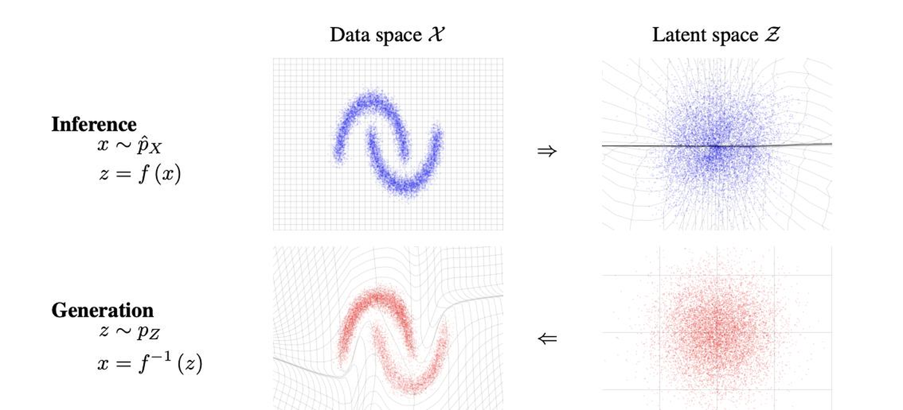

## Overview {#sec-overview-vae}

The previous chapters built generative models by *comparing* distributions: a
discriminator, a divergence, a transport cost. This chapter builds them by
*transforming* one. A latent variable is drawn from a simple prior and pushed
through a decoder, and the whole difficulty moves into one question --- how do
you train a model whose likelihood you cannot write down?

Two answers follow from one construction. If the map from noise to latent code
is cheap but not invertible in the data, you bound the likelihood and get the
**variational autoencoder**. If instead you insist the map be invertible, the
bound becomes an equality and you get a **normalizing flow**. The lecture
derives both from a single encoder written as a deterministic function of
noise, so VAE, beta-VAE, NICE, Real NVP and Glow are not five models but five
choices of one object $F_\phi^x$.

The exposition follows *Part 2 --- VAE*, slides 3--41, and Chapter 13 of
*Geometry of Deep Learning* [@lecture-slides-vae; @gdl]. Equations carrying the
book's numbering are marked where they first appear. A section of advanced
topics at the end collects material the lecture did not develop, so the main
narrative follows the class itself.

## Notation {#sec-notation-vae}

| Symbol | Meaning |
|:---|:---|
| $x\in\mathcal X\subseteq\mathbb R^D$ | An observation; $D$ is the **data** dimension |
| $d\mu(x)$ | The data measure; in training, the empirical measure of the dataset |
| $z\in\mathbb R^d$ | A latent variable; $d$ is the **latent** dimension |
| $m$ | The **split index** of a coupling layer, $1\le m<D$ |
| $\theta,\phi$ | Decoder and encoder parameters |
| $p(z)$ | The latent prior, here $\mathcal N(0,I_d)$ |
| $p_\theta(x\mid z)$ | The conditional observation distribution |
| $G_\theta(z)$ | The decoder mean, when the observation model is Gaussian |
| $q_\phi(z\mid x)$ | The approximate posterior, or stochastic encoder |
| $u\sim r(u)$ | Noise with density $r$; throughout, $u\sim\mathcal N(0,I_d)$ |
| $F_\phi^x(u)$ | The encoder: a map from noise to a latent sample, $x$ fixed |
| $\mu_\phi(x),\sigma_\phi(x)$ | The VAE encoder's mean and coordinatewise standard deviation |
| $F_\phi$ | The invertible data-to-latent map of a flow |
| $\sigma>0$ | The fixed scalar input-noise level in the flow construction |
| $\ell_{\mathrm{ELBO}}$ | The negative ELBO, the quantity minimized |

**Three dimensions, three letters.** The VAE compresses, so $d<D$. A bijective
flow cannot, so there $D=d$; once that is said, flow sections write $D$ and the
letter $d$ does not reappear. A coupling layer splits the $D$ coordinates of
its input into blocks of size $m$ and $D-m$: the split index is $m$, never $d$.
Keeping these apart matters because the same symbol is used for all three in
much of the literature, including the lecture slides, which write a coupling
split as $y_{1:d},y_{d+1:D}$.

The data measure $\mu$ is not the encoder mean $\mu_\phi(x)$. In coordinate
sums, $\mu_i(x)$ and $\sigma_i(x)$ drop the parameter subscript. The symbol
$\odot$ is elementwise multiplication, $I_m$ the $m\times m$ identity, and
$\operatorname{diag}(a)$ the diagonal matrix built from $a$. Norms are
Euclidean and all logarithms natural. For $f:\mathbb R^m\to\mathbb R^n$,
$\partial f(v)/\partial v$ is the $n\times m$ Jacobian. Losses written with an
argument $x$ are per observation; objectives without one average over
$d\mu(x)$.

## The evidence lower bound {#sec-elbo-vae}

### Why an approximate posterior is needed

The model draws $z\sim p(z)$ and then $x\sim p_\theta(x\mid z)$, so the joint
density factors as $p_\theta(x,z)=p_\theta(x\mid z)p(z)$ and the quantity
maximum likelihood needs is the marginal

$$
p_\theta(x)=\int_{\mathbb R^d}p_\theta(x\mid z)p(z)\,dz .
$$ {#eq-marginal-vae}

Each factor is cheap. With the Gaussian decoder used throughout,
$p_\theta(x\mid z)=\mathcal N(G_\theta(z),I_D)$, evaluating the integrand at a
given $z$ costs one decoder pass. The integral is the problem:

$$
p_\theta(x)
=\frac{1}{(2\pi)^{(D+d)/2}}
\int_{\mathbb R^d}
\exp\!\left(-\tfrac12\|x-G_\theta(z)\|^2-\tfrac12\|z\|^2\right)dz .
$$

The integrand is Gaussian in $x$ but not in $z$, because $G_\theta$ is a
nonlinear network and the exponent is therefore not quadratic in $z$. It has no
closed form, and quadrature in a latent space of realistic dimension is out of
reach. The exact posterior

$$
p_\theta(z\mid x)=\frac{p_\theta(x\mid z)p(z)}{p_\theta(x)}
$$

is no help: its normalizer is the same integral. So we introduce a tractable
family $q_\phi(z\mid x)$ and bound the likelihood instead of computing it.

### Jensen's inequality

Fix $x$ with $p_\theta(x)>0$. The encoder $q_\phi(z\mid x)$ is chosen from a
parameterized family; it is not obtained by evaluating the true posterior.
Assume it is positive wherever $p_\theta(x,z)$ is, apart from null sets, so that
sampling under $q_\phi$ omits no region contributing to @eq-marginal-vae. A
Gaussian encoder with positive variances satisfies this everywhere on
$\mathbb R^d$.

Multiplying and dividing by $q_\phi(z\mid x)$ and applying concavity of the
logarithm,

$$
\begin{aligned}
\log p_\theta(x)
&=\log\left(\int q_\phi(z\mid x)\,
 \frac{p_\theta(x\mid z)p(z)}{q_\phi(z\mid x)}\,dz\right)\\
&\ge\int q_\phi(z\mid x)
 \log\!\left(\frac{p_\theta(x\mid z)p(z)}{q_\phi(z\mid x)}\right)dz .
\end{aligned}
$$ {#eq-jensen-vae}

Assuming the terms are integrable, the right-hand side splits into

$$
\int\log p_\theta(x\mid z)\,q_\phi(z\mid x)\,dz
-D_{\mathrm{KL}}\!\left(q_\phi(z\mid x)\,\|\,p(z)\right).
$$

This is the **evidence lower bound**. When $q_\phi(z\mid x)=p_\theta(z\mid x)$
the ratio inside the logarithm is the constant $p_\theta(x)$ and Jensen holds
with equality; @sec-elbo-gap identifies the gap in general.

### Reconstruction against regularization

Negating gives the quantity to minimize:

$$
\boxed{
\begin{aligned}
\ell_{\mathrm{ELBO}}(x,\theta,\phi)
:={}&-\int\log p_\theta(x\mid z)\,q_\phi(z\mid x)\,dz\\
&+D_{\mathrm{KL}}\!\left(q_\phi(z\mid x)\,\|\,p(z)\right).
\end{aligned}}
$$ {#eq-elbo-loss}

The first term is **reconstruction**: for a Gaussian decoder with identity
covariance it is half the expected squared error between $x$ and $G_\theta(z)$,
up to a constant, and it measures error in observation space. The second is
**regularization**: it compares the encoder with the prior in latent space, and
it is what makes the model generative rather than merely a good autoencoder.
Without it nothing ties the codes the encoder produces to the prior that
generation samples from. KL divergence is nonnegative but asymmetric, so it is
not a metric. Training minimizes $\int\ell_{\mathrm{ELBO}}\,d\mu(x)$.

## The general encoder {#sec-general-vae}

Everything that follows is one objective specialized in two directions. The
step that makes this possible is to stop treating the encoder as a density and
start treating it as a *map applied to noise*.

### Sampling written as a deterministic map

Let $u\sim r(u)$, in our case $\mathcal N(0,I_d)$. For fixed $x$ the encoder
turns $u$ into a latent sample, and the density of that sample is

$$
\boxed{
q_\phi(z\mid x)=\int\delta\!\left(z-F_\phi^x(u)\right)r(u)\,du ,
\qquad u\sim r(u).
}
$$ {#eq-general-encoder}

This is equation (13.60) of the book. Sampling means drawing $u$ and setting
$z=F_\phi^x(u)$; inside an integral over $z$, the Dirac delta selects that
value. The entire difference between a VAE and a flow will be the choice of
$F_\phi^x$ --- @fig-vae-encoder draws the Gaussian one.

### The general loss

Fix $x$ and $\phi$, assume $F_\phi^x$ is a diffeomorphism and the logarithms
below are integrable, and expand the KL term of @eq-elbo-loss:

$$
\begin{aligned}
\ell_{\mathrm{ELBO}}(x,\theta,\phi)
={}&-\int\log\!\left(p_\theta(x\mid z)p(z)\right)q_\phi(z\mid x)\,dz\\
&+\int\log q_\phi(z\mid x)\,q_\phi(z\mid x)\,dz .
\end{aligned}
$$

Both integrals are now rewritten through @eq-general-encoder.

**The likelihood and prior term.** Substituting the delta representation and
integrating out $z$,

$$
\begin{aligned}
&-\int\log\!\left(p_\theta(x\mid z)p(z)\right)q_\phi(z\mid x)\,dz\\
&\quad=-\int\!\!\int\log\!\left(p_\theta(x\mid z)p(z)\right)
\delta\!\left(z-F_\phi^x(u)\right)r(u)\,du\,dz\\
&\quad=-\int\log p_\theta\!\left(x\mid F_\phi^x(u)\right)r(u)\,du
 -\int\log p\!\left(F_\phi^x(u)\right)r(u)\,du .
\end{aligned}
$$

**The encoder log-density term.** Here $q_\phi$ appears both inside and outside
the logarithm, so give the inner copy its own variable $u'$:

$$
\begin{aligned}
&\int\log q_\phi(z\mid x)\,q_\phi(z\mid x)\,dz\\
&\quad=\int\log\left(\int\delta\!\left(F_\phi^x(u)-F_\phi^x(u')\right)r(u')\,du'\right)r(u)\,du .
\end{aligned}
$$

The inner integral is evaluated by changing variables,

$$
v=F_\phi^x(u'),\qquad u'=H_x(v),\qquad H_x=(F_\phi^x)^{-1},
$$

where $H_x$ inverts the noise-to-latent map at fixed $x$ and $\phi$.
Differentiating $F_\phi^x(H_x(v))=v$ gives the inverse-Jacobian relation, and
the delta then selects $v=F_\phi^x(u)$, at which point $u'=u$:

$$
\int\delta\!\left(F_\phi^x(u)-F_\phi^x(u')\right)r(u')\,du'
=\frac{r(u)}{\left|\det\!\left(\dfrac{\partial F_\phi^x(u)}{\partial u}\right)\right|} .
$$ {#eq-encoder-density-transform}

Taking the logarithm splits this into an entropy term in $r$ alone and a
log-determinant term.

**Collecting.** The two integrals in $\log r(u)$ and $\log p(F_\phi^x(u))$
combine into a log ratio, leaving the book's equation (13.61):

$$
\boxed{
\begin{aligned}
\ell_{\mathrm{ELBO}}(x,\theta,\phi)
={}&-\int\log p_\theta\!\left(x\mid F_\phi^x(u)\right)r(u)\,du\\
&+\int\log\!\left(\frac{r(u)}{p\!\left(F_\phi^x(u)\right)}\right)r(u)\,du\\
&-\int\log\left|\det\!\left(\frac{\partial F_\phi^x(u)}{\partial u}\right)\right|r(u)\,du .
\end{aligned}}
$$ {#eq-general-loss}

The first integral is reconstruction; the last two together are the KL term.
Nothing so far has assumed a Gaussian encoder, a particular prior, or any
architecture. The three sections that follow each fix $F_\phi^x$ and read off
the consequence.

## The variational autoencoder {#sec-vae}

### A Gaussian encoder

Take the encoder affine in the noise:

$$
\boxed{
z=F_\phi^x(u)=\mu_\phi(x)+\sigma_\phi(x)\odot u ,
\qquad u\sim\mathcal N(0,I_d).
}
$$ {#eq-vae-encoder}

![The Gaussian VAE encoder. The network predicts $\mu_\phi(x)$ and $\sigma_\phi(x)$, the latent code is formed as $z=\sigma_\phi(x)\odot u+\mu_\phi(x)$ with $u\sim\mathcal N(0,I_d)$, and the decoder $G_\theta$ maps $z$ back to the data space. From the course slides [@lecture-slides-vae, p. 11].](figures/lec04/jungwoopark01-vae-encoder.png){#fig-vae-encoder width=70%}

Each coordinate of $\sigma_\phi(x)$ is positive, so @fig-vae-encoder realizes

$$
q_\phi(z\mid x)=\mathcal N\!\left(\mu_\phi(x),\operatorname{diag}\big(\sigma_\phi^2(x)\big)\right),
$$

and the Jacobian the general loss asks for is immediate:

$$
\frac{\partial F_\phi^x(u)}{\partial u}=\operatorname{diag}\big(\sigma_\phi(x)\big),
\qquad
\log\left|\det\!\left(\frac{\partial F_\phi^x(u)}{\partial u}\right)\right|
=\frac12\sum_{i=1}^d\log\sigma_i^2(x).
$$

Note what is *not* required: the map from observations to codes need not be
invertible. Only the map from noise to code, at fixed $x$, must be. This is the
VAE of Kingma and Welling [@kingma2014], and writing the sample this way is
also what lets gradients reach $\phi$ --- see @sec-reparam-vae.

### The Gaussian KL term

Let $r$ and $p$ both be standard Gaussian. Their normalizing constants cancel
in the ratio, so

$$
\log\!\left(\frac{r(u)}{p(F_\phi^x(u))}\right)
=\tfrac12\left(\|\mu_\phi(x)+\sigma_\phi(x)\odot u\|^2-\|u\|^2\right),
$$

and since $\mathbb E[u_i]=0$, $\mathbb E[u_i^2]=1$, the middle term of
@eq-general-loss averages to $\tfrac12\sum_i(\mu_i^2(x)+\sigma_i^2(x)-1)$.
Adding the log-determinant gives the book's (13.64)--(13.65):

$$
D_{\mathrm{KL}}\!\left(q_\phi(z\mid x)\,\|\,\mathcal N(0,I_d)\right)
=\frac12\sum_{i=1}^d\left(\sigma_i^2(x)+\mu_i^2(x)-\log\sigma_i^2(x)-1\right).
$$ {#eq-gaussian-kl}

The variance part, $\sigma_i^2-\log\sigma_i^2-1$, is minimized at
$\sigma_i^2=1$ and grows without bound in both directions, so the term
penalizes a collapsed code and an over-dispersed one alike.

### From likelihood to reconstruction error

With $p_\theta(x\mid z)=\mathcal N(G_\theta(z),I_D)$,

$$
-\log p_\theta(x\mid z)=\tfrac12\|x-G_\theta(z)\|^2+\tfrac D2\log(2\pi).
$$

Two things are being used here and both matter: the observation model is
Gaussian, and its covariance is the identity. Neither is forced on us --- a
Bernoulli decoder on binarized images gives a cross-entropy instead, and the
squared-error form would then be wrong. Dropping the parameter-free constant
and combining with @eq-gaussian-kl gives the objective, the book's (13.67):

$$
\boxed{
\begin{aligned}
\ell_{\mathrm{VAE}}(\theta,\phi)
={}&\frac12\int_{\mathcal X}\!\!\int
\left\|x-G_\theta\!\left(\mu_\phi(x)+\sigma_\phi(x)\odot u\right)\right\|^2
r(u)\,du\,d\mu(x)\\
&+\frac12\sum_{i=1}^d\int_{\mathcal X}
\left(\sigma_i^2(x)+\mu_i^2(x)-\log\sigma_i^2(x)-1\right)d\mu(x).
\end{aligned}}
$$ {#eq-vae-objective}

### Varying the decoder output

After training, resampling the noise at a fixed observation traces out a family
of reconstructions, the book's (13.68):

$$
\hat x(u)=G_\theta\!\left(\mu_\phi(x)+\sigma_\phi(x)\odot u\right),
\qquad u\sim\mathcal N(0,I_d).
$$

The encoder's mean and spread stay fixed while $u$ moves the code. This is the
concrete sense in which a VAE is generative where a deterministic autoencoder
is not; to generate without any input, draw $z\sim p(z)$ instead.

## The beta-VAE {#sec-beta-vae}

Weighting the two terms differently gives the beta-VAE [@higgins2017], the
book's (13.69):

$$
\boxed{
\begin{aligned}
\ell_{\beta\text{-}\mathrm{VAE}}(\theta,\phi)
={}&\frac12\int_{\mathcal X}\!\!\int
\left\|x-G_\theta\!\left(\mu_\phi(x)+\sigma_\phi(x)\odot u\right)\right\|^2
r(u)\,du\,d\mu(x)\\
&+\frac\beta2\sum_{i=1}^d\int_{\mathcal X}
\left(\sigma_i^2(x)+\mu_i^2(x)-\log\sigma_i^2(x)-1\right)d\mu(x).
\end{aligned}}
$$ {#eq-beta-objective}

Setting $\beta=1$ recovers @eq-vae-objective. A larger $\beta$ buys prior
conformity with reconstruction detail. @sec-rate-distortion-vae derives
$\beta$ as a Lagrange multiplier on an information budget, which is where the
choice stops looking arbitrary.

![Latent traversals on 3D faces. Each model occupies a group of five columns; within a row one latent coordinate is varied and the rest held fixed. The beta-VAE rows change one attribute at a time --- azimuth, lighting, elevation --- where the VAE rows change several together and InfoGAN separates them less cleanly. The beta-VAE faces are also visibly blurrier. From the course slides [@lecture-slides-vae, p. 16], after Higgins et al. [@higgins2017].](figures/lec04/jungwoopark01-beta-vae-traversals.png){#fig-beta-traversals width=95%}

@fig-beta-traversals shows both halves of the trade at once. A coordinate is
better aligned with a factor of variation when moving it moves that factor and
little else, and the beta-VAE rows do this more consistently. They are also
blurrier: under a squared-error objective a decoder that cannot distinguish
fine detail averages it away. Stronger regularization *can* encourage
interpretable structure; it does not guarantee it, and past some point it
simply discards information.

## Normalizing and invertible flows {#sec-flows}

### Noise before an invertible map

Now make the encoder invertible and tie the decoder to it. Take $D=d$ and
$F_\phi:\mathbb R^D\to\mathbb R^D$ invertible:

$$
\boxed{
F_\phi^x(u)=F_\phi(\sigma u+x),
\qquad G_\theta=F_\phi^{-1},
\qquad u\sim\mathcal N(0,I_D).
}
$$ {#eq-flow-encoder}

![A normalizing flow as an autoencoder. The noise $\sigma u$ is added to $x$ *before* the invertible encoder $F_\phi$, and the decoder is its inverse, so the round trip returns $\sigma u+x$. Redrawn after the course slides [@lecture-slides-vae, p. 17], correcting panel (c), which draws the noise entering after the map.](figures/lec04/Jaden-Shin-1214-flow-corrected.png){#fig-flow-noise width=70%}

Here $\sigma>0$ is one fixed scalar, not the learned vector $\sigma_\phi(x)$ of
the VAE, and the encoder and decoder now share parameters. As
@fig-flow-noise records, the noise enters *before* the map; for a nonlinear
$F_\phi$ that is not the same as perturbing the output.

### Why the reconstruction term becomes a constant

Because the decoder inverts the encoder exactly, reconstruction stops
depending on the parameters at all:

$$
\begin{aligned}
\frac12\int\left\|x-G_\theta\!\left(F_\phi^x(u)\right)\right\|^2r(u)\,du
&=\frac12\int\left\|x-F_\phi^{-1}\!\left(F_\phi(\sigma u+x)\right)\right\|^2r(u)\,du\\
&=\frac12\int\|\sigma u\|^2r(u)\,du=\frac{D\sigma^2}{2}.
\end{aligned}
$$ {#eq-flow-reconstruction}

::: {.callout-note}
## A constant worth getting right
Since $u\sim\mathcal N(0,I_D)$ we have $\mathbb E\|u\|^2=D$, so the value is
$D\sigma^2/2$ --- that is $\sigma^2/2$ *per coordinate*, which is how the
slides write it [@lecture-slides-vae, p. 18]. The conclusion is the same either
way, because what matters is only that the term does not depend on $\phi$.
:::

The entropy $\int\log r\,r\,du$ is likewise parameter-free. Dropping both
leaves the flow loss,

$$
\begin{aligned}
\ell_{\mathrm{flow}}(x,\phi)
={}&-\int\log p\!\left(F_\phi^x(u)\right)r(u)\,du\\
&-\int\log\left|\det\!\left(\frac{\partial F_\phi^x(u)}{\partial u}\right)\right|r(u)\,du ,
\end{aligned}
$$ {#eq-flow-loss}

and with a standard Gaussian prior, up to one more constant,

$$
\ell_{\mathrm{flow}}(x,\phi)
=\frac12\int\|F_\phi(\sigma u+x)\|^2r(u)\,du
-\int\log\left|\det\!\left(\frac{\partial F_\phi(\sigma u+x)}{\partial u}\right)\right|r(u)\,du .
$$

Two forces are now in balance and neither alone would do. The prior term pulls
latent outputs into the high-density region; left to itself it would collapse
everything onto the origin. The log-determinant is what stops it: a map that
crushes volume pays for it. Generation draws $z\sim p(z)$ and applies
$G_\theta=F_\phi^{-1}$.

### Making the log-determinant tractable

A forward pass gives $F_\phi(x)$ cheaply, but the determinant of a general
network's Jacobian does not come cheaply. Build $F_\phi$ from simple invertible
layers instead:

$$
F_\phi=f_K\circ\cdots\circ f_1,
\qquad h_0=x,\quad h_i=f_i(h_{i-1}),\quad h_K=F_\phi(x),
$$

so that by the chain rule and multiplicativity of the determinant, the book's
(13.73)--(13.75),

$$
\boxed{
\log\left|\det\!\left(\frac{\partial F_\phi(x)}{\partial x}\right)\right|
=\sum_{i=1}^K\log\left|\det\!\left(\frac{\partial h_i}{\partial h_{i-1}}\right)\right| .
}
$$ {#eq-composed-logdet}

![A flow as a sequence of invertible maps, each reshaping the density of the previous one, from a simple $p_0$ to the data distribution $p_K$. The diagram runs in the generative direction $z_0\to z_K=x$; density evaluation runs the other way. From the course slides [@lecture-slides-vae, p. 19].](figures/lec04/jungwoopark01-flow-composition.png){#fig-flow-chain width=60%}

Composition turns a product into a sum, as @fig-flow-chain illustrates, but it
does not by itself make any single term cheap. Each layer still needs a
Jacobian whose structure gives up its determinant, while the composition stays
expressive enough to be worth having. For the noisy-input objective the layers
start at $h_0=\sigma u+x$, and

$$
\frac{\partial F_\phi(\sigma u+x)}{\partial u}
=\left(\frac{\partial F_\phi(\sigma u+x)}{\partial x}\right)\sigma I_D ,
$$

so the perturbation contributes a constant $D\log\sigma$ and nothing else.
@eq-flow-loss is therefore the ordinary flow negative log density averaged over
perturbed observations, up to parameter-free constants; @sec-exact-flow-vae
writes that density out and prices the dense determinant.

Generation reverses the order and inverts each layer,
$F_\phi^{-1}=f_1^{-1}\circ\cdots\circ f_K^{-1}$, with $f_K^{-1}$ acting first.
The next two sections give layers for which both the inverse and the
determinant are available in closed form.

## NICE: additive coupling {#sec-nice}

### The idea

![The coupling construction. The first block passes through untouched; a network $m$ reads it and sets the parameters of a simple invertible map $g$ applied to the second block. Inverting needs $g^{-1}$ only --- $m$ is never inverted, which is why it can be an arbitrary network. From the course slides [@lecture-slides-vae, pp. 30--31].](figures/lec04/Jaden-Shin-1214-coupling-idea.png){#fig-coupling-idea width=65%}

@fig-coupling-idea is the whole trick, and it is worth stating before any
algebra. Split the coordinates. Copy one block. Let a network read the copied
block and transform the other block with it. Because the copied block is
available unchanged on both sides, the network's output can be recomputed
during inversion rather than inverted --- so the network may be arbitrarily
complicated while the layer stays exactly invertible.

### Forward map, inverse, and Jacobian

Split $x$ into $x_1\in\mathbb R^m$ and $x_2\in\mathbb R^{D-m}$ with
$1\le m<D$. NICE adds a network output to the second block [@nice]:

$$
\boxed{
y_1=x_1,\qquad y_2=x_2+\mathcal F(x_1).
}
$$ {#eq-nice-coupling}

The inverse recovers $x_1$ immediately and subtracts the same quantity,

$$
\boxed{
x_1=y_1,\qquad x_2=y_2-\mathcal F(y_1),
}
$$ {#eq-nice-inverse}

and the Jacobian is block triangular with identity diagonal blocks:

$$
\frac{\partial y}{\partial x}
=\begin{bmatrix} I_m & 0\\[2pt]
\dfrac{\partial\mathcal F(x_1)}{\partial x_1} & I_{D-m}\end{bmatrix},
\qquad
\log\left|\det\!\left(\frac{\partial y}{\partial x}\right)\right|=0 .
$$ {#eq-nice-logdet}

### The loss, and the price of volume preservation

A composition of additive couplings and permutations has
$|\det(\partial F_\phi/\partial x)|=1$, so every log-determinant in
@eq-flow-loss vanishes and, dropping constants,

$$
\boxed{
\ell_{\mathrm{NICE}}(x,\phi)=\frac12\int\|F_\phi(\sigma u+x)\|^2 r(u)\,du .
}
$$ {#eq-nice-loss}

Training simply drives perturbed observations into the prior's high-density
region. The restriction is severe and easy to miss: additive layers can bend
and reorient a region but can never change its volume, and stacking them does
not help, since a product of ones is one. A flow built only from these layers
cannot adapt the density of the prior to the density of the data, however
complex the networks $\mathcal F$ are. The original NICE model therefore ends
with a learned diagonal scaling layer, which supplies the missing volume change
and its own log-determinant [@nice]. Real NVP puts the scaling inside every
layer instead.

## Real NVP: affine coupling {#sec-realnvp}

### Forward map and inverse

Real NVP gives the coupling an input-dependent scale [@realnvp]:

$$
\boxed{
y_1=x_1,\qquad y_2=x_2\odot\exp\!\left(s(x_1)\right)+t(x_1),
}
$$ {#eq-realnvp-forward}

with $s,t:\mathbb R^m\to\mathbb R^{D-m}$ producing log scales and translations.
The exponential makes every scale positive, and $s=0$ recovers NICE. Inversion
evaluates the same two networks at $y_1=x_1$:

$$
\boxed{
x_1=y_1,\qquad x_2=\left(y_2-t(y_1)\right)\odot\exp\!\left(-s(y_1)\right).
}
$$ {#eq-realnvp-inverse}

![Forward (a) and inverse (b) pass of an affine coupling layer. The unchanged branch supplies the same conditioning value in both directions, so $s$ and $t$ are evaluated, never inverted. From the course slides [@lecture-slides-vae, pp. 22, 33].](figures/lec04/Jaden-Shin-1214-coupling.png){#fig-coupling width=85%}

### The determinant

Differentiating @eq-realnvp-forward, the lower-left block is whatever it is and
the diagonal is what counts:

$$
\frac{\partial y}{\partial x}
=\begin{bmatrix} I_m & 0\\[2pt]
\dfrac{\partial y_2}{\partial x_1} &
\operatorname{diag}\!\left(\exp\!\left(s(x_1)\right)\right)\end{bmatrix},
\qquad
\log\left|\det\!\left(\frac{\partial y}{\partial x}\right)\right|
=\sum_j s_j(x_1).
$$ {#eq-realnvp-logdet}

A positive sum means the layer expands volume locally and a negative sum means
it contracts. @sec-ex-coupling carries a single layer through with numbers and
checks this against a finite-difference Jacobian.

### The loss

Let $F_\phi=f_K\circ\cdots\circ f_1$ be affine couplings with permutations
between them, and write $h_0(u)=\sigma u+x$, $h_i(u)=f_i(h_{i-1}(u))$. Let
$s_{i,j}$ be the $j$th log-scale output of layer $i$, evaluated on that layer's
conditioning block $h_{i-1,1}(u)$. Permutations contribute nothing, so
combining @eq-realnvp-logdet with @eq-composed-logdet and dropping constants,

$$
\boxed{
\ell_{\mathrm{RealNVP}}(x,\phi)
=\int\left[\frac12\|F_\phi(\sigma u+x)\|^2
-\sum_{i=1}^K\sum_j s_{i,j}\!\left(h_{i-1,1}(u)\right)\right]r(u)\,du .
}
$$ {#eq-realnvp-loss}

Setting every log-scale network to zero returns @eq-nice-loss. The translation
networks never appear in the determinant, yet they shape the loss through the
states $h_i$. For ordinary density estimation, run the same layers at $h_0=x$:

$$
-\log p_X(x)=\frac12\|F_\phi(x)\|^2-\sum_{i=1}^K\sum_j s_{i,j}(h_{i-1,1})+\frac D2\log(2\pi).
$$ {#eq-realnvp-nll}

{#fig-moons width=75%}

@fig-moons makes the point that a trained flow is one bijection: inference
and generation are not two models but two ways of reading the same one.

## Glow {#sec-glow}

The lecture closes with Glow [@glow], which keeps the coupling layer and fixes
what coupling alone cannot do. A coupling layer always leaves one block
untouched, so some coordinates must be permuted between layers for information
to reach everything. A fixed permutation is a crude instrument. Glow replaces
it with a *learned* one and adds a normalization layer, giving three components
per step [@lecture-slides-vae, pp. 23--25, 36--41].

**Actnorm.** A per-channel affine transform $y_{i,j}=s\odot x_{i,j}+b$ applied
at every spatial position $(i,j)$ of an $h\times w\times c$ tensor, initialized
so that the post-transform activations have zero mean and unit variance on the
first minibatch. Its log-determinant is $h\cdot w\cdot\operatorname{sum}(\log|s|)$.

**Invertible $1\times1$ convolution.** The learned replacement for a fixed
permutation: $y_{i,j}=Wx_{i,j}$ with $W$ a $c\times c$ matrix shared across
positions. Because the same matrix acts at every one of the $h\cdot w$
positions,

$$
\log\left|\det\!\left(\frac{\partial\,\mathrm{conv2D}(h;W)}{\partial h}\right)\right|
=h\cdot w\cdot\log\left|\det W\right| .
$$ {#eq-glow-conv}

A permutation matrix is a special case, so the layer can only improve on one.
Computing $\det W$ directly costs $O(c^3)$; parameterizing $W$ in LU form
removes that:

$$
W=PL\left(U+\operatorname{diag}(s)\right),
\qquad
\log|\det W|=\operatorname{sum}\left(\log|s|\right),
$$ {#eq-glow-lu}

with $P$ a fixed permutation, $L$ unit lower triangular and $U$ strictly upper
triangular, bringing the cost to $O(c)$.

**Affine coupling.** Exactly @eq-realnvp-forward, acting on a channel split,
with log-determinant $\operatorname{sum}(\log|s|)$.

![The invertible generator. An image is squeezed into channels, passed through $L$ steps of $1\times1$ convolution and stable additive coupling, and squeezed back; every arrow runs in both directions. From the course slides [@lecture-slides-vae, p. 38].](figures/lec04/slides-glow-architecture.png){#fig-glow-arch width=95%}

![The three blocks, each with its inverse. (b) Squeeze rearranges a $H\times W$ map into four channels at half the resolution. (c) The invertible $1\times1$ convolution multiplies every spatial position by the same $W$, and is undone by $W^{-1}$. (d, e) The stable additive coupling layer adds $\mathcal{F}_1$ of the untouched block to the other, and subtracts it to invert. From the course slides [@lecture-slides-vae, p. 39].](figures/lec04/slides-glow-blocks.png){#fig-glow-blocks width=100%}

@fig-glow-arch and @fig-glow-blocks are worth reading together: the first
says the model is a stack, the second says every element of the stack is a
map whose inverse is written next to it. That is the whole design constraint
of this chapter made concrete.

A **squeeze** operation between scales trades spatial resolution for channels,
reshaping $1\times H\times W$ into $4\times\frac H2\times\frac W2$, so that the
$1\times1$ convolution has channels to mix and the coupling split is spatially
local. Stacking $L$ such steps gives the invertible generator; every component
has a closed-form inverse and an $O(c)$ log-determinant, so @eq-composed-logdet
applies unchanged and the model is trained by exact maximum likelihood.

The point is not the particular three layers. It is that the whole chapter's
constraint --- invertible, with a cheap determinant --- has enough room inside
it to build a model that samples high-resolution images, provided each layer's
structure is chosen so that its determinant is read off rather than computed.

## What the coupling construction costs {#sec-flow-limits}

Flows must be expressive, invertible, and cheap to differentiate, and the three
demands pull against each other. Setting $y_1=x_1$ buys the triangular Jacobian,
and the price is that no single layer can transform all coordinates jointly:
each one leaves a block alone and moves the rest by a restricted affine map.
Alternating the blocks lets every coordinate change eventually, but a
restricted layer may need a deep stack to express what one unrestricted map
would, and depth is compute. NICE pays more than Real NVP, being confined to
unit volume.

Two limits are structural rather than architectural. A bijection forces
$D=d$, so a flow has no bottleneck and no compressed representation --- exactly
what the VAE gives up invertibility to obtain. And scale factors that grow very
large or very small make numerical inversion ill-conditioned, which bounds in
practice how aggressive the learned volume changes can be.

## Advanced topics {#sec-advanced-vae}

The material below was not developed in the lecture. It is collected here so
that the preceding sections follow the class.

### The ELBO gap, exactly {#sec-elbo-gap}

Write $\mathcal L(x,\theta,\phi)=-\ell_{\mathrm{ELBO}}(x,\theta,\phi)$. Bayes'
rule gives a second derivation of the bound that also names the gap
[@kingma2014]. Assuming finite expectations,

$$
\begin{aligned}
D_{\mathrm{KL}}\!\left(q_\phi(z\mid x)\,\|\,p_\theta(z\mid x)\right)
&=\int q_\phi(z\mid x)\log\!\left(\frac{q_\phi(z\mid x)p_\theta(x)}{p_\theta(x,z)}\right)dz\\
&=\log p_\theta(x)-\mathcal L(x,\theta,\phi),
\end{aligned}
$$

so that

$$
\log p_\theta(x)=\mathcal L(x,\theta,\phi)
+D_{\mathrm{KL}}\!\left(q_\phi(z\mid x)\,\|\,p_\theta(z\mid x)\right).
$$ {#eq-elbo-gap}

The KL term is nonnegative, which proves the bound, and it is *exactly* the
gap, vanishing when the encoder matches the true posterior almost everywhere.
Note which two distributions it compares: the encoder and the **posterior**.
The regularizer in @eq-elbo-loss compares the encoder with the **prior**. They
are different objects and only the first is the bound's slack.

### Reparameterization and gradient estimation {#sec-reparam-vae}

Fix $x$ and $\theta$ and write $f_\theta(z)=\log p_\theta(x\mid z)$. The
reconstruction expectation depends on $\phi$ through the distribution it
averages over, which is not something a sampler can differentiate.
Reparameterization moves that dependence into the integrand:

$$
\mathbb E_{q_\phi(z\mid x)}\!\left[f_\theta(z)\right]
=\mathbb E_{u\sim r}\!\left[f_\theta\!\left(F_\phi^x(u)\right)\right],
$$

and since $r$ does not depend on $\phi$, differentiating under the expectation
gives the **pathwise** estimator

$$
\nabla_\phi\mathbb E_q\!\left[f_\theta(z)\right]
=\mathbb E_{u\sim r}\!\left[
\left(\frac{\partial F_\phi^x(u)}{\partial\phi}\right)^{\!\top}
\left.\nabla_z f_\theta(z)\right|_{z=F_\phi^x(u)}\right].
$$ {#eq-pathwise}

The alternative differentiates the density, using $\nabla_\phi q=q\nabla_\phi\log q$:

$$
\nabla_\phi\int f_\theta(z)q_\phi(z\mid x)\,dz
=\mathbb E_q\!\left[f_\theta(z)\nabla_\phi\log q_\phi(z\mid x)\right].
$$ {#eq-score-function}

This is the **score-function** estimator. Both are unbiased. The pathwise one
uses $\nabla_z f_\theta$, first-order information about how the integrand moves
when the code moves; the score-function one uses only the value $f_\theta(z)$,
weighted by a score. For a smooth Gaussian problem the first is usually far
less noisy, and @sec-ex-estimators makes the gap concrete --- but this is a
tendency, not a theorem. The score-function estimator remains the one that
works when no differentiable reparameterization exists, as with discrete latent
variables, and a baseline independent of $z$ reduces its variance at no bias,
since $\mathbb E_q[\nabla_\phi\log q_\phi]=0$.

### Worked example: two gradient estimators {#sec-ex-estimators}

Take $q_\mu=\mathcal N(\mu,1)$ and $f(z)=z$, so that
$\nabla_\mu\mathbb E_{q_\mu}[z]=1$ for every $\mu$, and write $z=\mu+u$ with
$u\sim\mathcal N(0,1)$.

The pathwise estimator @eq-pathwise gives
$\nabla_z f\cdot\partial z/\partial\mu=1$ for *every* sample: exact, with zero
variance. The score-function estimator @eq-score-function uses
$\nabla_\mu\log q_\mu(z)=z-\mu=u$, so one sample gives
$f(z)u=(\mu+u)u=\mu u+u^2$, with mean $1$ --- also unbiased. For the variance,
using $\mathbb E[u^2]=1$, $\mathbb E[u^3]=0$, $\mathbb E[u^4]=3$:

$$
\operatorname{Var}(\mu u+u^2)
=\mu^2\mathbb E[u^2]+2\mu\mathbb E[u^3]+\mathbb E[u^4]-1=\mu^2+2 .
$$ {#eq-sf-variance}

| $\mu$ | score function: mean | score function: variance | $\mu^2+2$ | pathwise: variance |
|---|---|---|---|---|
| 0 | 1.0013 | 2.007 | 2 | 0.0 |
| 1 | 0.9988 | 3.003 | 3 | 0.0 |
| 2 | 0.9965 | 5.980 | 6 | 0.0 |
| 3 | 0.9972 | 10.999 | 11 | 0.0 |

: One-sample gradient estimates of $\nabla_\mu\mathbb E[z]$, $z\sim\mathcal N(\mu,1)$, over $10^6$ draws. {#tbl-estimators}

![Variance of one-sample estimates of $\nabla_\mu\mathbb E[z]$ for $z\sim\mathcal N(\mu,1)$. Dots are the empirical values of @tbl-estimators, the curve is @eq-sf-variance, and the pathwise estimator sits on zero.](figures/lec04/Jaden-Shin-1214-estimator-variance.png){#fig-estimator-variance width=60%}

@tbl-estimators and @fig-estimator-variance agree with @eq-sf-variance to three
figures. The variance grows with $\mu^2$, and in a VAE the role of $f$ is played
by $\log p_\theta(x\mid z)$, a sum over thousands of pixels whose magnitude
dwarfs $\mu$ here. That is the practical reason the VAE is trained with
@eq-pathwise.

### The beta-VAE as constrained rate-distortion {#sec-rate-distortion-vae}

Define average distortion and rate by

$$
\mathcal D(\theta,\phi)=-\int\mathbb E_{q_\phi(z\mid x)}\!\left[\log p_\theta(x\mid z)\right]d\mu(x),
\qquad
\mathcal R(\phi)=\int D_{\mathrm{KL}}\!\left(q_\phi(z\mid x)\,\|\,p(z)\right)d\mu(x).
$$

Constraining the rate to a budget $C$ and introducing a multiplier
[@higgins2017],

$$
\min_{\theta,\phi}\mathcal D
\ \ \text{s.t.}\ \ \mathcal R\le C
\qquad\Longrightarrow\qquad
\mathcal J=\mathcal D+\beta\left(\mathcal R-C\right),\ \beta\ge0,
$$

and since $-\beta C$ is constant in the parameters, minimizing $\mathcal J$ is
minimizing $\mathcal D+\beta\mathcal R$ --- the beta-VAE objective
[@burgess2018]. Writing $\mathcal D^*(\mathcal R)$ for the best distortion at a
given rate, an interior smooth optimum satisfies
$\beta=-d\mathcal D^*/d\mathcal R$, so $\beta$ is the exchange rate between
nats of latent information and reconstruction error. With nonconvex networks
there is no guarantee that every budget $C$ is attained by some fixed $\beta$.

The rate decomposes. With the aggregate encoder
$q_\phi(z)=\int q_\phi(z\mid x)\,d\mu(x)$, splitting the log ratio gives

$$
\mathcal R=I_q(X,Z)+D_{\mathrm{KL}}\!\left(q_\phi(z)\,\|\,p(z)\right),
$$ {#eq-rate-information}

so the KL penalty is charging for two different things at once: the information
the code keeps about the observation, and the mismatch between the aggregate
code distribution and the prior.

### Posterior collapse {#sec-collapse-vae}

Collapse is the state in which the latent variable carries nothing. At the
extreme the decoder ignores $z$, so $p_\theta(x\mid z)=p_\theta(x)$, hence
$p_\theta(z\mid x)=p(z)$; an encoder matching that posterior has
$q_\phi(z\mid x)=p(z)$ and, by @eq-rate-information, zero rate and zero mutual
information. Partial collapse switches off some coordinates and not others.

The failure is most likely exactly where it is least wanted: when the decoder
is powerful enough to model the data on its own, the KL term is a pure cost and
the cheapest way to pay it is to stop using the code. Large $\beta$ encourages
this, but it happens at $\beta=1$ too, and inference lag during joint training
can drive a model there on its own [@he2019]. The symptoms under a standard
Gaussian prior are $\mu_\phi(x)\approx0$, $\sigma_\phi(x)\approx\mathbf 1$ and a
near-zero KL.

![Inference lag and posterior collapse. Posterior means for 500 validation observations, with the model-posterior mean on the horizontal axis and the encoder mean on the vertical; the diagonal marks agreement. Top: ordinary training --- the model posterior spreads at iteration 200 while the encoder stays near zero, and by convergence both have returned to the origin. Bottom: extra encoder updates per decoder update let the encoder track the posterior, and the spread survives. After He et al. [@he2019, Fig. 2]. The two rows use different axis ranges.](figures/lec04/jungwoopark01-posterior-collapse.png){#fig-posterior-collapse width=100%}

@fig-posterior-collapse is a diagnosis, not a definition: spread along the
diagonal says the encoder means still depend on the input. Means alone do not
establish that two distributions agree, and blurry reconstructions on their own
do not establish collapse. A common remedy is KL annealing, which starts
training with a small weight on the KL term and raises it.

### Exact flow densities and the cost of a determinant {#sec-exact-flow-vae}

For a differentiable bijection $z=F_\phi(x)$ with nonsingular Jacobian, let
$p_X$ be the density induced by pushing the prior through $F_\phi^{-1}$; this
is a model density, distinct from the data measure $\mu$. Conservation of
probability, $p_X(x)\,dx=p_Z(z)\,dz$, gives

$$
-\log p_X(x)=-\log p_Z\!\left(F_\phi(x)\right)
-\log\left|\det\!\left(\frac{\partial F_\phi(x)}{\partial x}\right)\right| .
$$ {#eq-change-of-variables-flow}

With a standard Gaussian prior the first term is $\frac12\|F_\phi(x)\|^2$ plus
a constant, recovering @eq-realnvp-nll. The noisy-input objective of
@sec-flows averages this at $x+\sigma u$ instead of at $x$.

The cost this chapter has been avoiding: a dense $D\times D$ Jacobian needs
$O(D^2)$ storage and $O(D^3)$ operations for an LU-based determinant, before
counting the differentiation that builds it. Decomposition makes the
log-determinants additive, but additivity alone saves nothing unless each term
is cheap [@planar].

### Planar and autoregressive layers {#sec-flow-arch}

Coupling is one way to meet the requirement; two others are standard.

**Planar flows.** A rank-one perturbation of the identity [@planar],

$$
f(x)=x+v\,h\!\left(w^\top x+b\right),
\qquad v,w\in\mathbb R^D,\ b\in\mathbb R,
$$

with $h$ a differentiable scalar activation. The matrix determinant lemma
$\det(I+ab^\top)=1+b^\top a$ reduces the determinant to

$$
\log\left|\det\!\left(\frac{\partial f(x)}{\partial x}\right)\right|
=\log\left|1+h'\!\left(w^\top x+b\right)w^\top v\right| ,
$$ {#eq-planar-logdet}

an $O(D)$ computation. Invertibility is *not* automatic and the condition is
easy to omit: for $h=\tanh$ it requires $w^\top v>-1$, without which the
determinant can vanish or change sign and @eq-change-of-variables-flow no
longer applies. Under that condition, with $a=w^\top x+b$, the scalar map
$a\mapsto a+(w^\top v)\tanh a$ has positive derivative and is onto, so $a$ and
then $x=y-v\tanh a$ are determined --- but only through a numerical solve,
unlike the closed-form inverse of a coupling layer. Planar layers are therefore
used to enrich a variational posterior rather than to model data.

**Autoregressive flows.** Here $x_i$ and $y_i$ are scalar coordinates, not the
vector blocks of the coupling sections. With $x_{<i}=(x_1,\ldots,x_{i-1})$,

$$
y_i=x_i\exp\!\left(s_i(x_{<i})\right)+t_i(x_{<i}),
\qquad i=1,\ldots,D,
$$

the Jacobian is triangular and
$\log|\det\partial f/\partial x|=\sum_i s_i(x_{<i})$. Masked networks compute
every $s_i,t_i$ in one parallel pass when the full input is known, while the
other direction is sequential because $x_{<i}$ must be recovered first. MAF
takes the parallel direction for density evaluation; IAF takes it for sampling
[@maf; @iaf]. A coupling layer is the two-block special case: less expressive
per layer, fast in both directions.

Planar layers exploit a rank-one update, coupling layers a block-triangular
split, autoregressive layers a coordinate ordering, and Glow a matrix
factorization. In every case the determinant is made cheap by structure, not by
computation.

### Worked example: one affine coupling layer by hand {#sec-ex-coupling}

Two dimensions, $D=2$ with split index $m=1$. Let the flow be a single affine
coupling with $s(x_1)=\tfrac12 x_1$ and $t(x_1)=-x_1^2$, so

$$
z_1=x_1,\qquad z_2=x_2\exp\!\left(\tfrac12 x_1\right)-x_1^2,
\qquad z\sim\mathcal N(0,I_2).
$$ {#eq-ex-coupling}

**Forward.** At $x=(1,0.5)$: $s=0.5$, $t=-1$, so $z_1=1$ and
$z_2=0.5e^{0.5}-1=-0.17564$.

**Log-determinant.** By @eq-realnvp-logdet it is just $s(x_1)=0.5$. Writing the
full Jacobian shows what drops out:

$$
\frac{\partial z}{\partial x}
=\begin{bmatrix}1&0\\ \tfrac12 x_2e^{x_1/2}-2x_1 & e^{x_1/2}\end{bmatrix}
=\begin{bmatrix}1&0\\ -1.58782 & 1.64872\end{bmatrix},
\qquad\det=e^{0.5}=1.64872 .
$$

The lower-left entry involves both $s$ and $t$; the determinant never sees it.

**Log-likelihood.** By @eq-change-of-variables-flow with $p_Z=\mathcal N(0,I_2)$,

$$
\log p_X(x)=-\log 2\pi-\tfrac12\|z\|^2+s(x_1)
=-1.83788-\tfrac12(1+0.03085)+0.5=-1.85330 .
$$

**Inverse.** $x_2=(z_2-t(z_1))e^{-s(z_1)}=(-0.17564+1)e^{-0.5}=0.5$, recovering
$x$ exactly, with $s$ and $t$ evaluated and never inverted.

| Quantity | By hand | Numerical check |
|---|---|---|
| $z=F(x)$ | $(1,-0.17564)$ | $(1,-0.17564)$ |
| $\log\lvert\det\partial z/\partial x\rvert$ | $s(x_1)=0.5$ | $\log 1.64872=0.5$ (finite differences) |
| $\log p_X(x)$ | $-1.85330$ | $-1.85330$ |
| $F^{-1}(F(x))$ | $(1,0.5)$ | $(1,0.5)$ |
| $\int p_X\,dx$ | $1$ | $0.9999999981$ |

: One affine coupling layer at $x=(1,0.5)$, each value checked numerically. {#tbl-coupling-example}

{#fig-coupling-example width=95%}

The normalization in @tbl-coupling-example is computed one $x_1$ at a time,
since $\int p_X(x_1,x_2)\,dx_2=\mathcal N(x_1;0,1)$ for every $x_1$.
@fig-coupling-example shows what one layer does: $z_2$ is shifted by $-x_1^2$
and rescaled by $e^{x_1/2}$, so the Gaussian bends into a curved ridge. One
layer can only bend $x_2$ as a function of $x_1$. Alternating the roles of the
two coordinates across layers is what lets a flow bend in both directions.

### Where this chapter leads {#sec-connections-vae}

| Model | Encoder $F_\phi^x$ | $\dim z$ | Objective | $\log\lvert\det\rvert$ cost | Inverse |
|:---|:---|:---|:---|:---|:---|
| VAE [@kingma2014] | Gaussian, @eq-vae-encoder | $d<D$ | ELBO | closed form | not needed |
| beta-VAE [@higgins2017] | same | $d<D$ | $\mathcal D+\beta\mathcal R$ | closed form | not needed |
| NICE [@nice] | additive coupling | $D$ | exact likelihood | $0$ | one pass |
| Real NVP [@realnvp] | affine coupling | $D$ | exact likelihood | $O(D)$ | one pass |
| Glow [@glow] | coupling $+$ $1\times1$ conv | $D$ | exact likelihood | $O(c)$ per conv | one pass |
| Planar [@planar] | @eq-planar-logdet | $D$ | posterior only | $O(D)$ | numerical solve |
| MAF / IAF [@maf; @iaf] | autoregressive | $D$ | exact likelihood | $O(D)$ | sequential one way |

: The models of this chapter as choices of the encoder in @eq-general-loss. {#tbl-model-comparison}

Read @tbl-model-comparison down the $\dim z$ column and the chapter's one
trade-off is visible: the VAE compresses and pays with an approximate
likelihood; every flow keeps the likelihood exact and pays by giving up the
bottleneck.

Diffusion models, the subject of the next part, take the flow's picture of
generation as a chain of invertible steps and push it to the continuous limit.
The chain becomes a stochastic differential equation, the sum of
log-determinants becomes an integral, and the network defining the dynamics no
longer needs the explicitly invertible coupling architecture that NICE, Real
NVP and Glow were built around [@sde].

---

*Based on the scribe note of Jungwoo Park, with material from Youngjin Shin
and Daehan Yoon; edited by Jong Chul Ye.*
